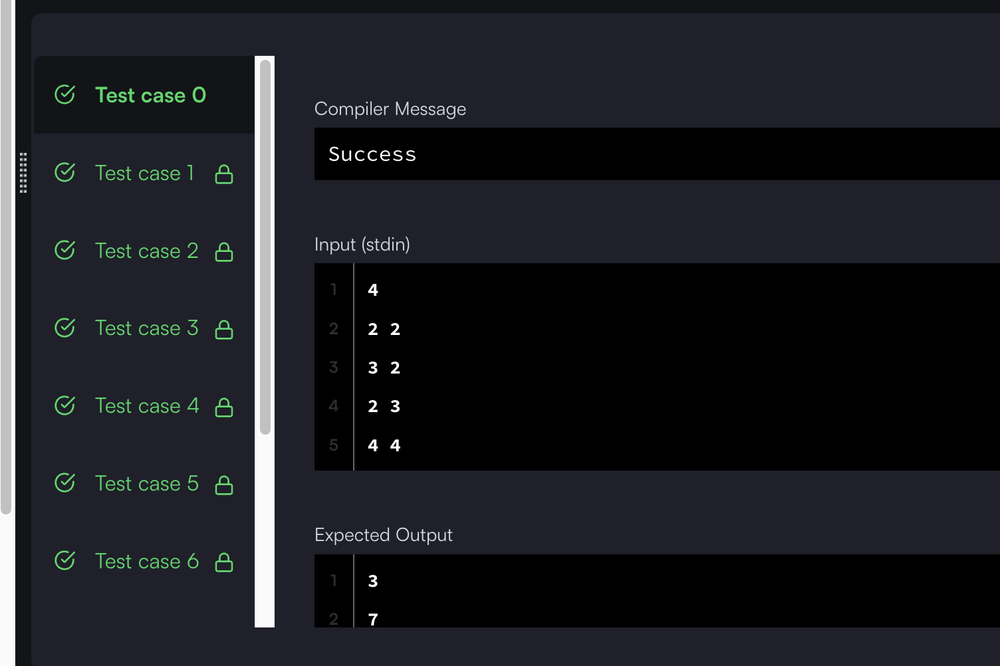

## 출처

- [해커 랭크 : Lego Blocks](https://www.hackerrank.com/challenges/one-week-preparation-kit-lego-blocks/problem?isFullScreen=true&h_l=interview&playlist_slugs%5B%5D=preparation-kits&playlist_slugs%5B%5D=one-week-preparation-kit&playlist_slugs%5B%5D=one-week-day-six)

## 문제 설명

- 영문 사이트이므로 문제를 간단히 설명하겠습니다.

1. 다음과 같은 총 네 가지 종류의 레고 블럭이 무한히 있습니다.

```
d	h	w
1	1	1   []        : 길이가 1이고, 높이가 1인 레고 블럭
1	1	2   [  ]      : 길이가 2이고, 높이가 1인 레고 블럭
1	1	3   [    ]    : 길이가 3이고, 높이가 1인 레고 블럭
1	1	4   [      ]  : 길이가 4이고, 높이가 1인 레고 블럭
```

2. 문제에서 주어지는 높이와 길이만큼 레고 블럭을 쌓으려고 합니다.

3. 이 때, 다음과 같이 수직으로 동일한 블럭이 쌓여있는 형태의 블럭은 단단하지 않아서[^1] 만들 수 없습니다.
   

4. 주어진 높이 n, 길이 m의 블럭을 만들 수 있는 모든 경우의 수를 구해야 합니다.

## 접근

- 레고의 높이(n), 길이(m)가 최대 1000이므로 완전탐색으로 모든 경우의 수를 구하는 것은 불가능하며, 길이 2, 높이 1000의 블럭을 쌓는 모든 경우의 수만 해도 벌써 2^1000입니다.[^2]
  > 그래서 문제에서도 소수 모듈러 연산으로 크기를 줄이고 있습니다.
- 이 문제에서는 전체 경우의 수를 귀납적으로 구하고, 전체에서 단단하지 않은 레고의 경우를 빼는 방식으로 단단한 레고의 경우를 구해야 합니다.

### 흐름

큰 문제해결의 흐름은 다음과 같습니다.

1. 해당 길이만큼 레고를 만들 수 있는 모든 경우의 수 찾기
   > row[m]
2. 해당 높이만큼 레고를 쌓기
   > row[m] ^ n = col[m]
3. 모든 경우의 수에서 단단하지 않은 레고의 경우의 수 빼기
   > col[m] - notSolidCol[m] = solidCol[m]

## 풀이

위 흐름에서처럼 총 3단계로 걸쳐 단계별 설명과 코드를 함께 확인해보겠습니다.

### 귀납적으로 레고 블럭 개수 구하기

레고 블럭의 길이가 4 이하인 경우와, 이상인 경우를 분리해서 개수를 구해보겠습니다.



**[M = 1일 때]**

그냥 1인 블럭 1개만 사용 가능합니다.

> row[1] = 1

**[M = 2일 때]**

- 맨 앞을 크기가 1인 블럭으로 고정시키면, 뒤에는 1인 블럭 1개(row[1])만 올 수 있습니다.
- 크기가 2인 블럭 1개를 사용할 수 있습니다.

> row[2] = row[1] + 1 = 2

**[M = 3일 때]**

- 맨 앞을 M = 1인 블럭으로 고정시켰을 때, 뒤의 2칸은 row[2]인 경우의 수와 같습니다.
- 맨 앞을 M = 2인 블럭으로 고정시켰을 때, 뒤의 1칸은 row[1]인 경우의 수와 같습니다.
- 크기가 3인 블럭 1개를 사용할 수 있습니다.

> row[3] = (row[2] + row[1]) + 1 = 4

**[M <= 4일 때]**

- 레고 블럭의 길이가 1 증가할 때마다, 전체 경우의 수는 다음과 같이 구할 수 있습니다.

  > (맨 앞 블럭을 (M = 1 ~ M-1)까지 고정시킨 경우의 수의 합) + 현재 블럭(1)

  > row[M] = (row[M - 1] + row[M - 2] + ... + row[1]) + 1

**[M > 4일 때]**

- 레고 블럭의 길이는 최대 4까지만 증가하므로[^3], 맨 앞 블럭을 1 ~ 4까지만 고정시킬 수 있으므로 다음과 같습니다.

  > 맨 앞 블럭을 (M = 1 ~ 4)까지 고정시킨 경우의 수의 합

  > row[M] = row[M - 1] + row[M - 2] + row[M - 3] + row[M - 4]

- 위의 귀납식을 다음과 같이 DP를 사용한 코드로 나타낼 수 있습니다.

  ```java
  public static int legoBlocks(int n, int m) {

          // Row 개수 구하기
          long[] row = new long[m + 1];
          for (int i = 1; i <= m; i++) {
              if (i <= 4) {
                  row[i] = 1;
                  for (int j = 1; j < i; j++) row[i] += row[j];
              } else {
                  // Overflow 방지를 위한 MOD 연산
                  // MOD = (int)Math.pow(10, 9) + 7;
                  row[i] = (row[i - 1] + row[i - 2] + row[i - 3] + row[i - 4]) % MOD;
              }
          }
          // ...
  }
  ```

### 레고 블럭을 쌓는 모든 경우의 수 구하기

단단한 블럭인지를 확인하지 않고, 모든 경우를 구하면 되므로 다음과 같이 구할 수 있습니다.

> 해당 길이의 블럭의 수 ^ 블럭의 높이
> col[m] = row[m] ^ n

- 이를 코드로 다음과 같이 나타낼 수 있습니다

  > Math.pow(x, y) 연산을 하게 되면 Overflow가 발생하므로 다음과 같이 곱셈 후 모듈러 연산을 해야합니다.

  ```java
  public static int legoBlocks(int n, int m) {
      // ...(생략)

      // 레고 블럭을 쌓는 모든 경우의 수 저장하기
      long[] col = new long[m + 1];
      for (int i = 0; i <= m; i++) {
          col[i] = 1;
          for (int j = 1; j <= n; j++) {
              col[i] *= row[i];

              // Overflow 방지를 위한 MOD 연산
              col[i] %= MOD;
          }
      }

      // ...(생략)
  }
  ```

### 단단하지 않은 블럭인 경우 빼기

단단하지 않은 블럭의 수 구하기는 앞에서 구했던 귀납적으로 블럭의 수 구하기와 유사합니다.



위와 같이 j를 고정시켜두면, 나머지 길이(m - j)에서 어떻게 블럭을 쌓더라도 단단하지 않은 경우가 됩니다.
이 때, (m - j)에서 블럭을 쌓는 모든 경우의 수는 위에서 구한 값을 활용할 수 있습니다.

> 길이가 (m - j)인 단단하지 않은 블럭 : col[m - j]

- 이를 코드로 표현하면 다음과 같습니다.

  ```java
  public static int legoBlocks(int n, int m) {
      // ...(생략)

      // Solid하지 않은 경우 빼서 Solid한 경우만 구하기
      long[] solidCol = new long[m + 1];

      solidCol[1] = 1; // 길이가 1일 때는 크기가 1인 블럭을 쌓는 1가지 경우밖에 없음
      for (int i = 2; i <= m; i++) {
          long temp = col[i]; // 전체 경우의 수로 초기화
          for (int j = 1; j < i; j++) {

              // 길이를 1씩 증가시키면서 단단하지 않은 경우 빼기
              temp -= solidCol[j] * col[i - j];

              // Overflow 방지를 위한 MOD 연산
              temp %= MOD;
          }

          // Overflow 방지를 위한 MOD 연산2
          solidCol[i] = (temp + MOD) % MOD; // 연산 전 MOD를 더해서 계산 결과가 -인 경우 처리
      }

      // m번째 단단한 레고블럭 개수 출력
      return (int)solidCol[m];
  }
  ```

## 결과

- 전체 코드

  ```java
  public static int legoBlocks(int n, int m) {

        // Row 개수 구하기
        long[] row = new long[m + 1];
        for (int i = 1; i <= m; i++) {
            if (i <= 4) {
                row[i] = 1;
                for (int j = 1; j < i; j++) row[i] += row[j];
            } else {
                row[i] = (row[i - 1] + row[i - 2] + row[i - 3] + row[i - 4]) % MOD;
            }
        }

        // Row X Col 총 개수 구하기
        long[] col = new long[m + 1];
        for (int i = 0; i <= m; i++) {
            col[i] = 1;
            for (int j = 1; j <= n; j++) {
                col[i] *= row[i];
                col[i] %= MOD;
            }
        }

        // Solid하지 않은 경우 빼서 Solid한 경우만 구하기
        long[] solidCol = new long[m + 1];
        solidCol[1] = 1;
        for (int i = 2; i <= m; i++) {
            long temp = col[i];
            for (int j = 1; j < i; j++) {
                temp -= solidCol[j] * col[i - j];
                temp %= MOD;
            }
            solidCol[i] = (temp + MOD) % MOD;
        }

        return (int)solidCol[m];
    }
  ```

- 결과
  

## 리뷰

넥슨 코딩테스트를 준비하면서 HackerRank의 문제들을 처음 풀어봤습니다.

> 문제별로 난이도 차이가 있는 것 같은데, 이 문제만 유난히 어려워서 많이 고민했고 결국 Discussion에 있는 풀이들을 보고 나서야 이해할 수 있었습니다.

DP의 개념을 익힐 수 있는 좋은 문제인 것 같습니다.

## References

| URL                                                                                                                                                                                                                                        | 게시일자 | 방문일자    | 작성자 |
| :----------------------------------------------------------------------------------------------------------------------------------------------------------------------------------------------------------------------------------------- | :------- | :---------- | :----- |
| https://www.hackerrank.com/challenges/one-week-preparation-kit-lego-blocks/forum?isFullScreen=true&h_l=interview&playlist_slugs%5B%5D=preparation-kits&playlist_slugs%5B%5D=one-week-preparation-kit&playlist_slugs%5B%5D=one-week-day-six | -        | 2024.10.26. | -      |

[^1]: 영문으로는 one solid structure를 만들어야 한다고 하는데, 레고 블럭이 두개로 분리되지 않는 형태를 말합니다.
[^2]: 길이가 2인 블럭은 2가지 경우가 있고([][], [ ]), 이를 높이 1000으로 쌓는 경우이므로 2^1000입니다.
[^3]: 문제 설명에서 보듯이 레고 블럭은 길이 1 ~ 4까지 총 4가지 종류만 있습니다.
