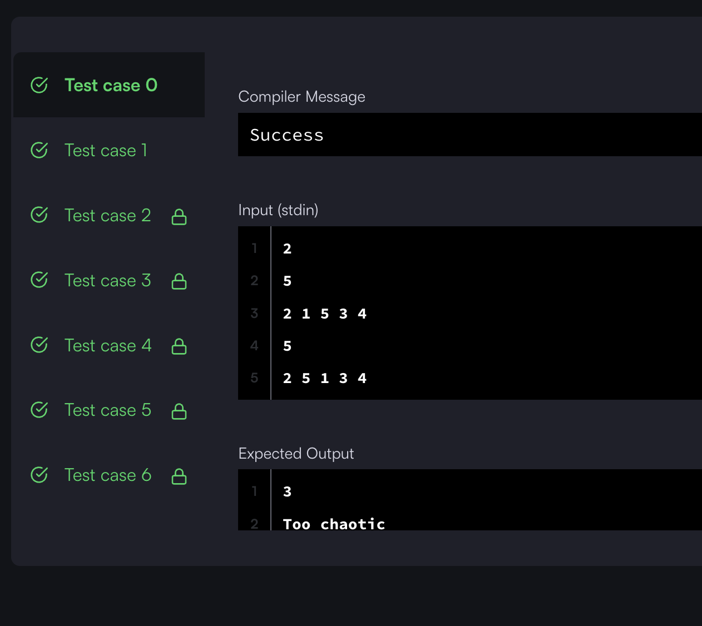

## 출처

- [HackerRank New Year Chaos](https://www.hackerrank.com/challenges/one-week-preparation-kit-new-year-chaos/problem)

## 문제 설명

> 영문 사이트이므로 문제를 간단히 설명하겠습니다.

1. 롤러코스터에 승객들이 n명 탑승중입니다. 각자는 탑승 순서대로 번호를 부여받습니다.
2. 롤러코스터 승객들은 **앞 사람과 최대 두 번까지** 순서를 변경할 수 있습니다.
   > bribe라는 단어를 처음 보고 해석이 안됐는데 '매수하다' 라는 뜻으로, 앞 사람 자리를 매수한다는 뜻인 것 같습니다.
3. 이렇게 변경된 롤러코스터의 상태가 큐로 주어집니다.
4. 만약 3번 이상 변경한 사람이 있으면 "Too Chaotic"이라는 문자열을 출력합니다.
5. 그런 사람이 없다면 승객들의 변경 횟수를 출력합니다.

## 접근

### 완전 탐색?

- 큐의 크기(n)가 최대 `10^5`이므로 `O(N^2)` 로직은 실행이 불가능하므로 완전탐색은 불가능합니다.

### Greedy

현재 승객이 타고있는 지점(idx)과 갖고 있는 번호의 관계를 통해 어떻게 변경이 이루어졌는지 유추해볼 수 있습니다.



- 본인의 현재위치가 실제위치보다 2칸 이상 차이나면 앞 사람과 두 번을 초과해서 변경했음을 알 수 있습니다.
  > 따라서 "Too Chaotic"을 출력합니다.



- 본인의 실제 위치보다 2칸까지[^1] 작은 위치를 보면서 본인보다 큰 사람이 있다면, 해당 사람과 교체했음을 알 수 있습니다.
  > 자신보다 앞에 큰 번호가 있다는 것은 무조건 본인과 변경이 이루어져야 큰 번호가 그 위치로 갈 수 있기 때문입니다.

## 풀이

```java
    public static void minimumBribes(List<Integer> q) {
        int cnt = 0;

        for (int i = 0; i < q.size(); i++) {

            // 본인의 현재위치가 실제위치보다 2칸 이상 차이나면 2번을 초과하여 변경
            if (q.get(i) - (i + 1) > 2) {
                System.out.println("Too chaotic");
                return;
            }

            // 본인 실제위치보다 2칸 앞까지부터 현재 위치까지 중 본인보다 큰 숫자의 개수 세기
            for (int j = q.get(i) - 2; j < i; j++) {

                // 0보다 작으면 배열 범위 초과오류 발생
                if (j < 0) continue;

                if (q.get(j) > q.get(i)) cnt++;
            }
        }

        System.out.println(cnt);
    }
```

## 결과



## 리뷰

그리디는 아이디어만 확실히 이해하면 정말 쉬운데, 그걸 모르면 도저히 풀 수가 없는 것 같습니다.

> 저도 이 문제를 세번째 풀고있는데도 이전 풀이가 기억이 안나면 풀 수 있을지 모르겠네요... 다양한 문제를 풀어보는 것 말고는 방법이 없는 것 같습니다.

## References

| URL | 게시일자 | 방문일자 | 작성자 |
| :-- | :------- | :------- | :----- |

[^1]:
    2칸 앞까지 확인하는 이유는 본인이 움직일 수 있는 범위가 원래 위치에서 2칸 이전 ~ 현재 위치까지이기 때문에 본인이 위치할 수 있는 모든 범위를 최적화하기 위함입니다.

    > 맨앞에서부터 현재 위치까지를 탐색할 경우 큐의 최대 크기가 `10^5`이므로 다음과 같이 시간초과가 발생합니다.

    ```java
    public static void minimumBribes(List<Integer> q) {
        int cnt = 0;

        for (int i = 0; i < q.size(); i++) {

            if (q.get(i) - (i + 1) > 2) {
                System.out.println("Too chaotic");
                return;
            }

            for (int j = 0; j < i; j++) {
                if (q.get(j) > q.get(i)) cnt++;
            }
        }

        System.out.println(cnt);
    }
    ```

    > 
