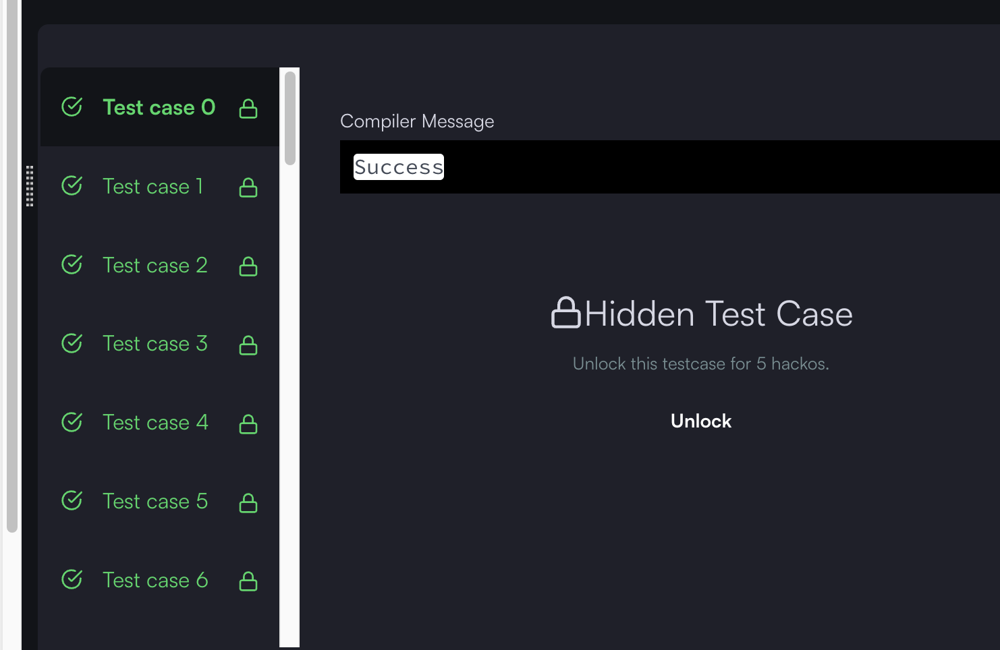

## 출처

- [HackerRank No Prefix Set](https://www.hackerrank.com/challenges/one-week-preparation-kit-no-prefix-set/problem)

## 문제 설명

- 주어진 단어 집합 중 Prefix(접두사)가 존재하는 단어가 있으면 `BAD SET`와 함께 `처음으로 접두사가 발생한 단어`를 출력합니다.
- 그런 단어가 없으면 `GOOD SET`을 출력합니다.

## 접근

### 완전탐색

- 가장 단순한 접근은 각 단어마다 나머지 단어들을 돌면서 prefix가 존재하는지 확인하는 것입니다.
- 문제에서 주어진 단어의 수는 최대 `10^5` 이므로, `O(N^2)`[^1] 이상의 알고리즘을 사용할 수 없습니다.

### TRIE

[Trie](<https://ko.wikipedia.org/wiki/%ED%8A%B8%EB%9D%BC%EC%9D%B4_(%EC%BB%B4%ED%93%A8%ED%8C%85)>)[^2] 자료구조를 통해 단어들의 탐색을 최적화할 수 있습니다.

- Trie 자료구조의 형태는 다음과 같습니다.



- 위와 같이 트리 형태로 알파벳을 저장하는 자료구조입니다.

- 만약 `ab`라는 단어가 존재하는지 확인하려면 다음과 같이 트리의 높이인 두 번만에 탐색할 수 있습니다.



- 만약 존재하지 않는 단어(`ak`)가 있어도 트리의 높이만큼 탐색하면 바로 확인이 가능합니다.[^3]



> 이러한 과정을 통해 단어가 존재하는지 탐색하는 과정을 `O(N) -> O(logN) : 트리 높이`로 줄일 수 있습니다.

### 주의사항

예를 들어 [abc, bcd, b, abcd] 라는 Test Case에서 bcd 이후 b가 나오면 첫 오류가 발생한 시점인 `b`가 출력되어야 합니다.

> 저도 구현 후 예외처리에서 막혀서 테스트 케이스를 하나 열어보고 알았습니다.

## 풀이

```java
    // Trie 자료구조 정의
    public static class Node {
        char c;
        boolean isExist;
        Node[] children;

        public Node(char c) {
            this.c = c;

            // 주어지는 알파벳 : a(0) ~ j(9) 이므로 크기 10으로 고정
            children = new Node[10];
        }

        // 다음 알파벳 가져오기
        public Node next(char c) {
            Node node = children[c - 'a'];

            // 다음 위치의 알파벳이 없으면 새로 만들어서 넣기
            if (node == null) {
                node = new Node(c);
                children[c - 'a'] = node;
            }
            return node;
        }

        // 자식들이 모두 비어있다면, 다음 위치의 알파벳이 없음
        public boolean hasNext() {
            for (Node c : children) {
                if (c != null) return true;
            }
            return false;
        }
    }

    public static void noPrefix(List<String> words) {

        // 루트 노드 초기화
        Node root = new Node('r');
        for (String word : words) {

            // 루트부터 탐색
            Node temp = root;
            for (char c : word.toCharArray()) {

                // 다음 알파벳 위치로 이동
                temp = temp.next(c);

                // 다음 알파벳이 존재하는 문자열이면, prefix가 되므로 현재 단어 출력
                if (temp.isExist) {
                    System.out.println("BAD SET");
                    System.out.println(word);
                    return;
                }
            }

            // 마지막 위치까지 이동했는데 해당 위치의 자식이 존재하면 현재 단어가 prefix가 되므로 현재 단어 출력
            if (temp.hasNext()) {
                System.out.println("BAD SET");
                System.out.println(word);
                return;
            }

            // 마지막 위치 표시해두기
            temp.isExist = true;
        }

        System.out.println("GOOD SET");
    }
```

## 결과



## 리뷰

Trie 자료구조를 알면 바로 풀 수 있는 문제여서 난이도 자체는 크게 높지 않은 것 같습니다.

> 하지만 Trie를 모르면서 풀 수 있는 사람은 몇이나 될지 모르겠습니다..

## References

| URL | 게시일자 | 방문일자 | 작성자 |
| :-- | :------- | :------- | :----- |

[^1]: `2^10 = (약)10^3` 이므로 주어진 단어의 수를 모두 도는데 필요한 시간복잡도는`(10^5)^2 = 10^10 = 2^30` 입니다. 이정도도 시간복잡도가 간당간당하지만, 단어의 길이가 최대 60이므로 시간초과가 발생합니다.
[^2]: Trie의 어원은 검색을 뜻하는 `Retrieval`의 중간 이름에서 나왔다고 합니다.
[^3]: 자식을 배열로 정의하고 a ~ i까지 알파벳 순서대로 채워넣으면, k(11)를 넣었을 때 존재 여부를 한번에 탐색이 가능합니다.

```java
char[] children = new char[26];
for (int i = 0; i < 10; i++) {
  children[i] = i + 'a';
}

/*
 * 출력 결과 : null
 */
System.out.println(children[k - 'a']);

```
