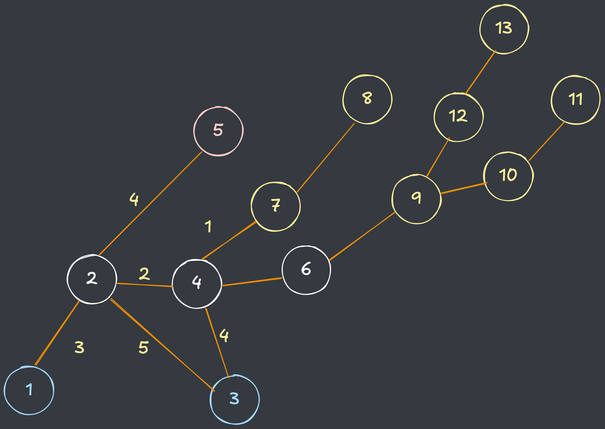
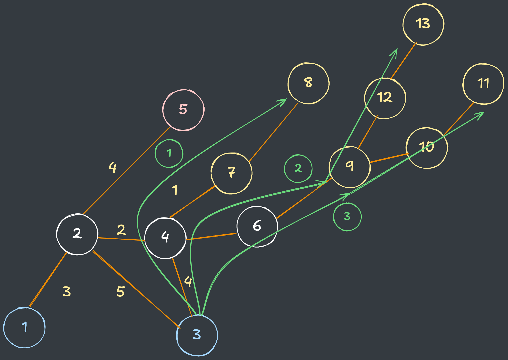
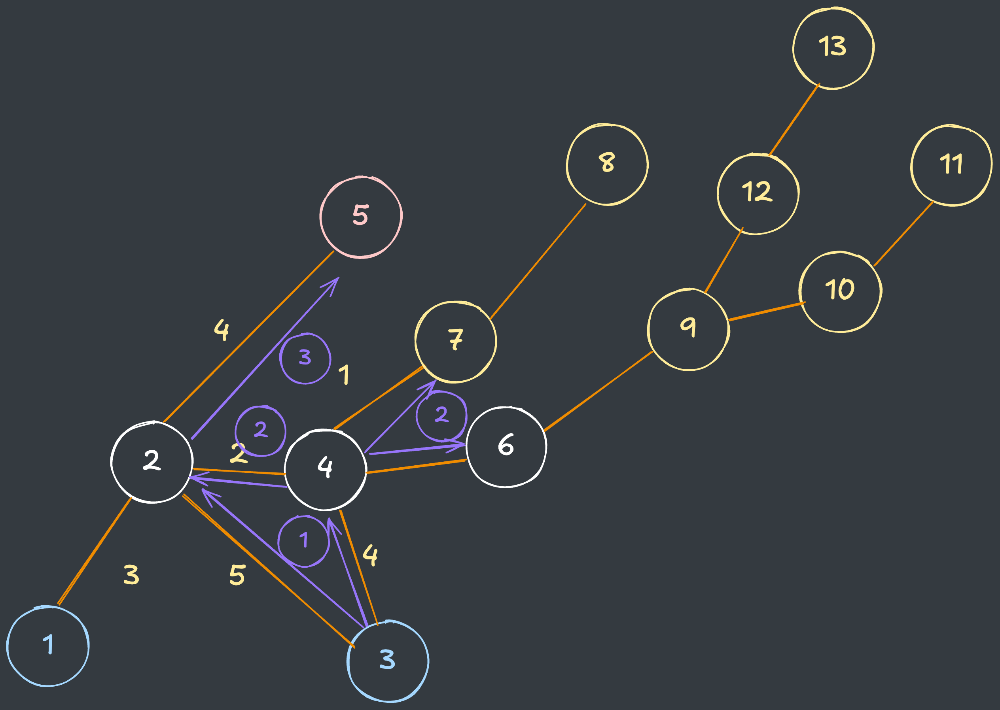
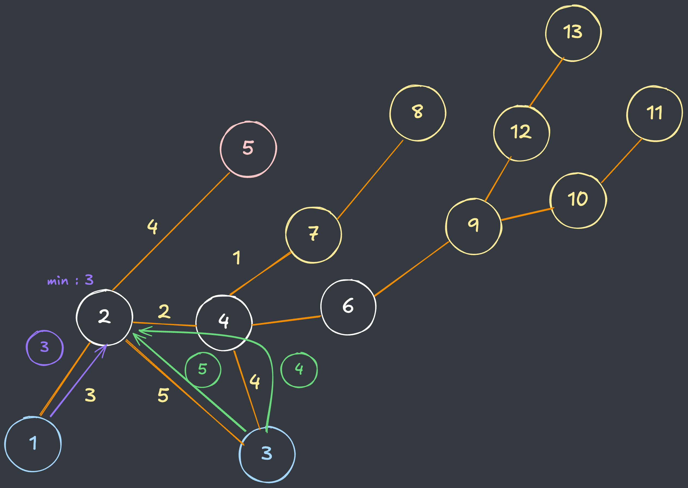
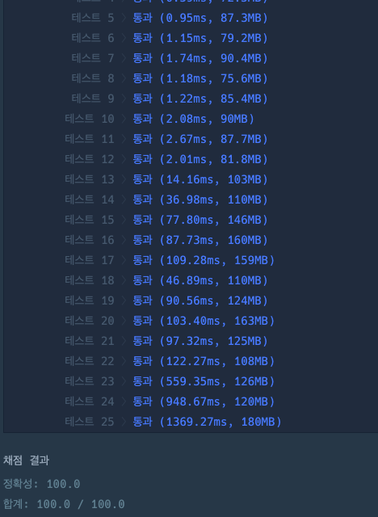

## 출처

- [Programmers 등산코스 정하기(2022 KAKAO TECH INTERNSHIP)](https://school.programmers.co.kr/learn/courses/30/lessons/118669)

## 접근

### 문제 분석

- 산의 봉우리까지 이동하는 과정을 시뮬레이션 하는 문제입니다.
- `Intensity`는 이동 과정에서 가장 긴시간을 뜻합니다.
- 문제에서는 정상에 도착한 후, 다시 출입구로 돌아와야 한다고 했지만 **올라갔던 길을 그대로 내려올 수 있기 때문에**, 정상까지만 경로를 추적하면 됩니다.
- 따라서 각 출발지(Gate)에서 도착지(Summit)까지의 `Intensity`가 최소가 되도록 완전탐색을 수행해야 합니다.

### 조건 분석

- 문제에서 주어진 정점(Vertex)은 `n = 50,000` 이고 간선(Edge)은 `paths = 200,000`입니다.
- 탐색의 시작점이 최대 `n`이기 때문에, **각 간선을 1번씩만 방문하도록 최적화**하면 시간복잡도 내 문제를 해결할 수 있습니다. 
  > `O(N) = n + paths = 250,000`
- 이 때, 정점의 개수에 비해 간선이 적으므로, 인접 리스트를 활용하는 것이 효과적입니다.[^1]
  > 간선의 개수가 적은 그래프에서 행렬(`n x n matrix`)을 사용하게 되면, 불필요한 탐색 및 메모리 초과가 발생할 수 있습니다. 

### BFS 

- 한 정점에서 다른 정점으로 이동 시, 깊이를 따라 이동하면(DFS) 불필요한 탐색이 발생하기 때문에 시간초과가 발생할 수 있습니다.

  - 아래와 같은 깊은 그래프가 있다고 가정하겠습니다.
  

  - `DFS`는 산꼭대기에 도착할때까지 깊이가 계속 깊어지므로, 다음과 같이 깊은 그래프에서는 모든 경로를 탐색하면서 시간복잡도가 계속 증가하게 됩니다.
  

  - 그러나 `BFS`에서는 최단 경로로만 이동하기 때문에 불필요한 탐색을 최적화할 수 있습니다.
  
  
### 방문처리 최적화
- 단순히 방문여부로 방문체크를 한다면, 이후에 더 작은 `Intensity`로 방문하는 경우를 탐색할 수 없기 때문에, 방문처리 배열은 `DP` 형태로 **Intensity 최솟값**을 저장해야 합니다.
- 문제에서 주어진 시작점이 여러개이기 때문에, 새로운 시작점에서 서로 다른 `BFS`를 수행하게 됩니다. 
- 그러나, 이전 등산코스에서 방문했던 지점이라면, 새로운 `BFS`에서 다시 방문할 필요가 없기 때문에 이를 최적화할 수 있습니다.

  
  - 위와 같이 1번 시작점에서 `Intensity = 3`으로 방문했던 지점이라면, 3번 시작점에서는 어떻게 해도 `Intensity`를 줄일 수 없기 때문에 해당 정점은 더이상 방문할 필요가 없습니다. 

### 도착지 최적화
- 도착지를 `Set`에 삽입하면, 해당 지점이 도착지인지 `O(1)`로 판단할 수 있기 때문에 도착여부를 빠르게 파악할 수 있습니다.
- 이 때, 문제에서 산봉우리 번호가 더 낮은 등산코스를 선택해야 하기 때문에, 더 빠른 도착지점이 앞으로 올 수 있도록 `TreeSet`으로 구현체를 선택합니다.
> `TreeSet`은 내부 원소를 정렬된 형태로 유지합니다.

## 풀이
```java
import java.util.*;

class Solution {
    // 정답 초기화
    int[] answer = {0, 10_000_001};
    
    public int[] solution(int n, int[][] paths, int[] gates, int[] summits) {
        
        // 인접리스트 정의 및 생성
        List<int[]>[] adjList = new List[n + 1];
        for (int i = 0; i < paths.length; i++) {
            
            int start = paths[i][0], end = paths[i][1], time = paths[i][2];
            
            if (adjList[start] == null) adjList[start] = new ArrayList<>();
            if (adjList[end] == null) adjList[end] = new ArrayList<>();
            
            adjList[start].add(new int[] {end, time});
            adjList[end].add(new int[] {start, time});
        }
        
        // DP 형태의 방문배열
        int[] isVisited = new int[n + 1];
        Arrays.fill(isVisited, 10_000_001);
        
        // 도착지 Set
        Set<Integer> summitSet = new TreeSet<>();        
        for (int summit : summits)
            summitSet.add(summit);
        
        // 각 시작지점에서 BFS 수행
        for (int start : gates){          
            bfs(n, start, adjList, isVisited, summitSet);
        }
        
        return answer;
    }
    
    void bfs(int n, int start, List<int[]>[] adjList, int[] isVisited, Set<Integer> summitSet) {
        
        // BFS
        Deque<int[]> q = new ArrayDeque<>();
        
        isVisited[start] = 0;
        q.offer(new int[] {start, 0});
        
        while (!q.isEmpty()) {
            int[] now = q.poll();
            
            // 도착지점에서 탐색 종료
            if (summitSet.contains(now[0])) continue;
            
            for (int[] adjs : adjList[now[0]]) {
                
                // Intensity : 현재 경로에서 가장 긴 시간
                int intensity = Math.max(adjs[1], now[1]);
                
                // 방문체크 : Intensity가 더 작을때만 재방문
                if (intensity >= isVisited[adjs[0]]) continue;
                isVisited[adjs[0]] = intensity;
                                         
                // 새로운 지점에서 다시 BFS
                q.offer(new int[] {adjs[0], intensity});
            }
        }
        
        // 산봉우리의 최솟값 찾기
        int minSummit = 0, minIntensity = 10_000_001;
        
        // TreeSet이므로 번호가 낮은 산봉우리부터 확인
        for (int summit : summitSet) {
            
            // 번호가 큰 산봉우리는 Intensity 최솟값이 작을때만 갱신 
            if (isVisited[summit] < minIntensity) {
                minIntensity = isVisited[summit];
                minSummit = summit;
            }
        }
        
        // 정답 최신화
        if ((answer[1] > minIntensity) ||
            // Intensity가 같으면 번호 확인
            (answer[1] == minIntensity && answer[0] > minSummit)) {
            answer = new int[] {minSummit, minIntensity};
        } 
    }
}
```

## 결과

- 소요 시간 : 1시간 30분



## 리뷰

- 문제를 정확히 이해하지 않고 구현하려다 보니 구현이 오래 걸렸습니다.
> 코스에서 가중치가 가장 작은 값만 확인하면 되므로 일반적인 Dijkstra와는 다른 로직임을 나중에야 알게 되었습니다.
> 문제를 정확히 이해하고 구현하는 습관을 길러야겠습니다.

## References

| URL | 게시일자       | 방문일자 | 작성자 |
| :-- |:-----------| :------- | :----- |
|[희소 그래프](https://ko.wikipedia.org/wiki/%EB%B0%80%EC%A7%91_%EA%B7%B8%EB%9E%98%ED%94%84)| 2023.04.01.|2025.01.22.|Wikipedia|

[^1]: 정점에 비해 간선이 적은 그래프를 [희소 그래프](https://ko.wikipedia.org/wiki/%EB%B0%80%EC%A7%91_%EA%B7%B8%EB%9E%98%ED%94%84)라고 합니다.
    > 해당 문제에서 최대 간선의 숫자는 `n * (n - 1) / 2 = 1,249,975,000`인 반면, 해당 그래프의 간선의 숫자는 `200,000`이므로 정점에 비해 간선이 적다고 할 수 있습니다.