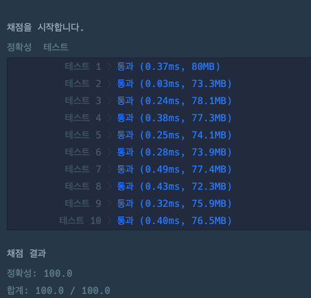

## 출처

- [프로그래머스 혼자 놀기의 달인](https://school.programmers.co.kr/learn/courses/30/lessons/131130#)

## 접근

숫자 더미를 여러 그룹으로 분리한 뒤, 가장 큰 그룹과 두번째로 큰 그룹을 선택합니다.

### 완전탐색(DFS)

DFS를 통해 숫자 더미를 여러 그룹으로 분리할 수 있습니다.

- 문제에서 주어진 카드의 최대 개수가 100 이하이므로, 한번씩 방문한다면 O(N)으로 해결이 가능합니다.

> 100개의 카드가 1개의 그룹인 경우, DFS의 최대 Depth가 100이므로 재귀 호출을 하더라도 StackOverFlow[^1]가 발생하지 않습니다.



## 풀이

```java
import java.util.*;

class Solution {

    // 카드 그룹을 넣을 전역변수
    List<Integer> group;

    public int solution(int[] cards) {

        group = new ArrayList<>();

        // 방문 체크를 위한 변수
        boolean[] visited = new boolean[cards.length + 1];

        // 카드를 돌면서 그룹화
        for (int card : cards) {

            // 이미 방문한 카드는 다시 방문하지 않음
            if (visited[card]) continue;

            // DFS
            dfs(card, 0, cards, visited);
        }

        // 그룹이 1개면 0 반환
        if (group.size() == 1) return 0;

        // 내림차순 정렬 후 가장 큰 그룹과 두번째로 큰 그룹 곱해서 반환
        group.sort(Comparator.reverseOrder());
        return group.get(0) * group.get(1);
    }

    // DFS
    void dfs(int now, int cnt, int[] cards, boolean[] visited) {

        // 이미 방문한 그룹이 다시 등장 -> 같은 사이클(그룹)이므로 그룹에 현재 개수 추가
        if (visited[now]) {
            group.add(cnt);
            return;
        }

        // 방문 체크
        visited[now] = true;

        // now에서 1을 빼줘야 배열 범위를 벗어나지 않음, 방문할 때마다 현재 그룹의 개수 1개씩 추가
        dfs(cards[now - 1], cnt + 1, cards, visited);
    }
}
```

## 결과

- 소요시간 7:41



## 리뷰

DFS를 통해 전체 탐색을 할 수 있는지 묻는 문제입니다.

> 아이디어와 구현 난이도는 쉬운 편이지만, 실제로 코딩테스트에서 접했을 때 빠르게 풀 수 있는 연습이 필요할 것 같습니다.

## References

| URL                                                                                            | 게시일자 | 방문일자    | 작성자 |
| :--------------------------------------------------------------------------------------------- | :------- | :---------- | :----- |
| [Oracle Java 8 공식문서](https://docs.oracle.com/javase/8/docs/technotes/tools/unix/java.html) | -        | 2024.11.25. | Oracle |

[^1]:
    - 프로그래머스 컴파일 옵션을 확인해보면 다음과 같이 스택 크기는 별도 설정되어 있지 않아 기본값을 사용하는 것을 알 수 있습니다.
      
    - JVM의 -Xss 옵션을 지정하여 스택 크기를 증가시킬 수 있는데, 64비트에서 기본값은 1(MB)로 되어있습니다.
      

      > [Oracle Java 8 공식문서](https://docs.oracle.com/javase/8/docs/technotes/tools/unix/java.html) 참고

    - 1MB(1,000,000Byte)의 스택 사이즈를 사용해서 100번의 재귀호출 시, 각 메서드의 메모리를 최대 10KB(10,000Byte)까지 사용 가능합니다.
