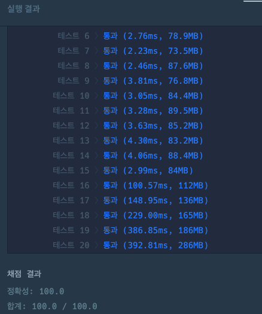

## 출처

- [프로그래머스 숫자 타자 대회](https://school.programmers.co.kr/learn/courses/30/lessons/136797)

## 접근

### 완전탐색

이전 숫자에서 왼손과 오른손을 움직여서 다음 숫자를 누르는 모든 경우를 방문하게 되면 매번 `2`번씩 방문이 발생합니다.

> 1,000개의 숫자를 왼손과 오른손으로 모두 누르려면 `2^1000`의 시간복잡도가 필요합니다.[^1] 이는 불가능하므로, 완전탐색만으로는 풀이할 수 없습니다.

### DP

문제에서 필요한 값은 최솟값이니, 완전탐색 중 최솟값들만을 저장하면서 계산하면 `100*1000 = 10^6`으로 시간복잡도를 줄일 수 있습니다.



- 위 과정을 자세히 살펴보면,

1. 처음 위치`[l : 4], [r : 6]`에서 0번 패드를 누르려면 2가지 경우가 발생합니다. 이 경우에는 중복되는 가짓수가 없으니 진행합니다.
2. 다음 위치`[l : 0, 4], [r : 6, 0]`에서 1번 패드를 누르려면 각각 2가지씩 총 4가지 경우가 발생합니다. 이 경우에도 중복되는 가짓수가 없으니 진행합니다.
3. 다음 위치`[l : 1, 1, 0, 4], [r : 6, 0, 1, 1]`에서 3번 패드를 누르려면 각각 4가지씩 총 8가지 경우가 발생합니다. 이 경우 더 작은 값만을 저장하여 가지치기가 가능합니다.

- 좀 더 자세히 살펴보기 위해, **다른 경우는 제외**하고 첫번째 중복의 경우만 추적해보겠습니다.



1. 처음 위치`[l : 4], [r : 6]`에서 왼손을 옮겨 0으로 이동하면 가중치 5, 오른손을 옮겨 0으로 이동하면 가중치 5가 발생합니다.
2. 다음 위치`[l : 0, 4], [r : 6, 0]`에서 오른손을 옮겨 1로 이동하면 가중치가 각각 5, 7이 발생합니다.
3. 다음 위치`[l : 1, 1, 0, 4], [r : 6, 0, 1, 1]`에서 왼손을 옮겨 3으로 이동하면 가중치가 각각 7, 5가 발생합니다.
4. 두 경우의 가중치는 모두 같으니 17을 저장합니다. **이후 탐색할 경우의 수가 1개 줄었습니다.**

> 위와 같은 방식으로 중복되는 경우를 줄이면, 최대 100`[l : 0 ~ 9, r : 0 ~ 9]`개 이상으로 경우의 수가 커지지 않습니다.

### 숫자패드 누르기

숫자패드를 누르는 것은 단순 구현이므로, 다양한 방법이 있습니다.

1. **모든 경우 직접 계산해보기**

   가능한 경우를 하나씩 세면 2차원 배열로 나타낼 수 있습니다.

   ```Java
   // 가중치를 구하기 위한 배열
   int[][] add = {
               {1, 7, 6, 7, 5, 4, 5, 3, 2, 3},
               {7, 1, 2, 4, 2, 3, 5, 4, 5, 6},
               {6, 2, 1, 2, 3, 2, 3, 5, 4, 5},
               {7, 4, 2, 1, 5, 3, 2, 6, 5, 4},
               {5, 2, 3, 5, 1, 2, 4, 2, 3, 5},
               {4, 3, 2, 3, 2, 1, 2, 3, 2, 3},
               {5, 5, 3, 2, 4, 2, 1, 5, 3, 2},
               {3, 4, 5, 6, 2, 3, 5, 1, 2, 4},
               {2, 5, 4, 5, 3, 2, 3, 2, 1, 2},
               {3, 6, 5, 4, 5, 3, 2, 4, 2, 1}};
   ```

2. **함수 만들기**

   각 숫자패드의 거리를 계산했을 때, 가로의 차이와 세로의 차이를 비교하여 전체 가중치를 구할 수 있습니다.

   ```Java
    int rd = Math.abs(sp[0] - ep[0]), cd = Math.abs(sp[1] - ep[1]);

        // 가로와 세로 거리차이가 없으면 같은 위치이므로 1 반환
        if (rd == 0 && cd == 0) return 1;

        // 가로와 세로의 거리차 중 작은 값만큼 대각선 이동(3) -> 이후 큰 값과 작은 값 차이만큼 평행 이동(2)
        return Math.min(rd, cd) * 3 + (Math.max(rd, cd) - Math.min(rd, cd)) * 2;
   ```

## 풀이

```Java
import java.util.*;

class Solution {
    public int solution(String numbers) {
        char[] numbers_ = numbers.toCharArray();

        // 가중치 저장을 위한 DP 배열 생성
        int[][][] dp = new int[numbers_.length][10][10];

        // 배열 내부의 값 초기화
        Arrays.stream(dp).forEach(d -> Arrays.stream(d).forEach(p -> Arrays.fill(p, Integer.MAX_VALUE)));

        // 시작점 초기화
        dp[0][numbers_[0] - '0'][6] = cal(numbers_[0] - '0', 4);
        dp[0][4][numbers_[0] - '0'] = cal(numbers_[0] - '0', 6);

        // DP를 통해 탐색 최적화
        for (int i = 1; i < numbers_.length; i++) {
            int n = numbers_[i] - '0';

            // 좌우 손가락을 움직이면서 최솟값만 저장
            for (int l = 0; l < 10; l++) {
                for (int r = 0; r < 10; r++) {

                    // 왼손과 오른손이 같은 위치에 올 수 없음 주의
                    if (l == r || dp[i - 1][l][r] == Integer.MAX_VALUE) continue;
                    dp[i][n][r] = Math.min(dp[i][n][r], dp[i-1][l][r] + cal(n, l));
                    dp[i][l][n] = Math.min(dp[i][l][n], dp[i-1][l][r] + cal(n, r));
                }
            }
        }

        // 마지막 배열에서 최솟값 반환
        return Arrays.stream(dp[numbers_.length - 1]).flatMapToInt(Arrays::stream).min().orElse(0);
    }

    // 가중치 구하는 함수
    int[][] pad = {{1, 2, 3}, {4, 5, 6}, {7, 8, 9}, {-1, 0, -1}};
    int cal(int s, int e) {

        // 각 패드의 위치 좌표 구하기
        int[] sp = null, ep = null;
        for (int r = 0; r < 4; r++) {
            for (int c = 0; c < 3; c++) {
                if (pad[r][c] == s) sp = new int[]{r, c};
                if (pad[r][c] == e) ep = new int[]{r, c};
            }
        }

        // 가로와 세로 가리 차이 구하기
        int rd = Math.abs(sp[0] - ep[0]), cd = Math.abs(sp[1] - ep[1]);

        // 가로와 세로 거리차이가 없으면 같은 위치이므로 1 반환
        if (rd == 0 && cd == 0) return 1;

        // 가로와 세로의 거리차 중 작은 값만큼 대각선 이동(3) -> 이후 큰 값과 작은 값 차이만큼 평행 이동(2)
        return Math.min(rd, cd) * 3 + (Math.max(rd, cd) - Math.min(rd, cd)) * 2;
    }
}
```

## 결과

- 소요시간 40:17

  

## 리뷰

DP문제인 것은 쉽게 알 수 있었지만, 구현 난이도가 있는 편이라고 생각합니다. DP는 항상 그렇지만 많은 문제를 풀어보는것 외에는 정도가 없는 것 같습니다.

> 손가락을 움직이는 가중치를 구현하는게 오히려 시간이 더 걸린 것 같습니다.

## References

| URL | 게시일자 | 방문일자 | 작성자 |
| :-- | :------- | :------- | :----- |

[^1]: 1초에 1억(`10^8`)번씩 계산해도 총 `2^1000 / 10^8` = `10^300 / 10^8` = `10^292`초가 소요됩니다. 1년이 대략 `3*10^7`라고 하니 `10^292 / (3 * 10^7)`, 즉 `3 * 10^284`년이 걸립니다.
