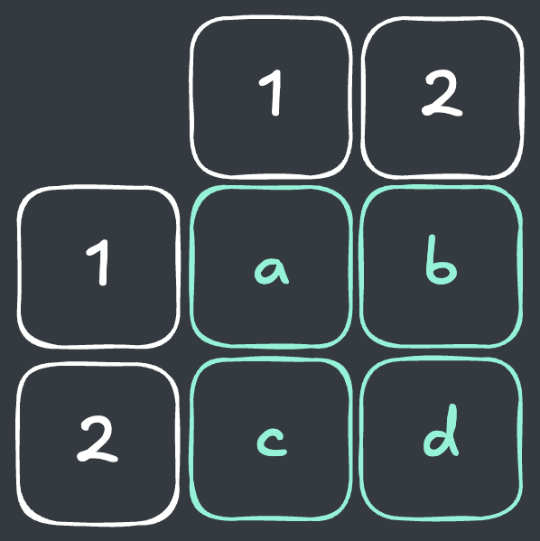
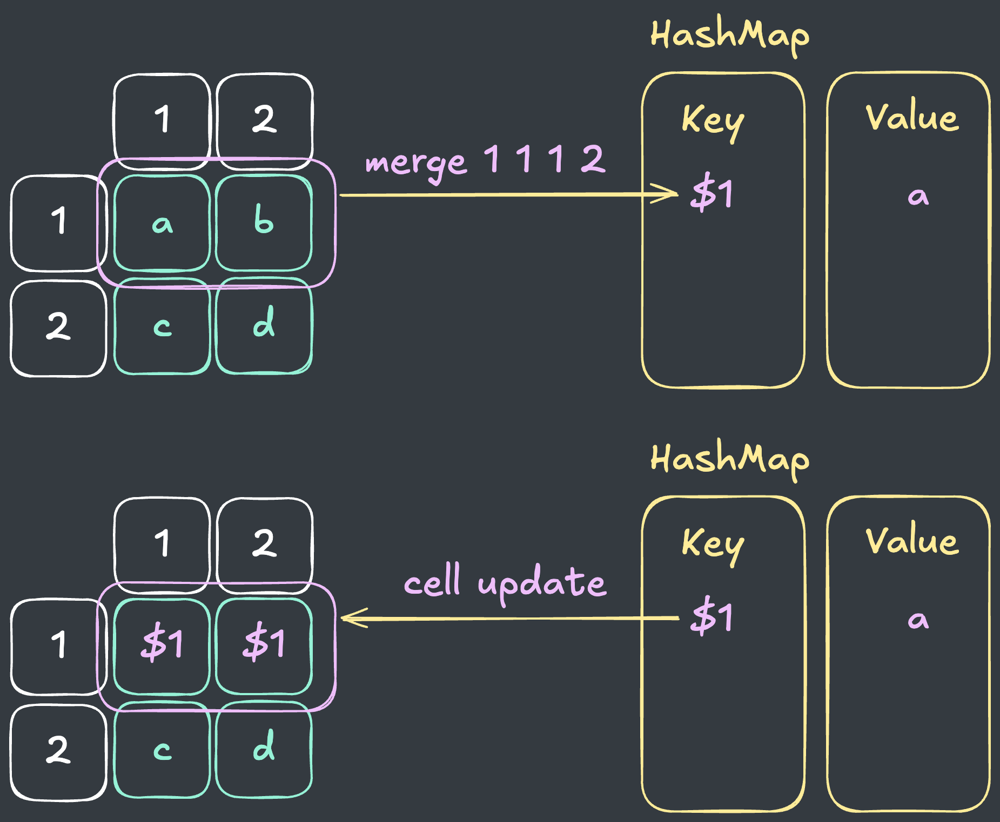
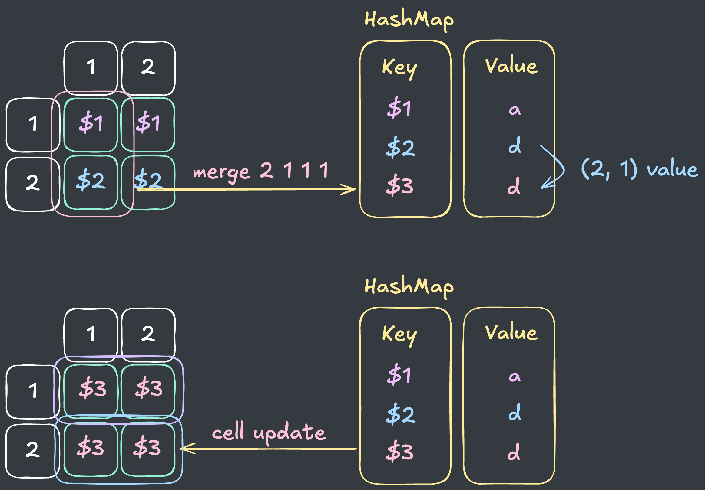
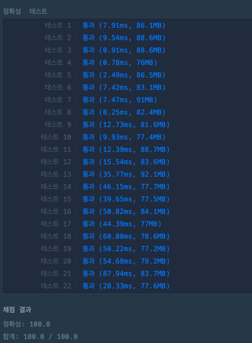

## 출처

- [Programmers 표 병합(2023 KAKAO BLIND RECRUITMENT)](https://school.programmers.co.kr/learn/courses/30/lessons/150366)

## 접근

### 문제 분석

- 표 편집 프로그램의 기능을 구현해야 합니다.
  - UPDATE : 셀 1개의 값 바꾸기, 모든 셀의 값 찾아 바꾸기
  - MERGE : 셀 합치기(그룹화)
  - UNMERGE : 셀 분리하기(그룹화 해제)
  - PRINT : 셀 1개의 값 출력하기
- 표의 크기가 `50 x 50`이고, 명령의 길이가 `1000 이하`이므로, 시간복잡도는 충분한 편입니다.

>`UPDATE`는 비교적 쉽게 구현할 수 있지만, 문제의 이름처럼 `표 병합`을 얼마나 정확하고 빠르게 구현하는지가 중요한 문제입니다. 

### Map 활용 그룹화(병합) 구현

병합을 구현하는 다양한 방식이 있지만, 저는 `HashMap`을 사용해서 매번 그룹을 생성하는 방식을 사용했습니다.

- 병합이 일어날 때마다 그룹(`Group`)을 새로 생성합니다.
- 생성된 그룹은 고유의 `KEY`를 공유하며, 같은 `KEY`를 가진 표는 동일한 값을 참조하도록 합니다.
- 이를 위해 `HashMap`에 그룹을 `KEY`별로 구분해서 저장합니다.

  

  - 위와 같은 표가 있다고 가정하면, 다음과 같이 그룹화를 수행합니다.
    1) 그룹화 시마다 새로운 `그룹 KEY`를 생성해서 `Map`에 저장합니다.
    2) 생성된 `그룹 KEY`로 표를 업데이트합니다.
    
    

  - 만약, 그룹과 그룹 간의 업데이트가 발생하면, 다음과 같이 그룹화를 수행합니다.
    1) 새로운 `그룹 KEY`를 생성해서 `Map`에 저장합니다.
    2) 기존 그룹들을 모두 새로운 `그룹 KEY`로 업데이트합니다.
  
    
      
    > 이 때, 새로 생성되는 그룹의 값을 `기존 그룹의 값 : (2, 1)value`으로 업데이트 하는 점과 `연관된 그룹을 한번에 업데이트`하는 점에 주목합니다.
    
## 풀이

```java
import java.util.*;

class Solution {
    
    List<String> answer;
    String[][] cell;
    Map<String, String> groups;
    int GROUP_ID;
    
    public String[] solution(String[] commands) {
        
        // 초기화
        answer = new ArrayList<>();
        cell = new String[51][51];
        Arrays.stream(cell).forEach(c -> Arrays.fill(c, "EMPTY"));
        groups = new HashMap<>();
        
        // 명령 수행
        for (String command : commands) {
            String[] splited = command.split(" ");
            switch(splited[0]) {
                case "UPDATE": 
                    if (splited.length == 4) 
                        update(splited[1], splited[2], splited[3]);
                    else 
                        update(splited[1], splited[2]);
                    break;
                case "MERGE": 
                    merge(splited[1], splited[2], splited[3], splited[4]); 
                    break;
                case "UNMERGE": 
                    unmerge(splited[1], splited[2]); 
                    break;
                case "PRINT": 
                    print(splited[1], splited[2]); 
                    break;
            }
        }
        
        return answer.toArray(new String[answer.size()]);
    }
    
    // 해당 셀 업데이트
    void update(String R, String C, String value) {
        int r = Integer.parseInt(R);
        int c = Integer.parseInt(C);
        
        // 그룹일 때는 그룹 값 업데이트
        if (isGroup(r, c)) groups.put(cell[r][c], value);
        else cell[r][c] = value;
    }
    
    // 전체 셀 업데이트
    void update(String value1, String value2) {
        for (int r = 1; r <= 50; r++) {
            for (int c = 1; c <= 50; c++) {
                
                // 그룹의 값을 변경할 때는 그룹 값 업데이트
                if (isGroup(r, c) && getValue(r, c).equals(value1)) groups.put(cell[r][c], value2);
                else if (cell[r][c].equals(value1)) cell[r][c] = value2;
            }
        }
    }
    
    // 병합
    void merge(String R1, String C1, String R2, String C2) {
        int r1 = Integer.parseInt(R1);
        int c1 = Integer.parseInt(C1);
        int r2 = Integer.parseInt(R2);
        int c2 = Integer.parseInt(C2);
        
        if (r1 == r2 && c1 == c2) return;
        
        // 새로운 그룹 생성
        String newGroupId = "$" + GROUP_ID++;
        
        // 새로운 그룹의 값 : (r1, c1)이 비었을 때는 (r2, c2) 값 사용
        if (getValue(r1, c1).equals("EMPTY") && !getValue(r2, c2).equals("EMPTY")) 
            groups.put(newGroupId, getValue(r2, c2));
        else groups.put(newGroupId, getValue(r1, c1));
        
        // 그룹일 때는 전체 그룹 키 업데이트
        if (isGroup(r1, c1)) update(cell[r1][c1], newGroupId);
        else cell[r1][c1] = newGroupId;
        
        if (isGroup(r2, c2)) update(cell[r2][c2], newGroupId);
        else cell[r2][c2] = newGroupId;
            
    }
    
    // 병합 해제
    void unmerge(String R, String C) {
        int r = Integer.parseInt(R);
        int c = Integer.parseInt(C);
        
        // 그룹 전체 값 비운 뒤 해당 셀의 값만 변경
        if (isGroup(r, c)) {
            String temp = getValue(r, c);
            update(cell[r][c], "EMPTY");
            cell[r][c] = temp;   
        }
    }
    
    // 출력
    void print(String R, String C) {
        int r = Integer.parseInt(R);
        int c = Integer.parseInt(C);
        answer.add(getValue(r, c));
    }
    
    // 값 가져오기 : 그룹일 때는 그룹의 값 사용
    String getValue(int r, int c) {
        if (isGroup(r, c)) return groups.get(cell[r][c]);
        else return cell[r][c];
    }
    
    // 그룹인지 확인 : 식별자($)
    boolean isGroup(int r, int c) {
        if (cell[r][c].contains("$")) return true;
        return false;
    }
}
```

## 결과

- 소요시간 : 2시간 초과



## 리뷰

다양한 방식으로 접근이 가능한 문제였습니다.
그룹을 구현하기 위해 많은 고민을 했는데, `Union-Find`를 사용하는 것이 훨씬 구현도 편하고 메모리도 덜 사용하는 방식인 것 같습니다.
> 다음번에 다시 풀떄는 `Union-Find`를 사용해 봐야겠습니다.

## References

| URL | 게시일자 | 방문일자 | 작성자 |
| :-- | :------- | :------- | :----- |
