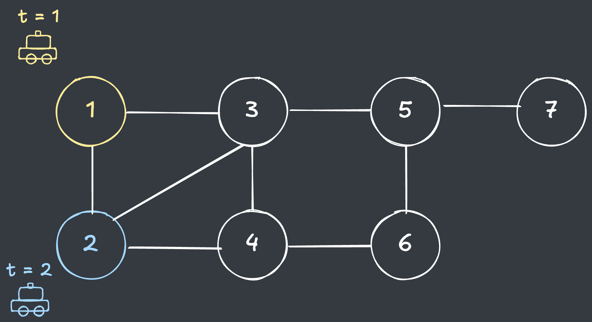
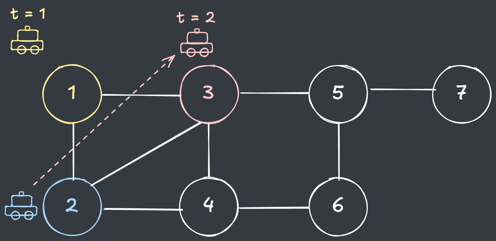
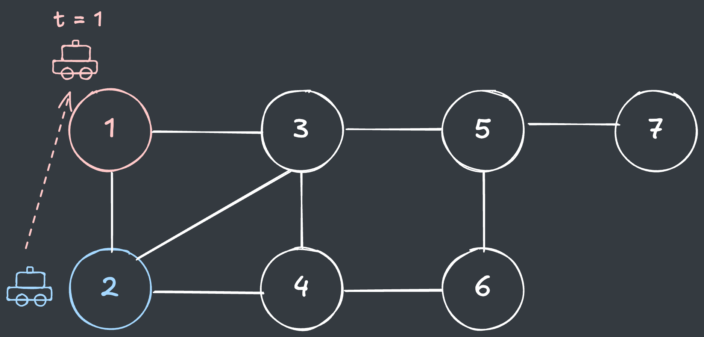
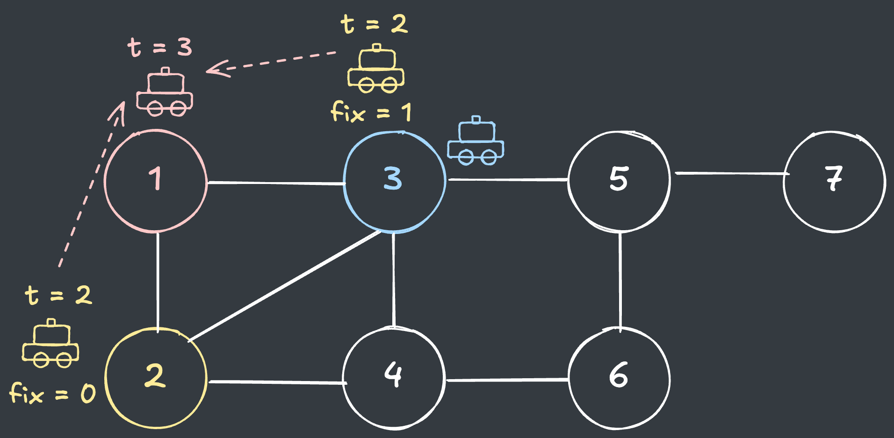
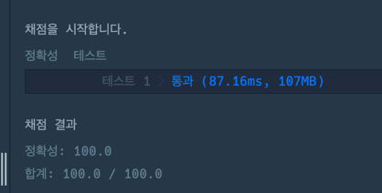

## 출처

- [프로그래머스 GPS(2017 카카오코드 본선)](https://school.programmers.co.kr/learn/courses/30/lessons/1837)

## 접근

### 문제 분석

오류가 발생한 택시의 경로를 최소한으로 수정하여 정확한 이동 경로를 구하는 문제입니다.

- 우선, 택시의 이동을 표현하기 위한 그래프 구조가 필요합니다.
- 문제에서 최소한으로 이동하는 경로를 찾기 위해서는 갈 수 있는 모든 경로에 대해 완전탐색을 수행해야 합니다.

### 시간복잡도 분석

#### 완전탐색

전체 경우의 수를 `BFS` 또는 `DFS`를 활용해서 **제한시간 내 목적지까지 갈 수 있는 모든 경로를 찾아서** 주어진 경로와의 차이를 비교하는 방법이 있습니다.

- 이러한 경우, 한 거점에서 다음 거점으로 이동하는 경우의 수는 `정점과 연결된 간선(m)`만큼 곱해지게 됩니다.

> 정점(`n = 200`)과 간선(`m = 10,000`)이 균일하게 연결된 그래프로 가정하면 한 정점에 연결된 간선의 수가 `50개`이기 때문에, <br>
> 전체 경우의 수는 정점 1개에 `50개`씩 증가하여 `O(N) = 50 ^ 200`이 됩니다.

- 따라서, 단순한 완전탐색으로는 전체 경우의 수를 모두 확인할 수 없음을 알 수 있습니다.

> 완전탐색을 최적화하는 기법이 필요함을 알 수 있습니다.

## 풀이

### DP

문제의 요구사항은 도착 지점까지 수정한 오류의 개수의 최솟값을 구하는 것입니다.

- 즉, 위의 완전탐색에서 모든 경로를 탐색하는 것은 불필요하며, **각 거점에서 수정한 오류의 최솟값**을 알 수 있다면 다음 거점에서의 최솟값을 구할 수 있습니다.

> 이전 값을 다음 탐색에 활용하는 `DP` 알고리즘을 적용할 수 있습니다.

문제의 예시를 통해 살펴보겠습니다.

- `t = 2`일 때 2번 거점의 오류수정 횟수의 최솟값을 구해보겠습니다.

  

  - 문제에서 주어진 택시 경로 상, `t = 2`일 때 택시는 원래 2번 거점에 있어야 합니다.
  - 따라서 2번 거점은 1번 거점에서 오류수정 없이 이동이 가능합니다.

  > 문제에서 **주어진 경로에 있는 정점**은 `이전 위치의 값을 그대로 사용`할 수 있습니다.

- 이번에는 `t = 2`일 때 3번 거점의 오류수정 횟수의 최솟값을 구해보겠습니다.

  

  - 문제에서 주어진 택시 경로 상, `t = 2`일 때 택시는 원래 2번 거점에 있어야 합니다.
  - 따라서 3번 거점은 1번 거점에서 1회 오류수정을 해야 이동할 수 있습니다.

  > 문제에서 **주어진 경로가 아닌 정점**은 `이전 위치의 값에서 오류수정이 1회` 필요합니다.

- 이번에는 `t = 2`일 때 1번 거점의 오류수정 횟수의 최솟값을 구해보겠습니다.
  
  

  - 문제에서 주어진 택시 경로 상, `t = 2`일 때 택시는 원래 2번 거점에 있어야 합니다.
  - 따라서 1번 거점은 1번 거점에서 1회 오류수정을 해야 이동할 수 있습니다.

  > 택시가 이전 위치에 그대로 있는 경우도 있음을 유의합니다.

규칙성을 좀 더 명확히 찾기 위해 `t = 3`인 상황을 확인해보겠습니다.

- `t = 3`일 때 1번 거점

  

  - `t = 3`일 때 택시는 원래 3번 거점에 있어야 합니다.(`오류수정 1회 필요`)
  - 1번 거점에서 이동 시 : `t = 2`일 때 1번 거점의 값인 `1` + 오류수정 `1`회 => `2`
  - 2번 거점에서 이동 시 : `t = 2`일 때 2번 거점의 값인 `0` + 오류수정 `1`회 => `1`
  - 3번 거점에서 이동 시 : `t = 2`일 때 3번 거점의 값인 `1` + 오류수정 `1`회 => `2`

  > 문제에서 최솟값만 필요하기 때문에, `2번 거점에서 1번 거점으로 이동`하는 `1`만 저장합니다.

위와 같은 방식으로 `특정 시간에 특정 거점의 오류수정 횟수의 최솟값`을 DP에 저장하여 완전탐색을 최적화할 수 있습니다.
> 오류수정으로 도달할 수 없는 경우 `-1`을 반환해야 함을 주의합니다.

## 코드

```java
import java.util.*;

class Solution {
    public int solution(int n, int m, int[][] edge_list, int k, int[] gps_log) {

        // 그래프(간선 리스트) 생성
        List<Integer>[] adjList = new List[n + 1];
        for (int i = 0; i < m; i++) {
            int from = edge_list[i][0], to = edge_list[i][1];
            if (adjList[from] == null) adjList[from] = new ArrayList<>(List.of(from));
            if (adjList[to] == null) adjList[to] = new ArrayList<>(List.of(to));
            adjList[from].add(to);
            adjList[to].add(from);
        }

        // DP 생성 및 초기화 : i : 시간, j : 거점, DP[i][j] -> 'i'시간에 'j'거점에 도착할 수 있는 최소 오류수정 횟수 
        int[][] dp = new int[k][n + 1];
        Arrays.stream(dp).forEach(d -> Arrays.fill(d, Integer.MAX_VALUE));
        dp[0][gps_log[0]] = 0;

        // DP 완전탐색
        for (int i = 1; i < k; i++) {
            for (int j = 1; j <= n; j++) {

                // 이전 거점이 도달할 수 없는 위치이면 통과
                if (dp[i - 1][j] == Integer.MAX_VALUE) continue;

                // 간선리스트 탐색
                for (int next : adjList[j]) {

                    // 택시 경로에 위치한 경우 : 이전 경로 값의 최솟값 사용
                    if (next == gps_log[i]) dp[i][next] = Math.min(dp[i][next], dp[i - 1][j]);

                        // 택시 경로에 위치하지 않은 경우 : 이전 경로 값의 최솟값 + 1 사용
                    else dp[i][next] = Math.min(dp[i][next], dp[i - 1][j] + 1);
                }
            }
        }

        // 마지막 거점의 최소 오류수정 횟수 반환
        int answer = dp[k - 1][gps_log[k - 1]];

        // 도달할 수 없으면 -1 반환
        return answer == Integer.MAX_VALUE ? -1 : answer;
    }

}
```

## 결과

- 소요시간 : 1시간 초과 + 풀이 검색



## 리뷰

최단경로(BFS)로 풀어보다가 문제의 테스트 케이스가 1개밖에 없어서 헤매다가 결국 [공식 풀이](https://tech.kakao.com/posts/342)를 일부 참고했습니다.
> DP 문제는 다양한 유형을 접해보는 수밖에 없는 것 같습니다.

## References

| URL                              | 게시일자        | 방문일자        | 작성자     |
|:---------------------------------|:------------|:------------|:--------|
| https://tech.kakao.com/posts/342 | 2017.09.13. | 2025.02.18. | bryan.j |
