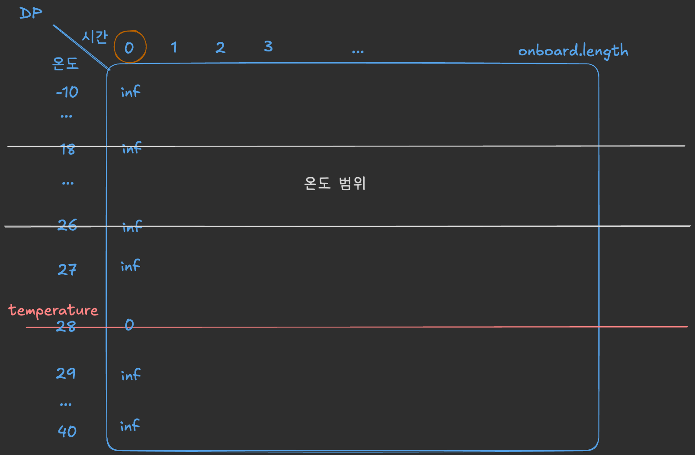
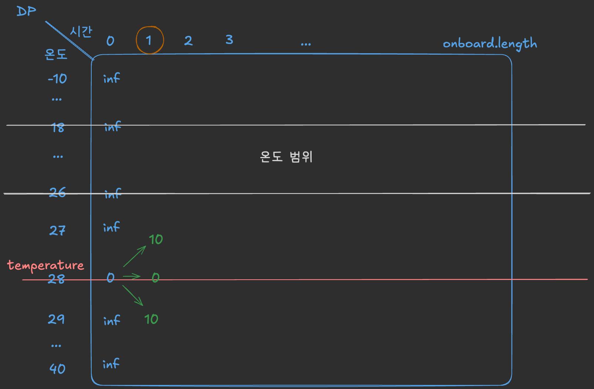
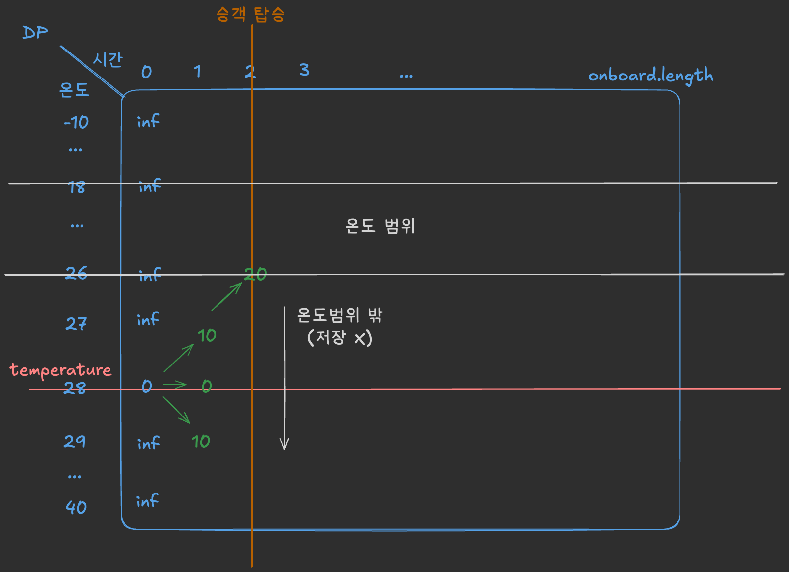
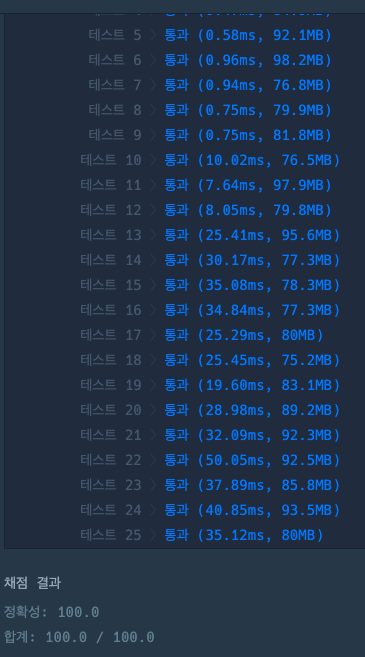

## 출처

- [에어컨](https://school.programmers.co.kr/learn/courses/30/lessons/214289)

## 접근

### 문제 분석

에어컨을 켜서 온도를 설정하거나, 끄면서 차량의 온도를 조절하는데 최소의 비용이 들 수 있도록 해야 합니다.
> 탑승객이 존재할때만 온도가 유지되면 됩니다.

### 시간복잡도 분석

- 온도의 범위는 `-10 <= temperature <= 40`로, 전체 범위를 확인하는데 많은 시간복잡도가 필요하지 않습니다.
- 전체 탑승객의 정보(시간)인 `onboard`의 길이는 `2 <= onboard.length <= 1,000`으로, 전체 시간을 탐색하는데 `O(N^3)`의 알고리즘까지 사용이 가능합니다.
  > 다만 온도 범위를 모두 탐색하는 것까지 고려하면 O(N^3)이하의 알고리즘이 필요합니다.
- 대부분의 완전탐색 알고리즘을 통해 문제를 해결할 수 있음을 알 수 있습니다.

### 공간복잡도 분석
- 시간복잡도와 마찬가지로, 공간복잡도는 고려하지 않아도 될 정도로 주어진 변수의 범위가 작은 편입니다.

## 풀이

### DP

- 완전탐색을 구현하기 위해 DP를 사용했습니다.

> `DFS`로도 가지치기만 잘하면서 백트래킹하면 시간복잡도 내에 가능할 것으로 보이지만, `DP`가 구현이 더 쉽고 직관적이기 때문에 `DP`로 풀이했습니다.

- DP배열을 다음과 같이 정의합니다.

> DP[i][j] : 해당 시간[i], 온도[j]에서 사용한 소비전력의 최솟값 저장

- 최초 DP는 무한대로 초기화한 후, 외부온도를 0(소비전력 없음)으로 초기화합니다.
  

- 이제 전체 시간을 탐색하면서 이전 온도로부터 다음 온도를 몇 도로 설정할지 확인해서 DP를 최신화합니다.
  

- 승객이 타고있지 않을때는 괜찮지만, 승객이 타면 주어진 온도 범위에 포함된 값들만 남겨야 합니다.
  

### 주의사항 

1. 에어컨을 켜지 않는 경우도 있음을 주의합니다.
2. 탑승객이 탑승하지 않았을 때는 주어진 온도 범위에 포함되지 않아도 됩니다.

## 코드

```java
import java.util.*;

class Solution {

    final int inf = Integer.MAX_VALUE;

    public int solution(int temperature, int t1, int t2, int a, int b, int[] onboard) {
        int len = onboard.length;

        // DP[i][j] : 해당 시간[i], 온도[j]에서 사용한 소비전력의 최솟값 저장
        int[][] dp = new int[len][51];

        // DP 초기화
        Arrays.stream(dp).forEach(d -> Arrays.fill(d, inf));
        dp[0][temperature + 10] = 0;

        // 전체 시간 확인(i : 시간)
        for (int i = 1; i < len; i++) {

            // 탑승객 탑승여부
            boolean boarding = onboard[i] == 1;

            // 전체 온도 탐색(j : 이전 시간의 온도)
            for (int j = -10; j <= 40; j++) {

                if (dp[i - 1][j + 10] == inf) continue;

                /* 에어컨 켜기 */

                // 에어컨 온도 설정(k : 다음 설정온도)
                for (int k = -10; k <= 40; k++) {

                    // 설정온도가 이전 온도보다 큰지 확인해서 다음온도 결정
                    int temp = j == k? j : j > k? j - 1 : j + 1;
                    if (boarding && (temp < t1 || temp > t2)) continue;

                    // 다음 온도가 이전 온도와 같은지 확인해서 비용 결정
                    int cost = temp == j? b : a;

                    // DP에 비용 최솟값 저장
                    dp[i][temp + 10] = Math.min(dp[i - 1][j + 10] + cost, dp[i][temp + 10]);
                }

                /* 에어컨 끄기 */

                // 에어컨 껐을 때의 온도 변화 결정
                int temp = j == temperature? j : j > temperature? j - 1 : j + 1;
                if (boarding && (temp < t1 || temp > t2)) continue;

                // DP에 비용 최솟값 저장
                dp[i][temp + 10] = Math.min(dp[i - 1][j + 10], dp[i][temp + 10]);
            }

        }

        // 마지막 DP의 온도 돌면서 비용 최솟값 선택
        int answer = inf;
        for (int i = -10; i <= 40; i++) {
            answer = Math.min(dp[len - 1][i + 10], answer);
        }

        return answer;
    }
}
```

## 결과



## 리뷰

DP를 잘 활용하면 풀 수 있는 문제였습니다.
> DP는 처음 어떤 값을 저장할지 명확히 정의하는게 중요한 것 같습니다.

## References

| URL | 게시일자 | 방문일자 | 작성자 |
| :-- | :------- | :------- | :----- |
