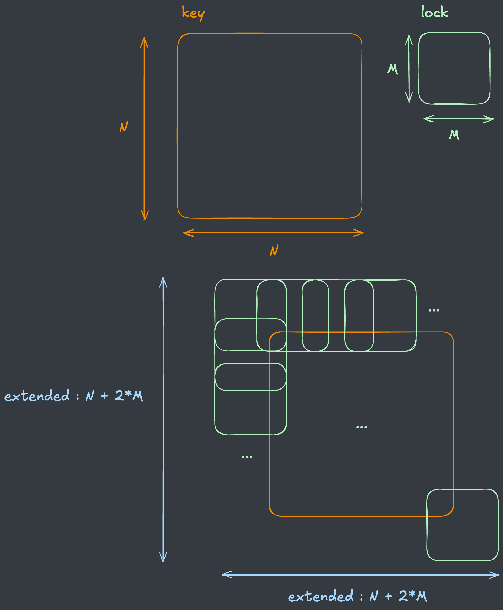
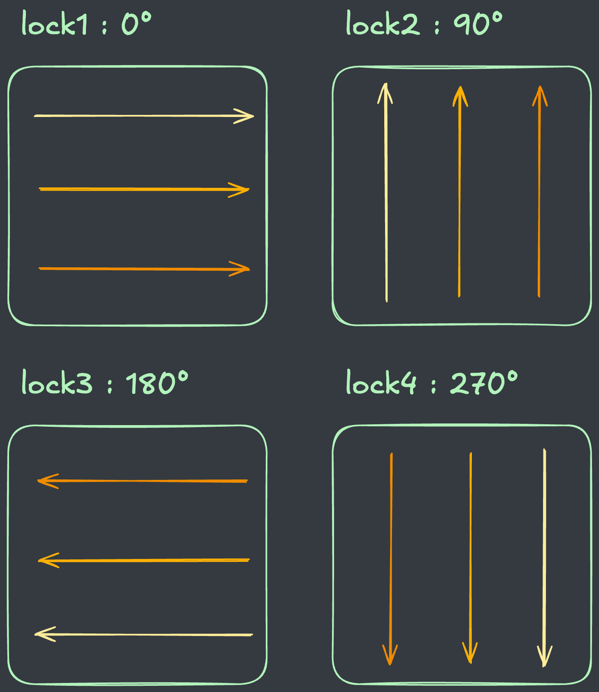
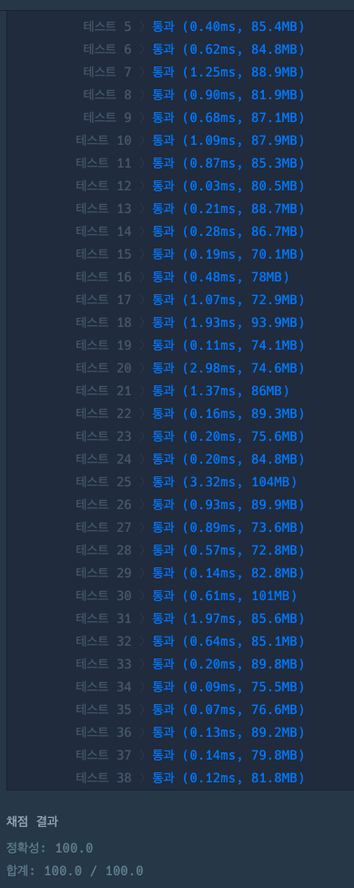

## 출처

- [Programmers 자물쇠와 열쇠(2020 KAKAO BLIND RECRUITMENT)](https://school.programmers.co.kr/learn/courses/30/lessons/60059)

## 접근

### 문제 분석

주어진 자물쇠와 열쇠를 이동시키고 돌려서 맞출 수 있는지 확인하는 문제입니다.

- 열쇠 혹은 자물쇠를 돌리는 로직과, 이동시키는 로직을 구현하면 됩니다.
> 문제에서 주어진 열쇠보다 자물솨의 크기가 작기 때문에, 자물쇠를 이동시키고 돌리는 식으로 구현하는 것이 더 효율적입니다.

- 모든 칸에 대해서 자물쇠를 돌리면서 맞추고, 이동하는 식으로 완전탐색을 진행합니다.

### 시간복잡도 분석

자물쇠와 열쇠의 크기는 `M <= N <= 20`이므로, 전체 칸의 개수는 `M^2 <= N^2 <= 400`입니다. 
> 시간복잡도는 `O(N^4)`이상도 충분하므로, 문제 풀이에 큰 영향을 주지 않습니다.

### 공간복잡도 분석

자물쇠와 열쇠의 크기가 `20`이하이기 때문에, 공간복잡도도 크게 신경쓰지 않아도 됩니다.

## 풀이

### 자물쇠 이동

주어진 시간복잡도 및 공간복잡도가 충분하기 때문에, 열쇠를 자물쇠 크기만큼 확장시킨 뒤 이동하면서 완전탐색을 진행합니다.



```java
public boolean solution(int[][] key, int[][] lock) {

int N = key.length, M = lock.length;

// 자물쇠 만큼 상하좌우로 확장된 키
int[][] keyExtend = new int[N + 2 * M][N + 2 * M];

// 키 내부 채우기
for (int i = M; i < N + M; i++) {
    for (int j = M; j < N + M; j++) {
        keyExtend[i][j] = key[i - M][j - M];
    }
}
}
```

### 자물쇠 돌리기

주어진 자물쇠를 90도씩 돌리면서 탐색하면 회전된 4개의 자물쇠를 얻을 수 있습니다. 



> 실제 구현에서 역방향 원소는 자물쇠의 크기 `M`에서부터 반대로 탐색하는 식으로 구현하였습니다.

```java
// 회전된 자물쇠를 반환하는 메서드
int[][] changeDir(int d, int M, int[][] lock) {
    
    // 정방향은 그대로 반환
    if (d == 0) return lock;
    
    // 회전된 자물쇠 저장
    int[][] ret = new int[M][M];
    for (int i = 0; i < M; i++) {
        for (int j = 0; j < M; j++) {
            
            // 90도 회전 -> i, j 교환, i는 역순 탐색
            if (d == 1) ret[i][j] = lock[j][M - i - 1];

            // 180도 회전 -> i, j 역순 탐색
            else if (d == 2) ret[i][j] = lock[M - i - 1][M - j - 1];

            // 270도 회전 -> i, j교환, j는 역순 탐색
            else ret[i][j] = lock[M - j - 1][i];
        }
    }
    return ret;
}
```

### 자물쇠와 열쇠 비교

자물쇠와 열쇠가 같은 값인지 확인하여, 하나라도 같은 값이 있다면 열쇠와 자물쇠가 맞물리지 않으므로 `false`를 반환하도록 하였습니다.

> 이 때, 열쇠가 자물쇠보다 크기 때문에, 시작점(`r, c`)을 이동하면서 비교하였습니다.

```java
// r, c : 시작점
boolean match(int r, int c, int M, int[][] key, int[][] lock) {
    for (int i = r; i < r + M; i++) {
        for (int j = c; j < c + M; j++) {
            
            // 하나라도 같은 값이 있으면 열쇠-자물쇠 일치하지 않음
            if (key[i][j] == lock[i - r][j - c]) return false;
        }
    }
    
    // 모두 다른 값이면 열쇠-자물쇠 일치
    return true;
}
```

## 코드

```java
import java.util.*;

class Solution {
    
    public boolean solution(int[][] key, int[][] lock) {
        
        int N = key.length, M = lock.length;

        // 크기 확장(N -> N + 2M)
        int[][] keyExtend = new int[N + 2 * M][N + 2 * M];
        for (int i = M; i < N + M; i++) {
            for (int j = M; j < N + M; j++) {
                keyExtend[i][j] = key[i - M][j - M];
            }
        }

        // 자물쇠 4방향 돌리기
        int[][][] locks = new int[4][M][M];
        for (int i = 0; i < 4; i++) {
            locks[i] = changeDir(i, M, lock);
        }
        
        // 4방향 자물쇠 정답 확인
        for (int i = 0; i < N + M; i++) {
            for (int j = 0; j < N + M; j++) {
                for (int d = 0; d < 4; d++) {
                    if (match(i, j, M, keyExtend, locks[d])) return true;    
                }
            }
        }
        
        return false;
        
    }
    
    // 90도씩 회전된 자물쇠 반환
    int[][] changeDir(int d, int M, int[][] lock) {
        
        if (d == 0) return lock;
        
        int[][] ret = new int[M][M];
        
        for (int i = 0; i < M; i++) {
            for (int j = 0; j < M; j++) {
                if (d == 1) ret[i][j] = lock[j][M - i - 1];
                else if (d == 2) ret[i][j] = lock[M - i - 1][M - j - 1];
                else ret[i][j] = lock[M - j - 1][i];
            }
        }
        return ret;
    }

    // 열쇠와 자물쇠 맞물리는지 확인
    boolean match(int r, int c, int M, int[][] key, int[][] lock) {
        for (int i = r; i < r + M; i++) {
            for (int j = c; j < c + M; j++) {
                if (key[i][j] == lock[i - r][j - c]) return false;
            }
        }
        return true;
    }
    
}
```

## 결과

- 소요 시간 : 28분



## 리뷰

- 주어진 자물쇠와 열쇠의 크기가 크지 않아서 어렵지 않게 구현할 수 있었습니다.
> `N, M`의 크기가 커서 시간초과가 발생했더라면 최적화하는데 많이 애먹었을 것 같습니다.

## References

| URL | 게시일자 | 방문일자 | 작성자 |
| :-- | :------- | :------- | :----- |
