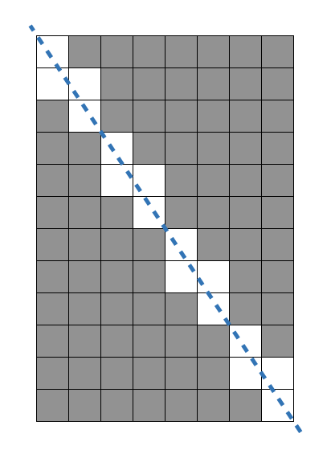
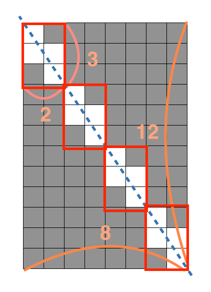
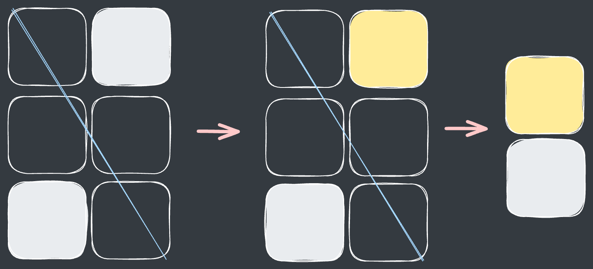
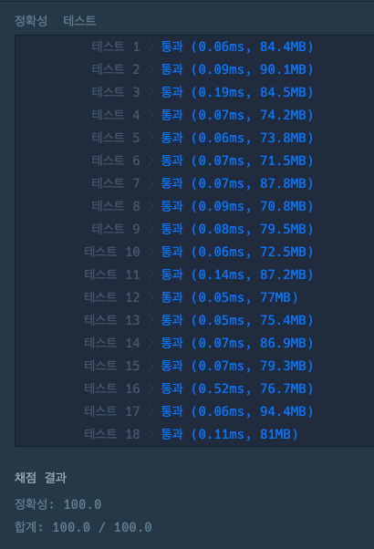
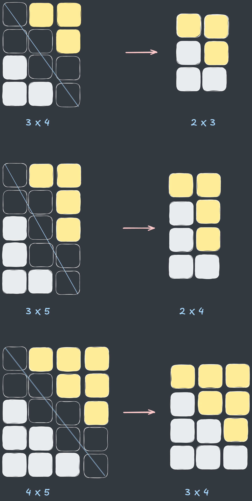

## 출처

- [프로그래머스 멀쩡한 사각형](https://school.programmers.co.kr/learn/courses/30/lessons/62048)

## 접근

규칙을 알고 나면 구하기 쉽지만, 모르면 생각보다 까다로운 문제입니다.

### 규칙 구하기

주어진 예시 (`w = 8, h = 12`)에 대해 규칙을 확인해보겠습니다. 



- 문제의 예시를 자세히 보면 작은 사각형이 반복되는 것을 알 수 있습니다.



> `w = 8`과 `h = 12`의 최대공약수인 `4`개의 사각형이 생성됩니다.

- 즉, 최대공약수로 해당 길이를 나누었을 때 생성된 작은 사각형의 잘린 개수를 구하면 됩니다.

- 최대공약수로 나눠진 사각형(`nw x nh = 2 x 3`)의 잘린 개수는 다음과 같이 구할 수 있습니다.


1. 잘리지 않은 사각형을 자른 선 기준으로 구분합니다.(위 : 노랑, 아래 : 하양)
2. 잘리지 않은 사각형끼리 직사각형 형태로 모읍니다.
3. 잘리지 않은 사각형의 크기는 기존 사각형보다 1씩 작은 크기가 됩니다.

    `남은 사각형 : (nw - 1) x (nh - 1) = 1 x 2`

    > 다른 형태의 사각형을 여러 개 그려보면서 잘라보면 해당 규칙을 쉽게 발견할 수 있습니다.[^1]

4. 따라서 전체 잘린 사각형의 크기는 다음과 같이 구할 수 있습니다.

   `잘린 사각형 = 나눠진 사각형 - 잘리지 않은 사각형`
    
    ` =  (nw x nh) - (nw - 1) * (nh - 1)`

    ` =  (nw * nh) - (nw * nh - nw - nh + 1)`

    ` = (nw + nh - 1)`

### 유클리드 호제법

[유클리드 호제법](https://ko.wikipedia.org/wiki/%EC%9C%A0%ED%81%B4%EB%A6%AC%EB%93%9C_%ED%98%B8%EC%A0%9C%EB%B2%95)은 최대공약수를 빠르게 구할 수 있는 알고리즘입니다.

- 정수 `a, b`에 대하여 두 수의 최대공약수를 `(a, b)`라고 표현하면 아래 식이 성립합니다.

  **`(a, b) = (b, a % b)`**

> 증명은 위 위키백과 링크에 자세히 정리되어 있으니 필요하시면 참고하시기 바랍니다!

- 위 문제의 예시에서 `w = 8, h = 12`이므로, 두 수의 최대공약수를 다음과 같이 구할 수 있습니다.

  `(8, 12) = (8, 12 % 8) = (8, 4)`

  `(8, 4) = (8 % 4, 4) = (0, 4)`

  `∴ (8, 12) = 4`

- 위 과정을 일반화하여 코드로 나타내면 다음과 같이 재귀적으로 표현할 수 있습니다.
  
  ```java
  int getGcd(int w, int h) {
      // 피제수가 0이면 나머지 숫자가 최대공약수
      if (h == 0) return w;
    
      // 유클리드 호제법으로 재귀호출
      return getGcd(h, w % h);
  }
  ```

> 나머지 연산 과정에서 최대 `log(N)` 씩 피제수가 감소하므로, 시간복잡도는 `O(log N)`가 됩니다.

## 풀이

- 소요시간 : 1:08:00

```java
class Solution {
    public long solution(int w, int h) {
        int d = getGcd(w, h);
        int nw = w / d, nh = h / d;
        return (long)w * h - (nw + nh - 1) * d;
    }
    
    int getGcd(int w, int h) {
        if (h == 0) return w;
        return getGcd(h, w % h);
    }
}
```

## 결과

- 소요 시간 : 01:08:53



## 리뷰

규칙을 구하는데 너무 오래 걸렸고, 유클리드 알고리즘도 오랜만에 쓰려다 보니 생각이 안나서 위키백과를 참고했습니다.
> 유클리드 알고리즘을 모르면 시간복잡도 내 풀 수 없는 문제들도 있으니, 만날 때마다 한번씩 사용해보는게 중요한 것 같습니다.

## References

| URL | 게시일자       | 방문일자        | 작성자       |
| :-- |:-----------|:------------|:----------|
|[유클리드 호제법](https://ko.wikipedia.org/wiki/%EC%9C%A0%ED%81%B4%EB%A6%AC%EB%93%9C_%ED%98%B8%EC%A0%9C%EB%B2%95)| 2024.10.22 | 2024.12.23. | Wikipedia |

[^1]: `3 x 4, 3 x 5, 4 x 5`인 사각형 중 잘리지 않은 크기는 다음과 같습니다.
      