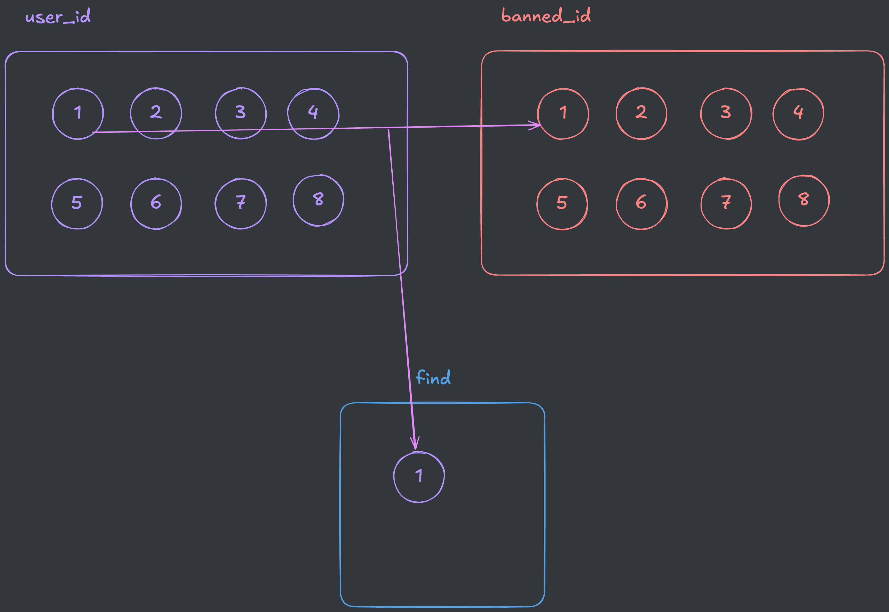
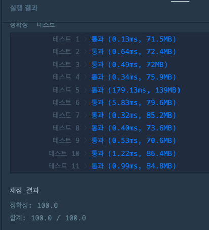

## 출처

- [Programmers 불량 사용자(2019 카카오 개발자 겨울 인턴십)](https://school.programmers.co.kr/learn/courses/30/lessons/64064)

## 접근

### 문제 분석

주어진 응모자 아이디에서 불량 사용자가 될 수 있는 모든 경우를 탐색하는 `완전탐색(Brute Force)` 문제입니다. 

### 시간복잡도 분석

- 주어진 사용자 아이디와 조합의 개수가 `n <= 8` 이므로, 모든 경우를 선택하는 시간복잡도는 불량 사용자 조합의 크기인 `8! = 40,302` 가 됩니다.

- 또한, 모든 사용자와 조합을 각각 1회씩 비교할 경우 시간복잡도는 `8 x 8 = 64`입니다.

- 따라서 완전탐색을 구현하기만 하면 시간복잡도는 충분함을 알 수 있습니다.

## 풀이

### 완전탐색(DFS)

가장 빠르게 완전탐색을 구현할 수 있는 `DFS`를 활용하겠습니다.

다음과 같이 1번 사용자 아이디부터 순차적으로 불량 사용자 아이디와 비교하면서, 해당 사용자를 조합에 추가합니다.



### 조합 중복 방지(Set)

문제에서 `나열된 순서와 관계없이 아이디 목록의 내용이 동일하다면 같은 것으로 처리`하라는 조건이 있으므로, 아이디 목록의 중복을 방지해야 합니다.

> 아이디 목록을 정렬한 뒤, Set 자료구조를 사용하여 저장하면 중복을 방지할 수 있습니다.

## 코드

```java
import java.util.*;

class Solution {

    // 중복 방지를 위한 조합(Set)
    Set<String> answers = new HashSet<>();
    
    public int solution(String[] user_id, String[] banned_id) {
        
        // 추후 리스트 복사를 위해 변경
        List<String> bannedId = Arrays.asList(banned_id);
        
        // 아이디 목록 정렬(나열 순서 변경 방지)
        Arrays.sort(user_id);
        
        // 완전탐색
        dfs(user_id, bannedId, new ArrayList<>(), 0);
        
        return answers.size();
    }
    
    void dfs(String[] userId, List<String> bannedId, List<String> find, int now) {
        
        // 전체 불량 사용자 확인 시 정답에 추가
        if (bannedId.isEmpty()) {
            
            // 정렬된 상태이기 때문에 리스트의 toString() 그대로 키로 사용
            answers.add(find.toString());    
            return;
        }
        
        // 탐색 종료조건
        if (now == userId.length) return;
        
        String cur = userId[now];
        
        // 현재 탐색중인 사용자가 불량 사용자 리스트에 포함되는지 확인
        for (int i = 0; i < bannedId.size(); i++) {
            
            // 같은 사용자인지 확인
            if (eq(cur, bannedId.get(i))) {
                
                // 탐색된 사용자 정답 리스트에 추가
                find.add(cur);
                
                // 배열 깊은복사 후 탐색된 불량 사용자 리스트 제거
                List<String> temp = new ArrayList<>(bannedId);
                temp.remove(i);
                
                // DFS 수행
                dfs(userId, temp, find, now + 1);
                
                // 복귀 후 백트래킹을 위해 탐색된 사용자 제거
                find.remove(find.size() - 1);
            }
        }
        
        // 현재 탐색중인 사용자 패스(완전탐색)
        dfs(userId, bannedId, find, now + 1);
    }
    
    // 같은 사용자인지 확인
    /* 다음 정규표현식으로도 가능
        cur.matches(bannedId.get(i).replace("*", "."))
     */
    boolean eq(String a, String b) {
        if (a.length() != b.length()) return false;
        for (int i = 0; i < a.length(); i++) {
            if (b.charAt(i) == '*') continue;
            if (a.charAt(i) != b.charAt(i)) return false;
        }
        return true;
    }
}
```

## 결과



## 리뷰

완전탐색을 할 수 있는지와 두 문자열을 비교할 수 있는지 묻는 백트래킹 문제였습니다.

> 완전탐색 로직을 잘못 작성해서 시간초과가 발생했는데[^1], 재귀적으로 호출되는 함수가 불필요한 동작을 하고 있지는 않은지 잘 판단해야겠습니다.

## References

| URL | 게시일자 | 방문일자 | 작성자 |
| :-- | :------- | :------- | :----- |

[^1]: 다음은 완전탐색 과정에서 시간초과가 발생한 코드입니다.

    ```java
    void dfs(String[] userId, List<String> bannedId, List<String> find, int now) {

        if (bannedId.isEmpty()) {
            answers.add(find.toString());    
            return;
        }

        if (now == userId.length) return;
        String cur = userId[now];

        for (int i = 0; i < bannedId.size(); i++) {

            if (eq(cur, bannedId.get(i))) {

                find.add(cur);

                List<String> temp = new ArrayList<>(bannedId);
                temp.remove(i);

                dfs(userId, temp, find, now + 1);

                find.remove(find.size() - 1);
            }

            // 시간초과 발생(For문 내부에서 중복 재귀호출 발생)
            else dfs(userId, bannedId, find, now + 1);
        }
    }
    ```