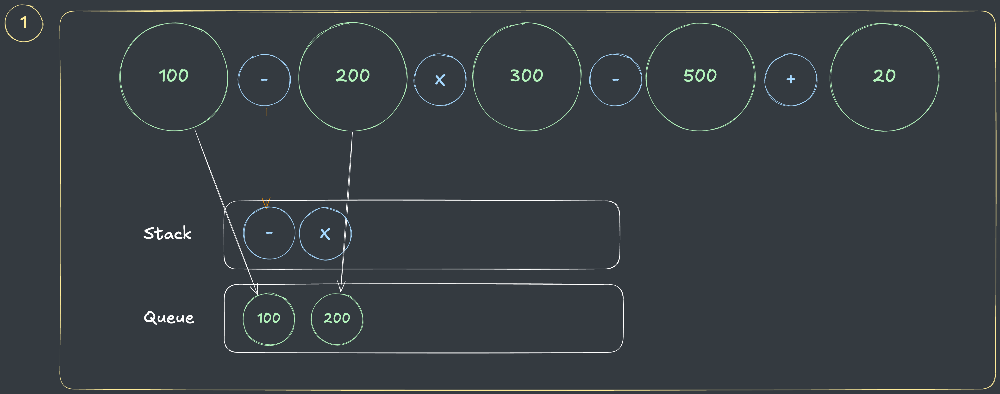
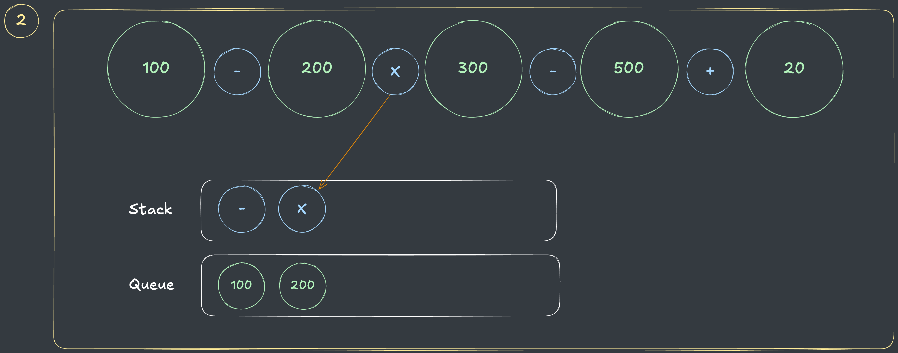
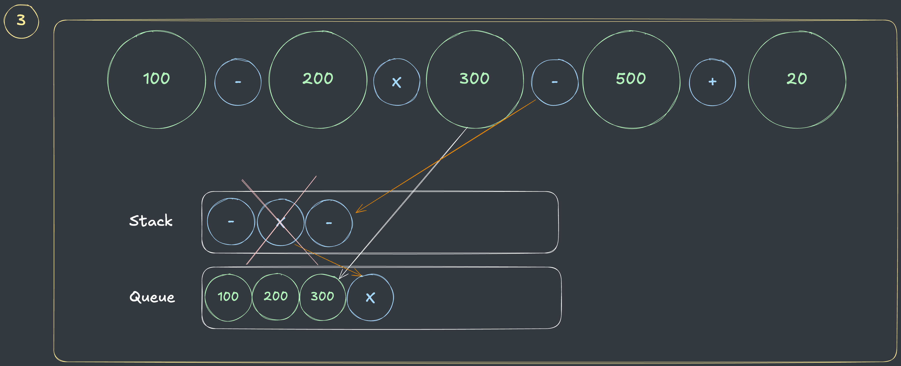
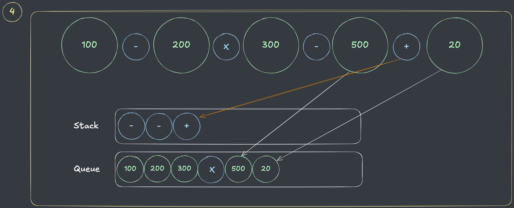
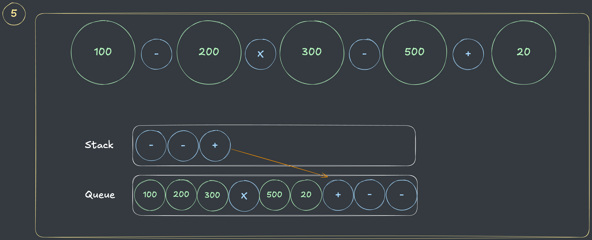
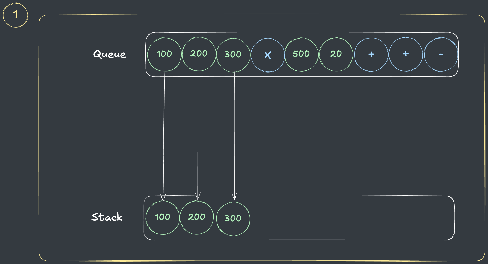
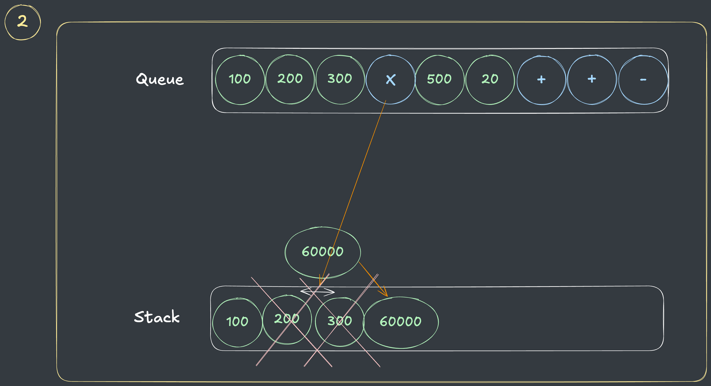
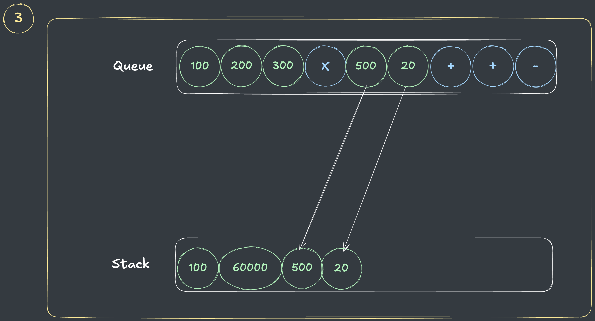
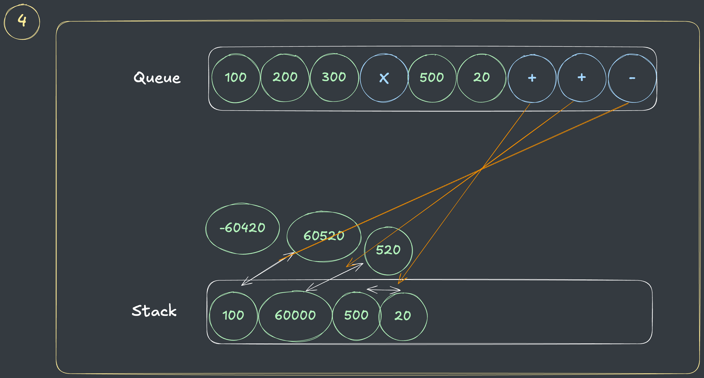
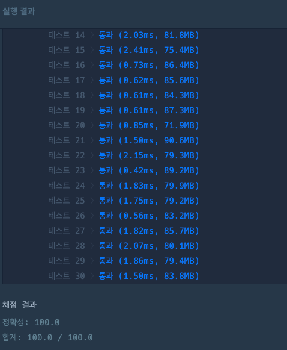

## 출처

- [수식 최대화(2020 KAKAO Internship)](https://school.programmers.co.kr/learn/courses/30/lessons/67257)

## 접근

### 완전탐색(DFS)

각 연산자의 우선순위를 변경하면서 전체 탐색을 하고, 변경된 우선순위마다 수식을 계산해서 최댓값을 갱신합니다.

- 연산자 순서에 따라 결과가 달라지므로, 순열(Permutation)에 해당합니다.

> 다양한 구현방법이 있지만, 개인적으로 다양한 조건을 만족하는 순열(조합)을 빠르게 구현할 수 있는 `DFS`를 선호합니다.

- 3가지 연산자만 있으므로, 모든 경우의 수를 구해도 `6가지`이기 때문에 시간복잡도는 충분합니다.

### 후위 표기 변환(InFix to PostFix)

- 보통 사람이 계산을 할 때는 `A + B * C`의 형태로 수식을 써서 계산을 합니다. 이 때, A와 B 사이에 연산자가 있는 형태를 [**중위 표기(InFix)**](https://ko.wikipedia.org/wiki/%EC%A4%91%EC%9C%84_%ED%91%9C%EA%B8%B0%EB%B2%95)라고 합니다.

- 그러나, 컴퓨터는 이러한 계산을 `A B C * +`의 형태로 변환해서 숫자 이후에 연산자가 나오는 형태로 변경한 뒤, 스택에 옮겨 계산하게 됩니다. 이러한 표기법을 [**후위 표기(PostFix)**](https://ko.wikipedia.org/wiki/%EC%97%AD%ED%8F%B4%EB%9E%80%EB%93%9C_%ED%91%9C%EA%B8%B0%EB%B2%95)라고 합니다.

- **후위 표기법**은 연산의 우선순위에 따라 쉽게 수식을 표현하고, 계산할 수 있다는 장점이 있습니다.

> 이번 풀이에서도 이러한 **후위 표기법**을 구현하여 문제를 해결하겠습니다.

- **중위 표기 -> 후위 표기의 변환과정** (**Infix -> Postfix**)을 자세히 살펴보면 다음과 같습니다.
  1. 결과를 담을 큐와 연산자를 임시 저장할 스택을 정의합니다.
  2. 중위 표기에서 숫자가 나오면 바로 큐에 삽입합니다.
  3. 중위 표기에서 연산자가 나오면 다음 절차를 수행합니다.
    1. 현재 저장된 스택에 현재 연산자보다 우선순위가 큰 연산자가 나올때까지 스택을 비웁니다.
    2. 현재 연산자를 스택에 저장합니다.
  4. 모든 중위 표기 원소를 확인한 후, 스택이 비어있지 않다면 해당 연산자들을 순차적으로 큐에 삽입합니다.

- 위 과정을 그림과 함께 순서대로 보겠습니다.
  > 아래는 문제에서 주어진 1번 예제에서 정답인 <br>`(우선순위 : X -> + -> -)`의 답을 구하는 과정입니다.

  
  - 숫자`(100, 200)`들은 큐에 바로 담고, 첫번째 연산자인 `-`는 스택이 비었으므로 바로 담습니다.

  
  - 두번째 연산자인 `X`는 스택에 담고, 해당 연산자보다 우선순위가 큰 연산자는 없으므로, 스택에서 연산자를 제거하지 않습니다.

  
  - 숫자 `300`은 바로 큐에 담고, 세번째 연산자인 `-`를 스택에 담는 과정에서 해당 연산자보다 우선순위가 큰 연산자인 `X`를 큐에 담습니다.

  
  - 나머지 숫자 `(500, 20)`를 큐에 담고, 네번째 연산자인 `+`를 담는 과정에서 스택의 첫번째 연산자(`-`)가 해당 연산자보다 우선운위가 작으므로 스텍에서 연산자를 제거하지 않습니다.

  
  - 중위 표기의 모든 원소를 확인했는데, 스택이 아직 비어있지 않으므로 스택의 모든 연산자를 큐에 추가합니다.

### 후위 표기 계산

후위 표기를 계산할 때는 숫자들을 임시 저장할 스택을 생성하고, 완료된 숫자들을 저장하면서 계산합니다.

- **후위 표기법의 계산 과정**을 자세히 살펴보면 다음과 같습니다.
  1. 숫자를 임시 저장할 스택을 정의합니다.
  2. 숫자가 나오면 스택에 담습니다.
  3. 연산자가 나오면 스택에서 숫자를 꺼내 계산한 뒤, 다시 스택에 넣습니다.

- 위 과정을 그림과 함께 순서대로 보겠습니다.
  > [위](#후위-표기-변환infix-to-postfix)에서 변환한 큐를 계산하는 과정입니다.

  
  - 연산자가 나올때까지 모든 숫자를 스택에 담습니다.

  
  - 연산자가 나오면 스택에서 2개를 꺼내 계산합니다.

  
  - 다시 연산자가 나올때까지 모든 숫자를 스택에 담습니다.

  
  - 연산자마다 스택에서 2개씩 숫자를 꺼내 계산합니다.

> 문제에서는 계산 결과의 절댓값을 구해야 하므로, 정답인 `60420`을 얻을 수 있습니다.

## 풀이

```java
import java.util.*;

class Solution {

    long answer = 0;
    List<String> exps = new ArrayList<>();

    public long solution(String expression) {
        parse(expression);
        dfs(new char[3], 0, new boolean[4]);
        return answer;
    }

    // 주어진 문자열에서 숫자와 연산자 분리
    void parse(String e) {
        StringBuilder sb = new StringBuilder();
        for (char c : e.toCharArray()) {
            if (c - '0' < 0) {
                exps.add(sb.toString());
                exps.add(new String(new char[]{c}));
                sb = new StringBuilder();
            } else {
                sb.append(c);
            }
        }
        exps.add(sb.toString());
    }

    // 연산자 순열 구하기(3! = 6)
    char[] exp = {'+', '-', '*'};

    void dfs(char[] priority, int now, boolean[] isAdded) {
        if (now == 3) {
            answer = Math.max(answer, calculate(priority));
            return;
        }

        for (char c : exp) {
            if (isAdded[c - '*']) continue;
            isAdded[c - '*'] = true;
            priority[now] = c;
            dfs(priority, now + 1, isAdded);
            isAdded[c - '*'] = false;
        }
    }

    // 숫자 계산
    long calculate(char[] priority) {
        Deque<String> q = infixToPostfix(priority);

        // 숫자들을 임시 저장할 스택
        Stack<Long> temp2 = new Stack<>();
        while (!q.isEmpty()) {
            String e = q.poll();

            // 연산자일 경우 스택에서 2개를 꺼내서 계산 후 결과값 스택으로 이동
            if (e.equals("*") || e.equals("+") || e.equals("-")) {
                long i2 = temp2.pop();
                long i1 = temp2.pop();
                temp2.push(calc(e, i1, i2));

            } else {
                // 숫자는 바로 스택으로 이동
                temp2.push(Long.parseLong(e));
            }
        }

        return Math.abs(temp2.pop());
    }

    // 중위 표기 -> 후위표기 변환
    Deque<String> infixToPostfix(char[] priority) {
        Deque<String> q = new ArrayDeque<>();
        Stack<String> temp = new Stack<>();
        for (String e : exps) {
            if (e.equals("*") || e.equals("+") || e.equals("-")) {

                // 현재 숫자보다 우선순위가 크거나 같은 연산자들을 모두 스택에서 큐로 이동
                while (!temp.isEmpty() && getPriority(priority, temp.peek()) >= getPriority(priority, e)) {
                    q.offer(temp.pop());
                }

                // 현재 연산자 스택에 보관
                temp.push(e);
            } else {

                // 숫자는 바로 큐에 넣기
                q.offer(e);
            }
        }

        // 연산자가 스택에 남아있다면 큐로 이동
        while (!temp.isEmpty()) q.offer(temp.pop());
        return q;
    }

    // 문자열인 계산식과 숫자들을 받아서 계산
    long calc(String c, long i1, long i2) {
        switch (c.charAt(0)) {
            case '+': {
                return i1 + i2;
            }
            case '-': {
                return i1 - i2;
            }
            case '*': {
                return i1 * i2;
            }
        }
        throw new RuntimeException();
    }

    // 우선순위 배열로부터 우선순위 가져옴
    int getPriority(char[] priority, String now) {
        for (int i = 0; i < 3; i++) {
            if (priority[i] == now.charAt(0)) return i;
        }
        return -1;
    }

}
```

## 결과

- 풀이시간 : 2시간 초과



## 리뷰

연산 순서를 정렬하는 로직을 구현하면서 컴퓨터의 연산 과정을 이해하는 데에도 도움이 되는 좋은 문제인 것 같습니다.
> 후위 표기로 변환 후 계산하는 방법을 전에도 배웠는데, 오랜만에 접하니 생각보다 구현이 오래 걸렸습니다. 머릿속 로직을 구현하는 연습을 좀 더 해야할 것 같습니다.

## References

| URL                                                                                                              | 게시일자        | 방문일자        | 작성자       |
|:-----------------------------------------------------------------------------------------------------------------|:------------|:------------|:----------|
| [중위 표기(InFix)](https://ko.wikipedia.org/wiki/%EC%A4%91%EC%9C%84_%ED%91%9C%EA%B8%B0%EB%B2%95)                     | 2024.10.01. | 2024.12.18. | Wikipedia |
| [후위 표기(PostFix)](https://ko.wikipedia.org/wiki/%EC%97%AD%ED%8F%B4%EB%9E%80%EB%93%9C_%ED%91%9C%EA%B8%B0%EB%B2%95) | 2024.06.04. | 2024.12.18. | Wikipedia |