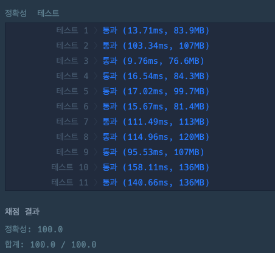

## 출처

- [Programmers 2개 이하로 다른 비트](https://school.programmers.co.kr/learn/courses/30/lessons/77885)

## 접근

### 완전탐색

- 가장 직관적인 풀이는 주어진 숫자를 1씩 증가시키면서 현재 비트와의 개수 차이를 구하는 것입니다.
- 그러나 이렇게 풀이하면 주어진 조건에서 시간복잡도가 초과합니다.
  > `numbers[i] <= 10^15 == 2^50`[^1]이므로 50개의 비트열로 표현되는데, 비트를 비교하는 과정에서 숫자가 1개 증가할 때마다 `50^2 = 2500`의 시간복잡도가 소모됩니다.[^2]

### 규칙성 찾기

- 완전탐색은 불가능하니 두 비트 중 다른 지점이 2개 이하이면서 가장 작은 수를 찾는 규칙을 찾아야 합니다.
- 현재 숫자와 다음 숫자의 이진수의 비트차이가 커지는 순간을 생각해보면, 맨 뒤에서부터 1이 쌓여있을 때 1을 더하면 비트차이가 크게 발생합니다.
  
- 또한, 이렇게 차이가 발생했을 때 비트 차이가 2이하로 줄어들게 하려면 맨 앞에서 두번째까지 0을 1로 채워야 합니다.
  
- 이를 일반화하면, 뒤에서부터 1의 개수를 세고, **처음 0이 나오는 지점과 그 다음지점을 변경**한 값이 정답이 됩니다.
  

### String Utility 사용하기

간편하게 구현하기 위해 Long을 2진수의 String으로 변환한 뒤, 자릿수를 바꾸고 다시 Long으로 변환하는 방식으로 구현하겠습니다.

> 자바에 특화된 구현이긴 하지만, String의 메서드를 활용하는 측면에서 도움이 될 것 같습니다.

1. `Long.toString(l, n)`

- long 타입의 l를 n진수로 변환한 String을 반환합니다.

> `Integer.toString(i, n)`도 가능합니다.

2. `string.lastIndexOf(s)`

- s라는 문자열이 처음 등장하는 위치를 뒤에서부터 찾아서 반환합니다.

3. `string.substring(a, b)`

- a부터 b까지의 부분 문자열을 반환합니다.

> 마지막은 b보다 작은 idx까지임을 주의합니다. `a <= idx < b`

4. `Long.parseLong(s, n)`

- n진수의 s문자열을 long으로 변환합니다.

> 마찬가지로 `Integer.parseInt(s, n)`도 가능합니다.

## 풀이

```java
class Solution {
    public long[] solution(long[] numbers) {

        long[] answer = new long[numbers.length];

        for (int i = 0; i < numbers.length; i++) {

            // 맨앞에 Padding 1개 + 이진수 문자열로 변환
            String s = "0" + Long.toString(numbers[i], 2);

            // 첫번째로 0이 나오는 지점 찾기
            int zero = s.lastIndexOf("0");

            // 2진수 문자열이 나온 지점이 뒤에서 두번째보다 작으면 오류가 발생하므로, 삼항연산자 사용
            answer[i] = (s.length() - zero < 2)?

                // 오류 발생지점(xxx...01, xxx...10)은 현재 크기 + 1만 해주면 정답
                numbers[i] + 1 :

                // 첫번째로 0이 나오는 지점과, 다음 지점을 변환(01 -> 10) 후 long으로 파싱
                Long.parseLong(s.substring(0, zero) + "10" + s.substring(zero + 2), 2);
        }

        return answer;
    }
}
```

## 결과



## 리뷰

문제 아이디어는 금방 떠올렸으나 구현하는데 생각보다 시간이 걸렸습니다.

> String 메서드를 찾아보지 않고 구현했을 때는 for문과 StringBuilder로 온몸비틀기[^3]하며 구현했는데 확실히 편의메서드는 많이 알아두면 좋은 것 같습니다..

## References

| URL | 게시일자 | 방문일자 | 작성자 |
| :-- | :------- | :------- | :----- |

[^1]: `2^10 = 1024`는 약 `10^3` 이므로, `10^15 = (10^3)^5 = (2^10)^5` 입니다.
[^2]: 문제에서 주어진 배열의 길이가 최대 100,000이므로 바로 다음 숫자가 정답이라고 가정해도 `2500 x 100,000 = 250,000,000`으로 시간복잡도를 초과합니다.
[^3]: String 메서드를 사용하기 전 코드입니다.

    ```java
    class Solution {
      public long[] solution(long[] numbers) {
        long[] answer = new long[numbers.length];
        for (int i = 0; i < numbers.length; i++) {
            answer[i] = getAns(numbers[i]);
        }
        return answer;
      }

      long getAns(long l) {
        String s = "0" + Long.toString(l, 2);
        int cnt = 0;
        for (int i = s.length() - 1; i >= 0; i--) {
            if (s.charAt(i) - '0' == 1) cnt++;
            else break;
        }
        if (cnt <= 1) return l + 1;

        int rcnt = s.length() - cnt;

        StringBuilder sb = new StringBuilder();
        for (int i = 0; i < rcnt - 1; i++) sb.append(s.charAt(i));
        sb.append("10");
        for (int i = rcnt + 1; i < s.length(); i++) sb.append(s.charAt(i));

        return Long.parseLong(sb.toString(), 2);
      }
    }
    ```
