## 출처

[프로그래머스 110 옮기기](https://school.programmers.co.kr/learn/courses/30/lessons/77886)

## 접근

### 문제 분석

- 주어진 이진 문자열에서 `110`이라는 문자열을 이동시켜야 하는 문제입니다.
- 문자열에서 `110`을 제거한 뒤, 새로운 위치에 얼마나 빨리 삽입할 수 있는지가 포인트입니다.
- 주어진 문자열의 길이는 `1,000,000`으로, O(N)혹은 O(NlogN) 이내의 시간복잡도를 구현해야 합니다.

## 퓰이

우선 문제에서 주어진대로 `110`을 옮겨야 하기 때문에, 우선 `110`을 모두 제거하고 그 개수를 저장해야 합니다.

#### 110 제거

그러나 문자열에서 `110`을 제거하는 과정이 만만치 않습니다.

- 문자열에서 단순히 `110`이라는 글자를 찾아 삭제하면 끝일 것 같지만, 다음과 같은 경우에는 한번에 끝나지 않습니다.
  - 다음과 같이 문자열이 주어졌다고 가정해보겠습니다.
  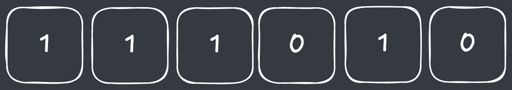
  - 문자열에서 `110`을 제거하면, 다시 `110`이라는 문자열이 나타납니다.
    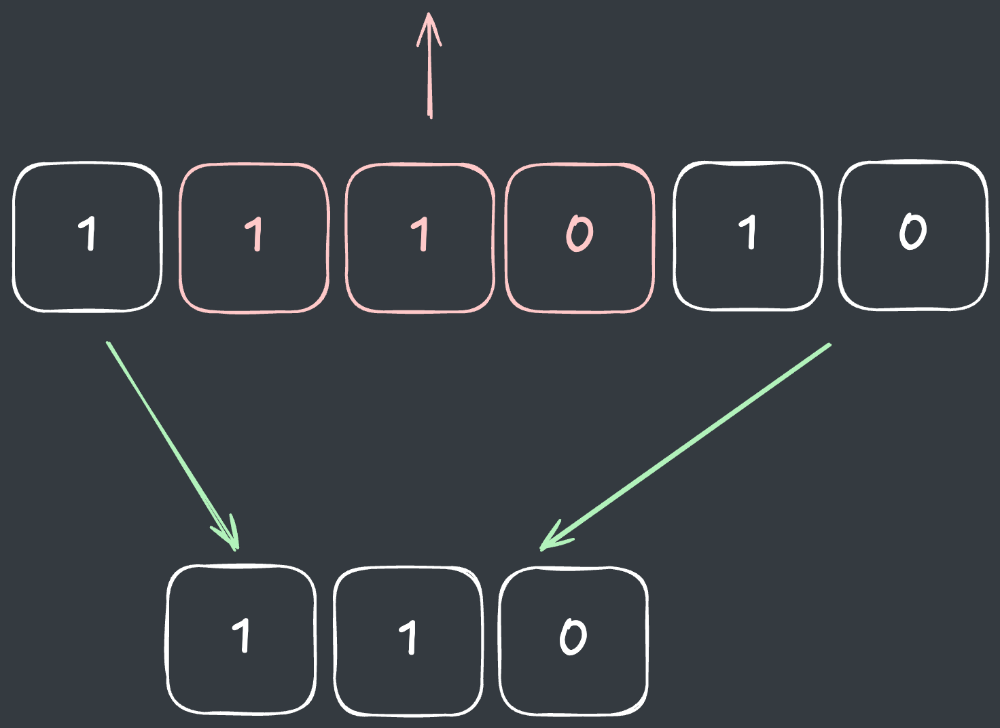
  - 따라서, `문자열에서 110이 나타나지 않을 때까지 110을 제거`해야 합니다.
  > 또한, 단순히 제거만 하는게 아니라 제거한 횟수를 별도로 저장해야 합니다.
  
따라서, 문자열을 앞에서부터 탐색하다가, `110`을 발견하면 해당 문자열을 저장한 뒤 새로운 문자열을 다시 탐색합니다.
> 스택을 사용할 수도 있지만, 여기서는 가변 객체[^1]인 `StringBuilder`를 활용해서 문자열을 제거하겠습니다.

- 다음과 같이 문자열이 주어졌다고 가정하겠습니다.
  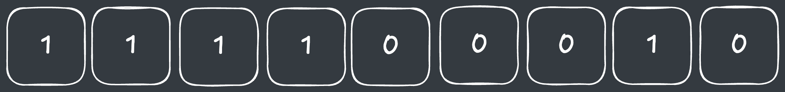
  - 문자열에서 `110`이 나올떄까지 탐색을 합니다.
    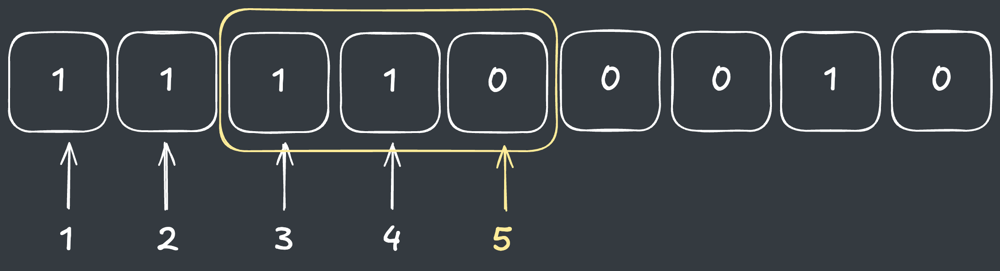
  - 해당 문자열을 제거한 뒤, `4칸 앞으로 이동해서 다시 탐색을 수행합니다.`
    > 4칸 전에서 시작하는 이유는, 해당 위치부터 다시 `110`이 나올 가능성이 생기기 떄문입니다.

    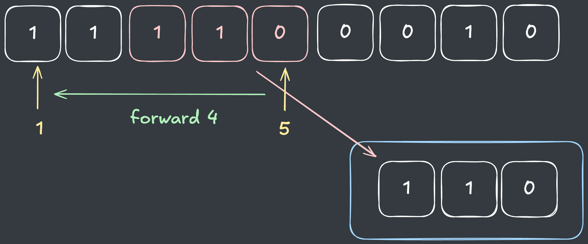

  - 새로운 문자열에서 다시 110이 나올떄까지 탐색합니다.  
    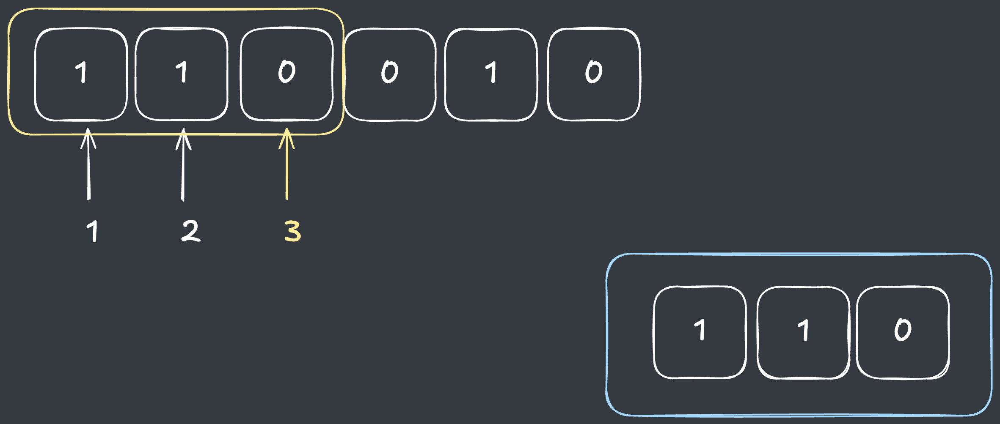
  - 동일하게 해당 문자열을 제거한 뒤 4칸 앞으로 이동해서 다시 탐색을 수행합니다.
  > 그러나 시작점보다 앞으로 갈 수는 없기 때문에 0으로 이동합니다.
    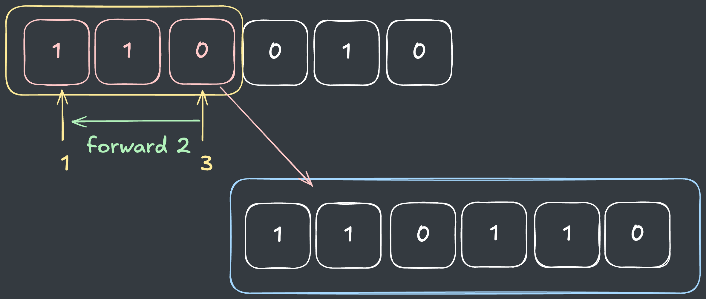
  - 이후 탐색을 마칠 때까지 `110`이 발견되지 않습니다.
    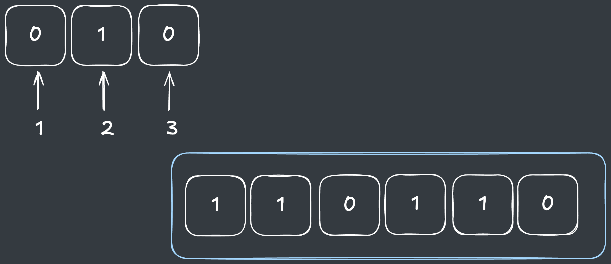

#### Greedy

이렇게 주어진 문자열에서 `110`을 제거했다면, 가장 정렬이 빠른 순서로 만들기 위해 `새로운 위치에 삽입`해야 합니다.
> 정렬했을 때 가장 최적이 되는 위치는 탐욕 알고리즘(Greedy)으로 구할 수 있습니다.

`110`이라는 숫자는 맨 뒤에 `0`이 붙기 때문에 가장 빠른 정렬을 만들기 위해 `1보다는 앞`에 나와야 하지만, `0보다는 뒤`에 나와야 합니다.

따라서, `뒤에서부터 첫번째로 0이 나오는 지점` 바로 뒤에 삽입했을 때가 가장 정렬이 빠른 순서가 됩니다.

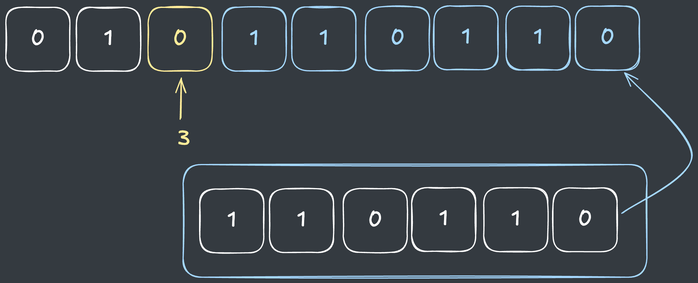

## 코드

```java
import java.util.*;

class Solution {
    public String[] solution(String[] s) {
        String[] answer = new String[s.length];
        
        for (int i = 0; i < s.length; i++) {
            
            // 가변 문자열 생성
            StringBuilder sb1 = new StringBuilder(s[i]);
            
            // 110 임시 저장공간 생성
            StringBuilder sb2 = new StringBuilder();

            // 앞에서부터 110 나올때까지 탐색
            for (int j = 0; j < sb1.length(); j++) {
                if (j >= 2 && sb1.charAt(j) == '0' && sb1.charAt(j - 1) == '1' && sb1.charAt(j - 2) == '1') {
                    
                    // 가변 문자열 제거
                    sb1.deleteCharAt(j);
                    sb1.deleteCharAt(j - 1);
                    sb1.deleteCharAt(j - 2);

                    // 앞에서부터 4칸 혹은 0으로 이동
                    j = Math.max(-1, j - 5);
                    
                    // 임시공간에 저장
                    sb2.append("110");
                } 
            }
            
            // 110을 제거한 새로운 문자열 생성
            String now = sb1.toString();
            
            // 뒤에서부터 0 위치 확인
            int idx = now.lastIndexOf('0');
            
            // 0 위치 바로 뒤에 저장된 110 문자열 추가
            answer[i] = now.substring(0, idx + 1) + sb2.toString() + now.substring(idx + 1, now.length());
        }
        
        return answer;
    }
}
```

## 결과

- 소요시간 : 2시간 초과

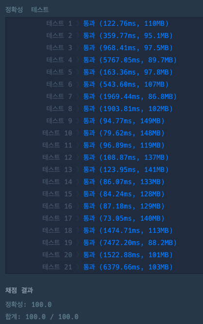

## 리뷰

문제에서 주어진 시간복잡도가 넉넉하지 않아서 불변객체인 `String`을 매번 생성하니 시간초과가 계속 발생했습니다.[^2]

> 다른 언어는 모르겠지만, Java의 경우 언어의 특성을 잘 이해해야 풀 수 있다는 점에서 좋은 연습문제인 것 같습니다. 

이런 문제를 접할 때마다 언어의 패러다임과 그에 대한 이해도도 매우 중요함을 느낍니다. 

## References

| URL | 게시일자 | 방문일자 | 작성자 |
| :-- | :------- | :------- | :----- |

[^1]: Java의 `String`은 `불변객체`이므로, 값이 변경될 때마다 매번 새로운 객체를 생성하는 과정에서 메모리가 많이 소모되지만, `StringBuilder`는 `가변객체`이므로 값이 변경되어도 새로운 객체가 생성되지 않아 값의 변경이 많을 경우 효율적입니다.  

[^2]: 다음은 시간초과가 발생한 코드입니다.
    ```java
    import java.util.*;
    
    class Solution {
        public String[] solution(String[] s) {
            String[] answer = new String[s.length];
            
            for (int i = 0; i < s.length; i++) {
                
                String now = s[i];
                
                StringBuilder sb = new StringBuilder();
                
                for (int j = 0; j < now.length(); j++) {
                    if (now.charAt(j) == '0' && j >= 2 && now.substring(j - 2, j + 1).equals("110")) {
                        
                        // 불변객체인 String 계속 생성
                        now = now.substring(0, j - 2) + now.substring(j + 1, now.length());
                        
                        j = Math.max(-1, j - 5);
                        sb.append("110");
                    } 
                }
                
                int idx = now.lastIndexOf('0');
                
                answer[i] = now.substring(0, idx + 1) + sb.toString() + now.substring(idx + 1, now.length());
            }
            
            return answer;
        }
    }
    ```
    - 제출 결과 
    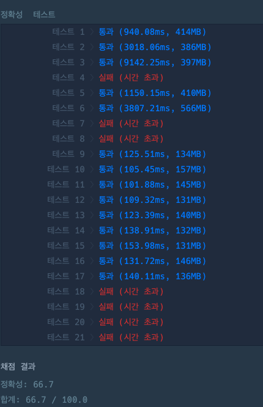