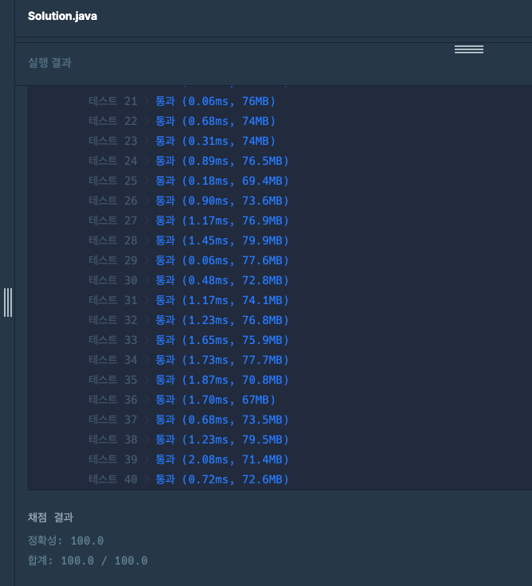

## 출처

- https://school.programmers.co.kr/learn/courses/30/lessons/84512

## 접근

- 단어의 길이가 5 이하이기 때문에, 완전탐색을 해도 시간복잡도가 초과되지 않습니다.
  > 각 단어 Idx별로 단어를 1개씩 선택하는 경우의 수 이므로 O(N^N) = 5^5 입니다.
- 단어사전을 탐색하다가, 주어진 문자열과 동일한 단어일 때의 크기를 반환하면 됩니다.
- 단어사전에 부모노드부터 나오기 때문에(A -> AA -> ...), PreOrder DFS[^1]로 단어를 탐색합니다.
- 중간에 해당 단어가 나오면 탐색을 중단하여 최적화합니다.[^2]
  > 백트래킹[^3]에서 자주 사용하는 기법으로, 재귀 탈출조건에서 값을 반환(아래 예시에서는 boolean)하여 탐색 종료여부를 결정할 수 있습니다.

## 풀이

```java
class Solution {

    // 재귀함수에서 탐색 순서를 저장하기 위한 변수
    int answer, cnt;

    public int solution(String word) {
        dfs(new StringBuilder(), word);
        return answer;
    }

    boolean dfs(StringBuilder sb, String word) {

        // 탈출조건 1 : 단어가 같으면 True 반환하여 탐색 종료
        if (sb.toString().equals(word)) return true;

        // 탈출조건 2 : 단어가 5 이상이면 false 반환하여 탐색 계속
        if (sb.length() >= 5) return false;

        // 문자열을 char 배열로 변환 후 for loop
        for (char c : "AEIOU".toCharArray()) {

            // 단어 추가 및 탐색 카운트
            sb.append(c); cnt++;

            // 추가된 단어가 주어진 단어와 같으면 정답 갱신 후 True 반환하여 탐색 종료
            if (dfs(sb, word)) {
              answer = cnt;
              return true;
            }

            // 마지막에 추가한 단어 삭제(다음 탐색에 영향을 주지 않기 위함)
            sb.deleteCharAt(sb.length() - 1);
        }

        return false;
    }
}
```

## 결과



## 리뷰

부모 -> 자식 순으로 탐색하는 PreOrder DFS를 정확히 구현해야 오류가 발생하지 않기 때문에 각 노드의 탐색순서를 지정할 수 있어야 합니다.

> 저도 문제만 보고 간단히 완전탐색만 구현하면 되는 쉬운 문제라고 생각했는데, 생각보다 DFS의 탐색 순서를 고려하는 과정에서 시간이 걸렸습니다.

문제의 구현 난이도 자체는 높지 않은 것 같고, DFS의 탐색 순서를 정확히 이해하고 있는지 묻는 문제인 것 같습니다.

## References

| URL | 게시일자 | 방문일자 | 작성자 |
| :-- | :------- | :------- | :----- |

[^1]:
    PreOrder는 부모를 먼저 출력 후, 자식들을 탐색하면서 출력하는 방식의 순회입니다.
    

[^2]: 이 문제에서 주어진 단어 1개만 찾으면 되기 때문에 시간초과가 발생하지 않지만, 테스트케이스가 많은 경우 모든 단어를 찾아놓거나 백트래킹 등으로 시간복잡도를 줄여야 합니다.
[^3]: 더 이상 탐색할 필요가 없는 경우를 정의한 후, 해당 경우에는 탐색하지 않도록 하여 완전탐색의 시간복잡도를 줄이는 기법입니다.
