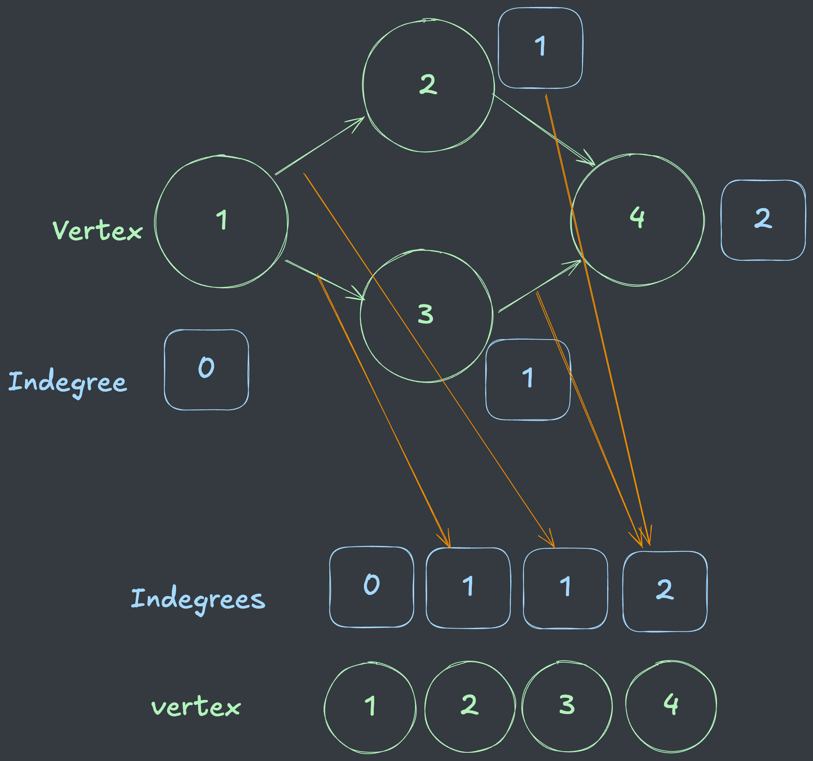
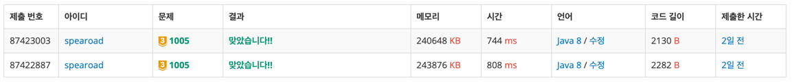

## 출처

- [백준 1005 ACM Craft](https://www.acmicpc.net/problem/1005)

## 접근

### 완전탐색(BFS)

특정 건물이 나올때까지 각 건물들을 탐색하는 과정을 `BFS`로 구현할 수 있습니다.

> 건물 사이의 관계(간선)의 개수가 `100,000`이므로, 각 간선을 한번씩만 방문한다면 시간복잡도 내 풀이가 가능합니다.

### 위상 정렬

각 건물은 해당 건물이 지어지기 전에 특정 건물을 지어야 하는 선행조건이 있습니다.

이를 구현하기 위해 [**위상정렬**](https://ko.wikipedia.org/wiki/%EC%9C%84%EC%83%81%EC%A0%95%EB%A0%AC)을 활용할 수 있습니다.

위상정렬은 다음과 같이 해당 건물을 짓기 전에 선행되어야 하는 건물이 모두 지어졌는지(`선행 건물의 개수가 0인지`) 확인하는 과정을 통해 구현할 수 있습니다.



1. 각 노드를 초기화하면서 선행차수를 확인합니다.
2. BFS 과정해서 해당 노드를 탐색 완료한 경우, 다음 노드의 선행차수를 1씩 줄입니다.
3. 선행차수가 0인 노드만 탐색합니다.

### 누적합

건물은 시간 순으로 지어져야 하므로, 해당 건물이 지어지는 순서대로 탐색해야 합니다.

이는 `해당 건물이 지어지는데 걸리는 시간`으로 정렬되는 우선순위 큐에 `해당 건물을 짓는데까지 걸린 시간(누적합)`을 넣음으로써 구현할 수 있습니다.

## 풀이

```java
import java.io.BufferedReader;
import java.io.IOException;
import java.io.InputStreamReader;
import java.util.Comparator;
import java.util.PriorityQueue;
import java.util.StringTokenizer;

public class Main {
    public static void main(String[] args) throws IOException {
        BufferedReader br = new BufferedReader(new InputStreamReader(System.in));
        int T = Integer.parseInt(br.readLine());

        for (int i = 0; i < T; i++) {
            StringTokenizer st = new StringTokenizer(br.readLine());
            int N = Integer.parseInt(st.nextToken());
            int K = Integer.parseInt(st.nextToken());

            int[] D = new int[N + 1];
            st = new StringTokenizer(br.readLine());
            for (int j = 1; j <= N; j++) {
                D[j] = Integer.parseInt(st.nextToken());
            }

            // 간선의 수가 많으므로 인접행렬로 구현
            int[][] adjm = new int[N + 1][N + 1];
            int[] indegree = new int[N + 1];
            for (int j = 0; j < K; j++) {
                st = new StringTokenizer(br.readLine());
                int from = Integer.parseInt(st.nextToken());
                int to = Integer.parseInt(st.nextToken());
                
                // 해당 인접행렬 1로 초기화
                adjm[from][to] = 1;
                
                // 선행차수 저장
                indegree[to]++;
            }

            int target = Integer.parseInt(br.readLine());

            solve(N, D, adjm, target, indegree);
        }
    }

    private static void solve(int n, int[] d, int[][] adjm, int target, int[] indegree) {

        // 누적합 작은순 정렬
        PriorityQueue<int[]> q = new PriorityQueue<>(Comparator.comparingInt(o -> o[1]));
        boolean[] visited = new boolean[n + 1];

        // 선행차수가 0인 건물부터 BFS
        for (int i = 1; i <= n; i++) {
            if (indegree[i] == 0) q.offer(new int[]{i, d[i]});
        }

        while (!q.isEmpty()) {

            // 누적합 가장 작은 건물 순으로 확인
            int[] now = q.poll();

            // Target 찾으면 출력 후 종료
            if (now[0] == target) {
                System.out.println(now[1]);
                return;
            }

            visited[now[0]] = true;

            for (int i = 1; i <= n; i++) {

                // 나머지 선행차수 1씩 감소
                if (visited[i] || adjm[now[0]][i] == 0 || --indegree[i] != 0) continue;

                // 누적합 저장
                q.offer(new int[]{i, now[1] + d[i]});
            }
        }
    }
}
```

## 결과

- 걸린 시간 : 1:15:00



## 리뷰

처음에는 `지어야 하는 건물을 역순으로 BFS 탐색`을 통해 구현할 수 있다고 생각해서 1시간 정도 고민했는데, 이러한 방식으로는 `동시에 생산을 시작할 수 있는` 경우의 수를 계산할 수
없음을 [해당 글](https://www.acmicpc.net/board/view/133434)을 통해 알게 되었습니다.

> 문제를 구현하기 전에 해당 방식으로 완전탐색이 가능한지 제대로 따져보고 구현을 시작하는 습관을 들여야겠습니다.

## References

| URL                                                                            | 게시일자      | 방문일자        | 작성자       |
|:-------------------------------------------------------------------------------|:----------|:------------|:----------|
| [백준 게시판 글](https://www.acmicpc.net/board/view/133434)                          | 2024.1.   | 2024.12.13. | wnsrl1228 |
| [**위상정렬**](https://ko.wikipedia.org/wiki/%EC%9C%84%EC%83%81%EC%A0%95%EB%A0%AC) | 2022.4.3. | 2024.12.13. | Wikipedia |