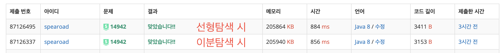
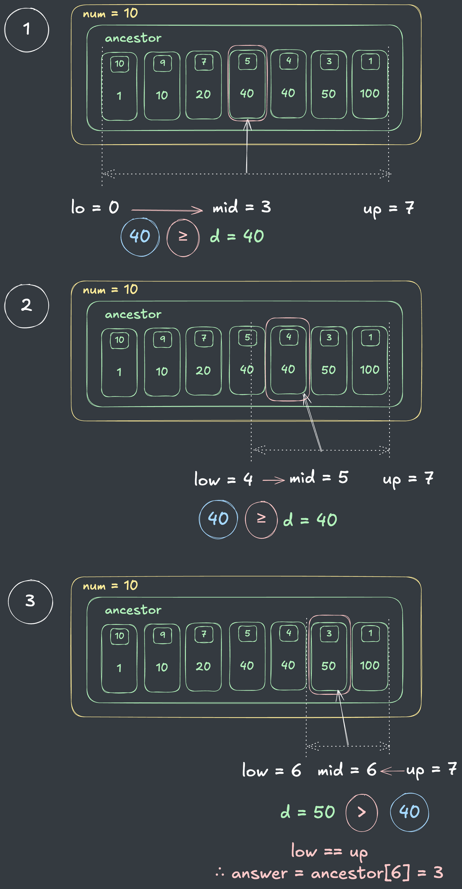

## 출처

- [백준 개미](https://www.acmicpc.net/problem/14942)

## 접근

### 완전탐색(DFS)
자식 방에서 부모(Root) 방향으로 DFS를 하면서 지상에 도달하는데 걸리는 시간을 확인합니다.

- 개미 방의 개수가 최대 `10^5`이므로, 최악의 경우인 방이 일렬로 나열된 경우를 고려해야 합니다.[^1]
  > 선형적인 DFS로는 시간복잡도가 초과할 것이라고 생각해서 BinarySearch로 최적화를 했는데, 선형으로 조상들을 탐색해도 시간초과가 되지 않는 것으로 보아 DFS 만으로도 풀 수 있을 것 같습니다.  

### TREE + BinarySearch
문제를 다시 읽어보면 자신 부모들의 집합, 즉, 조상들을 하나씩 타고 올라가면서 갈 수 있는 최대 조상의 번호를 반환해야 함을 알 수 있습니다. 

> 조상의 정보를 배열로 저장할 수 있다면, 현재 개미가 가진 에너지로 도달할 수 있는 위치를 이분탐색으로 찾을 수 있습니다.

1. **주어진 예제를 다음과 같이 Tree 형태로 그릴 수 있습니다.**

  

2. **각 노드에 조상들의 정보를 배열로 저장합니다.**

  
  - 위와 같이 본인을 포함한 자신의 조상들의 정보(`조상노드 번호(num), 다음 부모까지의 거리(dist)`)를 배열에 저장할 수 있습니다.
  > 예를 들어, 3번 노드는 부모인 2번 노드까지 거리가 10 소요되고, 조상인 1번 노드까지 거리가 20 소요되므로 조상 배열은 `[[3, 10], [2, 20], [1, 20]]`이 됩니다.

3. **최대로 갈 수 있는 조상 번호를 구합니다.**
  
  - 문제에서 주어진 에너지를 통해 본인의 조상 노드 중 최대로 갈 수 있는 노드의 위치를 구합니다.
  - 이 때, 조상과의 거리가 오름차순으로 증가하기 때문에, **BinarySearch**[^2]를 통해 시간복잡도를 `O(N) -> O(logN)`으로 최적화할 수 있습니다.
  > 테스트케이스에 최악의 시나리오는 없는지 이분탐색을 하지 않아도 시간초과가 발생하지는 않습니다.

## 풀이

```java
import java.io.BufferedReader;
import java.io.IOException;
import java.io.InputStreamReader;
import java.util.*;

public class Main {

    // 방 노드 해시맵에 별도로 저장
    static Map<Integer, Room> rooms = new HashMap<>();

    public static void main(String[] args) throws IOException {
        BufferedReader br = new BufferedReader(new InputStreamReader(System.in));
        int n = Integer.parseInt(br.readLine());

        // 개미 에너지 초기화
        int[] ants = new int[n + 1];
        List<int[]>[] adjList = new List[n + 1];
        for (int i = 1; i <= n; i++) {
            ants[i] = Integer.parseInt(br.readLine());
            adjList[i] = new ArrayList<>();
        }

        // 간선 리스트 초기화
        StringTokenizer st;
        for (int i = 1; i < n; i++) {
            st = new StringTokenizer(br.readLine());
            int from = Integer.parseInt(st.nextToken());
            int to = Integer.parseInt(st.nextToken());
            int dist = Integer.parseInt(st.nextToken());
            adjList[from].add(new int[]{to, dist});
            adjList[to].add(new int[]{from, dist});
        }

        // DFS로 개미집 초기화
        Room root = new Room(1);
        rooms.put(1, root);
        dfs(root, adjList);

        // 각 개미들의 Root 찾기
        StringBuilder answer = new StringBuilder();
        for (int i = 1; i <= n; i++) {
            answer.append(rooms.get(i).getFarRoomLeaner(ants[i]));
            answer.append("\n");
        }
        System.out.println(answer);
    }

    // DFS로 전체 개미집 구조 생성
    static void dfs(Room root, List<int[]>[] adjList) {
        Stack<Room> stack = new Stack<>();
        boolean[] visited = new boolean[adjList.length];
        stack.push(root);
        visited[1] = true;

        while (!stack.isEmpty()) {
            Room cur = stack.pop();

            // 부모 집으로부터 자식 집 생성
            for (int[] child : adjList[cur.num]) {
                if (visited[child[0]]) continue;
                visited[child[0]] = true;
                Room croom = new Room(child[0], child[1], cur);
                stack.push(croom);
                rooms.put(child[0], croom);
            }
        }
    }

    static class Room {
        int num;
        Room parent;
        int[][] ancestor;
        List<Room> children;

        Room(int num) {
            this.num = num;
            this.children = new ArrayList<>();
            this.ancestor = new int[][] {{1, 0}};
            rooms.put(num, this);
        }

        // 자식의 조상은 부모 조상에 현재 굴 길이 추가하기
        Room(int num, int dist, Room parent) {
            this.num = num;
            this.parent = parent;
            this.ancestor = new int[parent.ancestor.length + 1][2];
            this.children = new ArrayList<>();
            for (int i = 0; i < parent.ancestor.length; i++) {
                
                // 현재 ~ 부모까지의 거리를 모든 조상 거리에 더해줌
                ancestor[i + 1] = new int[] {parent.ancestor[i][0], parent.ancestor[i][1] + dist};
            }
            
            // 첫번째 조상에 [자신, 부모까지의 거리] 추가
            ancestor[0] = new int[] {this.num, dist};
        }

        // 선형으로 가장 멀리 떨어진 방 찾기
        public int getFarRoomLeaner(int energy) {
            for (int[] ints : ancestor) {
                if (ints[1] > energy) return ints[0];
            }
            return ancestor[ancestor.length - 1][0];
        }

        // 이분탐색으로 가장 멀리 떨어진 방 찾기
        public int getFarRoomBinary(int energy) {
            int left = 0, right = ancestor.length;
            while (left < right) {
                int middle = (left + right) / 2;
                if (energy < ancestor[middle][1]) {
                    right = middle;
                }
                else left = middle + 1;
            }

            return left == ancestor.length? 1 : ancestor[left][0];
        }
    }
}

```

## 결과

- 소요시간 : 2시간 초과



## 리뷰

선형탐색도 시간이 충분한데 이분탐색으로 안하면 시간복잡도가 터질 것 같아서 괜히 UpperBound를 구현한다고 더 시간이 걸린 것 같습니다.
> 플래티넘 문제라서 당연히 시간이 빡빡할거라고 생각했는데... **과한 최적화는 역시 항상 주의**해야겠습니다.

## References

| URL | 게시일자 | 방문일자 | 작성자 |
| :-- | :------- | :------- | :----- |

[^1]: 방이 일렬이라고 가정하면, 다음과 같이 최악의 경우에 Depth가 `10^5`인 DFS를 수행해야 합니다.

      

      - 방이 `10^5`개 이고, 깊이가 1씩 증가하니 총 방문횟수는 등차수열의 합공식에 의해 다음과 같습니다.
        - `1 + 2 + ... + 10^5 = (10^5) * (10^5 + 1) / 2`
        - `∴ O(N) = 10^10`
[^2]: 예를 들어, 다음과 같이 부모가 `[[10, 1], [9, 10]], [7, 20], [5, 40], [4, 40], [3, 50], [1, 100]`이고 개미의 에너지가 `40`인 경우, BinarySearch의 UpperBound를 활용하면 3번만에 최대 도달 가능한 조상의 위치인 `3`를 찾는 것이 가능합니다.
      
      
