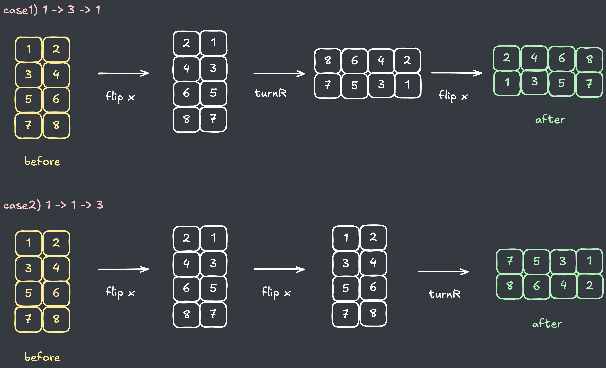
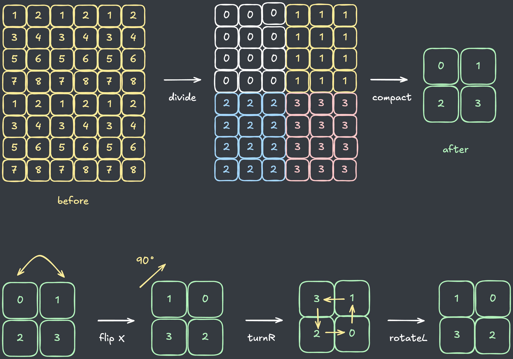
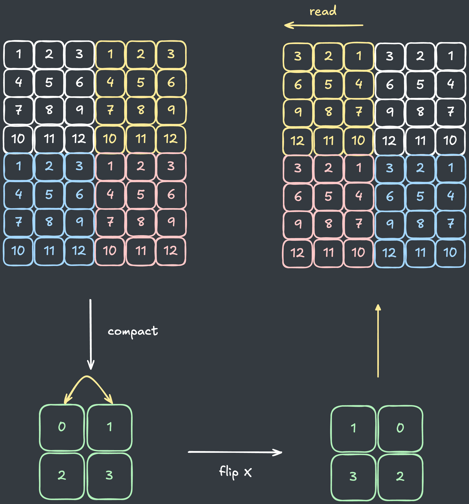
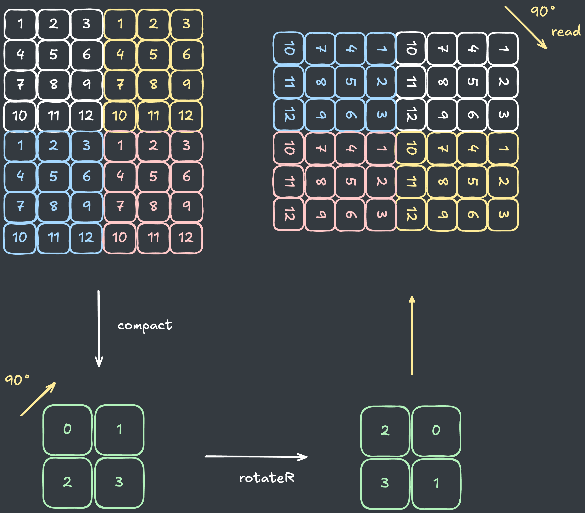
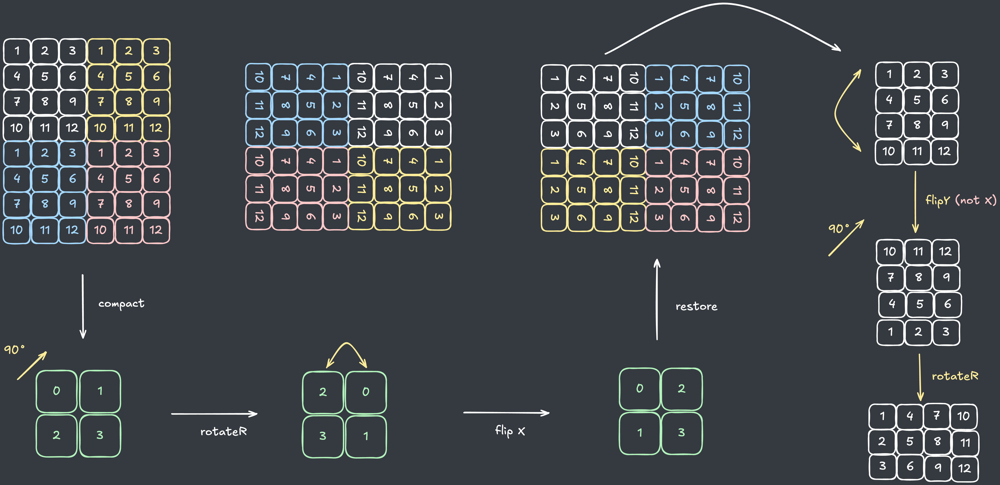
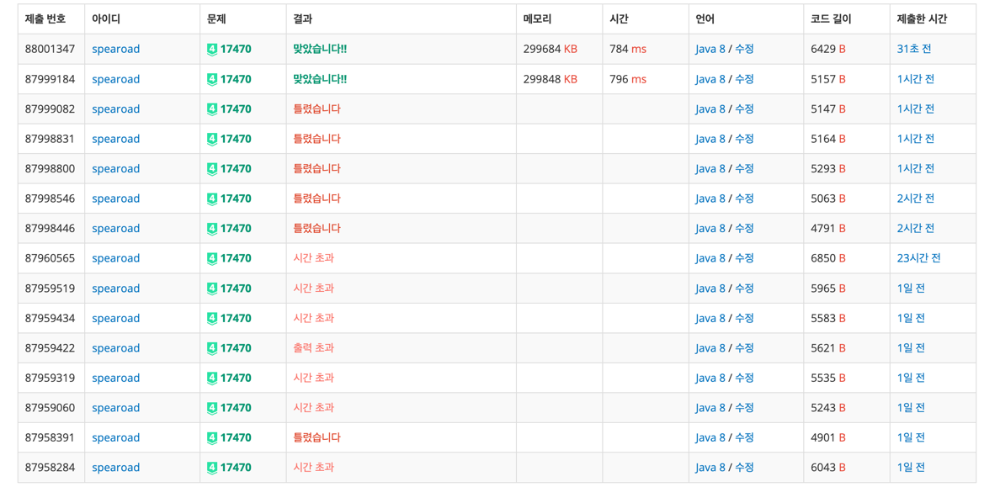

## 출처

- https://www.acmicpc.net/problem/17470

## 접근

### 시간복잡도 분석

문제에서 주어진 배열의 크기는 최대 `100 x 100`이고, 전체 연산의 개수는 `2,000,000`개 이므로, 일반적인 회전을 구현할 경우 시간 초과가 발생합니다.
> `O(N) = 100 x 100 x 2,000,000 = 2 x 10^13`입니다.

### 배열 연산 압축하기(X)

> 해당 접근은 잘못된 풀이입니다. 올바른 풀이는 [아래](#작은-배열로-압축하기)를 참고하시기 바랍니다.

연산을 구현하고 배열을 돌리다 보면, 뭔가 최적화할 수 있는 것 같은 느낌이 듭니다.

1. 상하(1)-좌우(2) 반전
   - `2번` 하면 원래 배열로 복귀합니다.

2. 오른쪽(3) 왼쪽(4) 회전
   - `4번` 하거나 `오른쪽 -> 왼쪽, 왼쪽 -> 오른쪽`순으로 회전하면 원래 배열로 복귀합니다.

3. 내부 오른쪽(5) 왼쪽(6) 회전
   - `4번` 하거나 `오른쪽 -> 왼쪽, 왼쪽 -> 오른쪽`순으로 회전하면 원래 배열로 복귀합니다.

이러한 경우를 고려해서 연산 횟수를 줄일 수 있을 것 같아, 다음과 같이 압축을 시도할 수 있습니다.

1. 최초 연산
    ```java
    char[] calc = {1, 2, 3, 4, 1, 2, 3, 4, 1, 2, 3, 4, 1, 2 ,3, 4, 1, 2, 3, 4};
    ```

2. 압축 : 3과 4가 만나면 원래 배열로 복귀하므로 삭제
    ```java
    char[] calc = {1, 2, 1, 2, 1, 2, 1, 2 ,1, 2};
    ```

3. 압축 : 1과 2가 짝수개이면 원래 배열로 복귀하므로 삭제
    ```java
    char[] calc = {1, 2};
    ```

그러나 다음과 같이 회전 도중에 뒤집기가 발생하면 기존 배열과 다른 모양이 되기 때문에 이러한 압축은 불가능합니다.

```java
char[] calc = {1, 3, 1}; // 뒤집기 -> 회전 -> 뒤집기
char[] calc = {1, 1, 3}; // 뒤집기 -> 뒤집기 -> 회전
```



### 작은 배열로 압축하기

문제에서 시간 초과가 발생하는 주된 원인은 **배열의 크기가 너무 크기 때문**입니다.

> 배열이 `2 x 2`사이즈라고 가정하면, 전체 연산의 횟수가 `2,000,000`이기 때문에 전체 연산을 수행하는 시간복잡도는
> 
> `O(N) = 4 x 2,000,000 = 8 x 10^7` 이 됩니다.
 
따라서, 다음과 같이 배열의 크기를 작게 줄여서(압축해서) 연산을 마친 뒤 원본 배열을 읽는 식으로 연산을 최적화할 수 있습니다.



### 배열 내부 복원하기

배열을 압축해서 연산을 하다 보니, 실제 배열로 복원하면서 뒤집기와 회전 연산에 차이가 발생합니다.

다음과 같이 3가지 경우를 유념해야 합니다.

1. 뒤집기를 하면 기존 배열의 원소를 반대로 복원해야 합니다.

    

2. 회전을 하면 복원 시 기존 배열을 90도 회전해야 합니다.

    

3. 회전된 상태에서는 뒤집기의 상하가 반대로 적용됩니다.

    

압축된 배열을 올바르게 복원하기 위해 변수를 연산과정에서 저장해두고, 복원 시 활용합니다.

> `뒤집기 상하`, `뒤집기 좌우` 와 `회전 횟수` 총 3가지 변수를 저장합니다.

## 풀이

```java
import java.io.BufferedReader;
import java.io.IOException;
import java.io.InputStreamReader;
import java.util.*;

public class Main {
    static int N, M, R;
    static char[] calc;

    // 압축된 배열
    static int[][] temp = {{0, 1}, {2, 3}};

    // 복원 시 필요한 변수
    static boolean flipX, flipY;
    static int turn;

    public static void main(String[] args) throws IOException {
        BufferedReader br = new BufferedReader(new InputStreamReader(System.in));
        StringTokenizer stringTokenizer = new StringTokenizer(br.readLine());
        N = Integer.parseInt(stringTokenizer.nextToken());
        M = Integer.parseInt(stringTokenizer.nextToken());
        R = Integer.parseInt(stringTokenizer.nextToken());

        int[][] arr = new int[N][M];
        for (int i = 0; i < N; i++) {
            stringTokenizer = new StringTokenizer(br.readLine());
            for (int j = 0; j < M; j++) arr[i][j] = Integer.parseInt(stringTokenizer.nextToken());
        }

        calc = br.readLine().replace(" ", "").toCharArray();
        calculate(calc);

        print(arr);
    }

    // 출력 시 압축된 배열을 복원
    private static void print(int[][] arr) {

        // 원본 배열의 각 사분면 저장
        int[][][] divide = new int[4][N / 2][M / 2];
        for (int i = 0; i < N; i++) {
            for (int j = 0; j < M; j++) {
                if (i < N / 2 && j < M / 2) divide[0][i][j] = arr[i][j];
                if (i < N / 2 && j >= M / 2) divide[1][i][j - M / 2] = arr[i][j];
                if (i >= N / 2 && j < M / 2) divide[2][i - N / 2][j] = arr[i][j];
                if (i >= N / 2 && j >= M / 2) divide[3][i - N / 2][j - M / 2] = arr[i][j];
            }
        }

        // 복원 시 저장된 변수 사용
        for (int i = 0; i < 4; i++) {
            if (flipX) divide[i] = flipX(divide[i]);
            if (flipY) divide[i] = flipY(divide[i]);
            if (turn != 0) for (int j = 0; j < turn; j++) divide[i] = turnR(divide[i]);
        }

        // 회전이 발생하면 원본 배열의 좌우 크기도 변경
        if (turn % 2 == 1) {
            int temp = N;
            N = M;
            M = temp;
        }

        // 각 사분면 복원하며 읽기
        StringBuilder sb = new StringBuilder();
        for (int i = 0; i < N; i++) {
            for (int j = 0; j < M; j++) {

                // 1사분면의 현재 값 읽어서 복원(temp[0][0])
                if (i < N / 2 && j < M / 2) sb.append(divide[temp[0][0]][i][j]);

                // 나머지 사분면도 동일하게 진행
                if (i < N / 2 && j >= M / 2) sb.append(divide[temp[0][1]][i][j - M / 2]);
                if (i >= N / 2 && j < M / 2) sb.append(divide[temp[1][0]][i - N / 2][j]);
                if (i >= N / 2 && j >= M / 2) sb.append(divide[temp[1][1]][i - N / 2][j - M / 2]);
                if (j != M - 1) sb.append(" ");
            }
            if (i != N - 1) sb.append("\n");
        }
        System.out.print(sb);
    }

    // 연산 수행하면서 복원을 위한 변수 저장
    static void calculate(char[] calc) {
        for (char r : calc) {
            switch (r) {
                // 뒤집기 시 회전된 상태(turn % 2 == 0) 에서는 반대로 뒤집기
                case '1': {
                    temp = flipY(temp);
                    if (turn % 2 == 0) flipY = !flipY;
                    else flipX = !flipX;
                    break;
                }
                case '2': {
                    temp = flipX(temp);
                    if (turn % 2 == 0) flipX = !flipX;
                    else flipY = !flipY;
                    break;
                }

                // 회전 시 4바퀴 이상 돌면 원복해야 하므로 모듈러 연산
                case '3': temp = turnR(temp); turn++; turn %= 4; break;
                case '4': temp = turnL(temp); turn--; turn += 4; turn %= 4; break;
                
                // 내부 이동은 별도 복원값 저장 불필요
                case '5': temp = rotateR(temp); break;
                case '6': temp = rotateL(temp); break;
            }
        }
    }
    
    // Y방향(세로) 뒤집기
    static int[][] flipY(int[][] arr) {
        int n = arr.length;
        int m = arr[0].length;
        int[][] temp = new int[n][m];
        for (int i = 0; i < n; i++) {
            for (int j = 0; j < m; j++) {
                temp[n - i - 1][j] = arr[i][j];
            }
        }
        return temp;
    }
    
    // X방향(가로) 뒤집기
    static int[][] flipX(int[][] arr) {
        int n = arr.length;
        int m = arr[0].length;
        int[][] temp = new int[n][m];
        for (int i = 0; i < n; i++) {
            for (int j = 0; j < m; j++) {
                temp[i][m - j - 1] = arr[i][j];
            }
        }
        return temp;
    }

    // 오른쪽으로 돌리기
    static int[][] turnR(int[][] arr) {
        int n = arr.length;
        int m = arr[0].length;
        int[][] temp = new int[m][n];
        for (int i = 0; i < n; i++) {
            for (int j = 0; j < m; j++) {
                temp[j][i] = arr[n - i - 1][j];
            }
        }
        return temp;
    }

    // 왼쪽으로 돌리기(압축된 배열에만 사용)
    static int[][] turnL(int[][] arr) {
        int[][] temp = new int[2][2];
        for (int i = 0; i < 2; i++) {
            for (int j = 0; j < 2; j++) {
                temp[j][i] = arr[i][1 - j];
            }
        }
        return temp;
    }

    // 내부 오른쪽으로 돌리기(압축된 배열에만 사용)
    static int[][] rotateR(int[][] arr) {
        int[][] temp = new int[2][2];
        for (int i = 0; i < 2; i++) {
            for (int j = 0; j < 2; j++) {
                temp[0][0] = arr[1][0];
                temp[1][0] = arr[1][1];
                temp[1][1] = arr[0][1];
                temp[0][1] = arr[0][0];
            }
        }
        return temp;
    }

    // 내부 왼으로 돌리기(압축된 배열에만 사용)
    static int[][] rotateL(int[][] arr) {
        int[][] temp = new int[2][2];
        for (int i = 0; i < 2; i++) {
            for (int j = 0; j < 2; j++) {
                temp[0][0] = arr[0][1];
                temp[1][0] = arr[0][0];
                temp[1][1] = arr[1][0];
                temp[0][1] = arr[1][1];
            }
        }
        return temp;
    }
}
```

## 결과

- 소요시간 : 2시간 초과



## 리뷰

처음에는 배열 연산을 압축하는 것으로 충분히 시간복잡도 내에서 풀이가 가능하다고 생각해서 계속 시도했지만, 차분히 생각해보니 최악의 경우 시간복잡도를 초과할 수밖에 없겠다는 생각이 들었습니다.

이후 질문 게시판에서 [다른 분의 댓글 설명](https://www.acmicpc.net/board/view/60438)을 보고 감을 잡아서 풀 수 있었습니다.  

> 항상 최악의 시간복잡도를 고려하는 것을 연습해야겠습니다.

## References

| URL                                                | 게시일자 | 방문일자        | 작성자     |
|:---------------------------------------------------|:-----|:------------|:--------|
| [백준 게시판](https://www.acmicpc.net/board/view/60438) | 2020 | 2024.12.31. | posko17 |