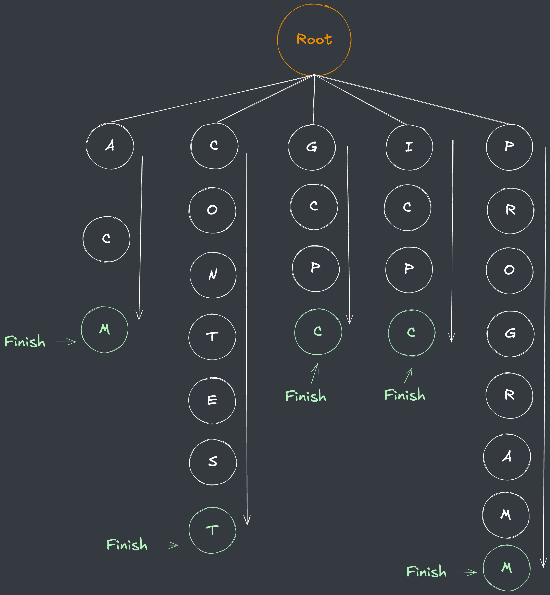
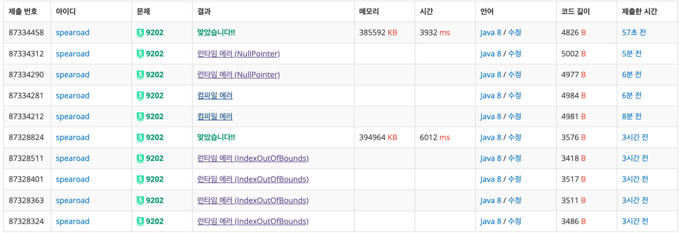

## 출처

[백준 9202 Boggle](https://www.acmicpc.net/problem/9202)

## 접근

### Backtracking

특정 단어를 한 글자씩 찾아들어가면서 단어 사전에 존재하는지 확인하는 방식은 전형적인 `DFS`의 형태입니다.
- 주어진 단어의 개수가 `w < 300,000` 이지만 탐색해야 하는 전체 `Boggle` 보드의 크기가 `4X4`이고, 이러한 `Boggle`의 개수가 `b < 30`이기 때문에 DFS 자체는 많은 시간복잡도가 필요하지 않습니다.
- `DFS` 탐색 과정에서 다음 글자를 추가했을 때, 단어 사전에 포함된 단어를 만들 수 있는지를 빠르게 확인하여 불가능한 경우를 가지치기(`pruning`)한다면, 시간복잡도를 더욱 줄일 수 있습니다.

> 이러한 기법을 [Backtracking](https://ko.wikipedia.org/wiki/%ED%87%B4%EA%B0%81%EA%B2%80%EC%83%89)이라고 합니다.

### Trie

단어 사전에 현재 단어가 포함되어 있는지를 확인하는 기법에는 여러 가지가 있지만, 저는 `Trie`[^1] 자료구조를 통해 단어를 저장하고, 이렇게 저장된 노드를 활용해서 다음 노드로 탐색할지 여부를 결정하였습니다.

문제에서 주어진 예시를 `Trie` 형태로 저장하면 다음과 같습니다.



- Root 노드로부터 각 알파벳을 하나씩 갖는 자식 노드들을 순차적으로 저장합니다.
-  마지막 노드 위치에 단어가 있다는 것을 표시하기 위해 `isFinished`라는 플래그 값을 별도로 저장합니다.
  > `A -> C -> M` 순서로 탐색하는 중, 현재 노드인 `M` 노드에 `isFinished`값이 있으므로 `ACM`이라는 단어가 사전에 있음을 확인할 수 있습니다.
- 만약, `A`노드에서 `C`가 아닌 다른 자식을 찾으려고 하면, 단어 사전에 존재하지 않는다는 것을 `O(1)`의 시간복잡도로 확인하는 것이 가능합니다.

## 풀이

```java
import java.io.BufferedReader;
import java.io.IOException;
import java.io.InputStreamReader;
import java.util.*;

public class Main {

    // 루트 노드 별도로 저장
    static Node root;

    // Trie 노드
    static class Node {
        char c;
        Node[] children;
        boolean isFinished;

        // 생성자
        Node(char c) {
            this.c = c;
            this.children = new Node[26];
            this.isFinished = false;
        }

        // 자식이 없다면 추가 후 자식 참조값 리턴
        Node add(char c) {
            Node temp = this.children[c - 'A'];
            if (temp != null) return temp;

            Node child = new Node(c);
            this.children[c - 'A'] = child;
            return child;
        }

        // 자식이 있는지 여부 확인
        boolean hasChild() {
            if (children == null) return false;
            for (Node child : children)
                if (child != null) return true;
            return false;
        }
    }

    public static void main(String[] args) throws IOException {
        BufferedReader br = new BufferedReader(new InputStreamReader(System.in));

        int N = Integer.parseInt(br.readLine());

        // 루트노드 생성
        root = new Node('r');

        for (int i = 0; i < N; i++) {
            char[] word = br.readLine().toCharArray();
            Node temp = root;

            // 단어 순서대로 따라가면서 자식 노드 추가
            for (char c : word) {
                temp = temp.add(c);
            }

            // 마지막 알파벳에 플래그 표시
            temp.isFinished = true;
        }

        br.readLine();

        int b = Integer.parseInt(br.readLine());

        // DFS 결과 저장할 HashSet
        Set<String> result = new HashSet<>();
        for (int i = 0; i < b; i++) {

            // 새로운 boggle 입력
            char[][] boggle = new char[4][4];
            for (int j = 0; j < 4; j++) {
                boggle[j] = br.readLine().toCharArray();
            }

            for (int r = 0; r < 4; r++) {
                for (int c = 0; c < 4; c++) {

                    // 첫번째 자식부터 탐색
                    Node temp = root.children[boggle[r][c] - 'A'];
                    if (temp == null) continue;

                    // 첫번째 자식 현재위치에 넣고 탐색 시작
                    StringBuilder sb = new StringBuilder();
                    sb.append(boggle[r][c]);
                    dfs(boggle, result, r, c, temp, sb, new boolean[4][4]);
                }
            }

            printAnswer(result);
            result.clear();
            if (i != b - 1) br.readLine();
        }
    }

    // DFS + Backtracking
    static int[] dr = {0, 0, 1, -1, 1, 1, -1, -1};
    static int[] dc = {1, -1, 0, 0, 1, -1, -1, 1};
    static void dfs(char[][] boggle, Set<String> result, int r, int c, Node temp, StringBuilder sb, boolean[][] isVisited) {
        isVisited[r][c] = true;

        // 단어가 있는 위치에 도달하면 해당 단어 추가
        if (temp.isFinished) {
            result.add(sb.toString());

            // 현재 위치 아래에 자식이 없다면 가지치기
            if (!temp.hasChild()) return;
        }

        // 8방향 탐색
        for (int i = 0; i < 8; i++) {
            int nr = r + dr[i];
            int nc = c + dc[i];

            if (nr < 0 || nr >= 4 || nc < 0 || nc >= 4 || isVisited[nr][nc]) continue;
            if (temp.children[boggle[nr][nc] - 'A'] == null) continue;

            // 다음 단어 추가
            sb.append(boggle[nr][nc]);
            dfs(boggle, result, nr, nc, temp.children[boggle[nr][nc] - 'A'], sb, isVisited);

            // DFS 복귀 후 값 초기화
            sb.deleteCharAt(sb.length() - 1);
            isVisited[nr][nc] = false;
        }
    }

    // 정답 출력
    static int[] scoreMap = {0, 0, 0, 1, 1, 2, 3, 5, 11};
    static void printAnswer(Set<String> result) {
        int maxLength = 0;
        int score = 0;
        List<String> maxs = new ArrayList<>();
        for (String r : result) {

            // 총점에 현재단어 길이 점수 추가
            score += scoreMap[r.length()];
            if (r.length() > maxLength) {
                maxLength = r.length();
                maxs.clear();
                maxs.add(r);

                // 가장 긴 단어 여러개일 경우 저장
            } else if (r.length() == maxLength) {
                maxs.add(r);
            }
        }

        // 가장 긴 단어 여러개일 경우 오름차순 정렬
        maxs.sort(Comparator.naturalOrder());

        // 총점 + 가장 긴 단어 + 결과 크기 출력
        System.out.println(score + " " + maxs.get(0) + " " + result.size());
    }

}
```

## 결과

- 소요시간 : 1:55:30



## 리뷰

자식 노드를 탐색하는 과정에서 발생한 런타임 오류(`IndexOutOfBounds`)를 해결하는데 너무 오래 걸렸습니다.
> `DFS`를 재귀 형식으로 구현하는게 구현 속도는 빠르지만 디버딩 툴 없이 디버깅하기가 까다로워서 잘 고민해봐야겠습니다.

또한 문제를 풀고 보니 시간 제한이 `10초`로, 다른 분들의 풀이를 보니 `Trie`를 활용하지 않고도 `Backtracking`만 잘 구현한다면 시간복잡도 내로 충분히 풀 수 있는 것 같습니다.
> 효율적인 알고리즘으로 푸는 것보다, 주어진 시간복잡도 내에서 가장 빨리 구현할 수 있는 알고리즘을 찾는게 중요함을 항상 주의해야겠습니다.

## References

| URL | 게시일자 | 방문일자 | 작성자 |
| :-- | :------- | :------- | :----- |
|[Backtracking](https://ko.wikipedia.org/wiki/%ED%87%B4%EA%B0%81%EA%B2%80%EC%83%89)| 2022.02.08. | 2024.12.10. | Wikipedia|

[^1]: `Trie` 자료구조에 대한 자세한 설명은 [다음 링크](https://1eaf.site/cote/hackerrank_no_prefix_set/#trie)를 참고하시기 바랍니다.