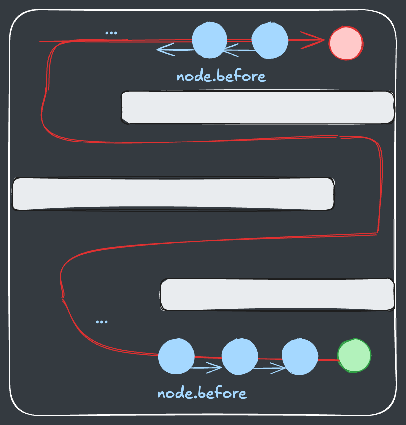
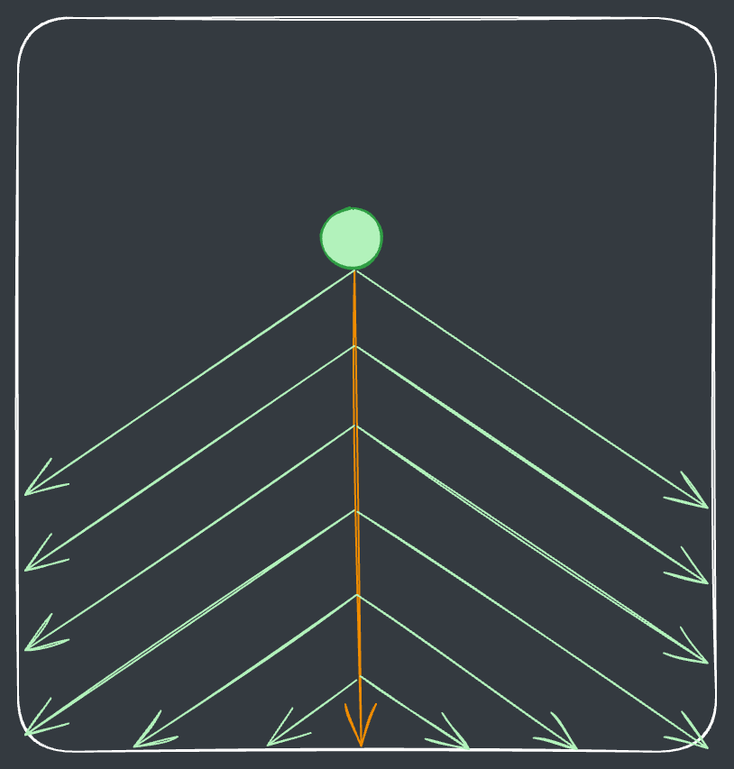
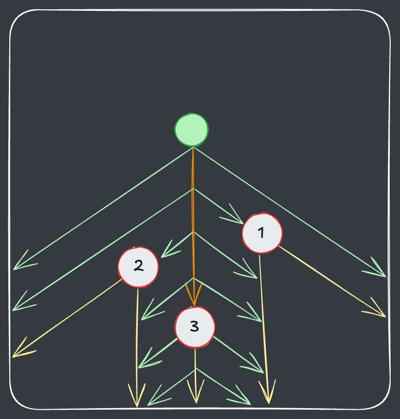
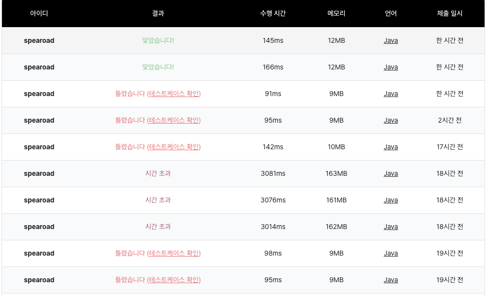

## 출처

- [메두사와 전사들](https://www.codetree.ai/training-field/frequent-problems/problems/medusa-and-warriors/description?page=1&pageSize=10)

## 접근

복잡한 문제인만큼 구현하면서 순차적으로 처리해야 할 과정이 많은데, 이에 필요한 알고리즘을 정리해보면 다음과 같습니다.
1. **메두사의 이동경로 구현**
   - BFS + 경로 역추적
2. **시선 생성**
   - 배열 탐색 구현
3. **병사 이동 및 공격**
   - 배열 탐색 구현

> 알고리즘 자체는 어렵지 않으나, 배열 탐색을 구현하는 과정이 복잡합니다.

### 메두사 이동경로 구현(BFS)

- 메두사가 이동하는 과정에 장애물이 있기 때문에, `BFS`를 통해 **미로를 탐색하는 최단경로**를 구해야 합니다.

- 또한, 이동경로를 다시 돌면서 병사들과의 상호작용을 확인하기 위해 이러한 경로를 별도 배열에 저장해야 합니다.

- 이는 다음과 같이 `BFS`시에 이전 노드 정보를 함께 저장하여 `LinkedList` 형태로 구현할 수 있습니다.



- 이를 코드로 다음과 같이 구현할 수 있습니다.

  ```java
  /* 생략 */
  
      // BFS + 이전노드 탐색용
      static class Node {
          int r;
          int c;
          Node before;
  
          public Node(int r, int c, Node node) {
              this.r = r;
              this.c = c;
              this.before = node;
          }
      }
  
      // BFS로 메두사 이동 최단경로 구하기 + 리스트로 경로 반환
      static List<int[]> bfs() {
          Queue<Node> q = new ArrayDeque<>();
          boolean[][] visited = new boolean[N][N];
          q.offer(new Node(s[0], s[1], null)); 
          visited[s[0]][s[1]] = true;
  
          while(!q.isEmpty()) {
              Node now = q.poll();
  
              // 도착하면 배열 생성한 뒤, 역순으로 배열에 추가 후 반환
              if (now.r == e[0] && now.c == e[1]) {
                  List<int[]> ret = new ArrayList<>();
                  while (now != null) {
                      ret.add(new int[]{now.r, now.c});
                      now = now.before;
                  }
                  return ret;
              }
  
              // 상하좌우로 이동
              for (int i = 0; i < 4; i++) {
                  int nr = now.r + dr[i];
                  int nc = now.c + dc[i];
                  if (nr < 0 || nr >= N || nc < 0 || nc >= N || visited[nr][nc] || town[nr][nc] == 1) continue;
                  visited[nr][nc] = true;
                  q.offer(new Node(nr, nc, now));
              }
          }
  
          // 도착하지 못하면 null 반환
          return null;
      }
  
  /* 생략 */
  ```

### 시선 생성 구현(배열 탐색)

**기본 시선 생성하기** 

- 메두사의 시선은 상하좌우로 움직일 수 있습니다.

- 해당 시선에서 대각선 방향으로 모든 시선이 채워지게 됩니다.

- 다음과 같이 각 시선 방향을 따라가면서 양쪽 대각선으로 뻗어나가는 식으로 구현합니다.



- 시선을 처리하는 로직만 코드로 확인해보면 다음과 같습니다.

  ```java
    // 시선 생성
    static void see(int[] now) {
        
        /* 생략 */
  
        // 4방향 시선 이동
        for (int d = 0; d < 4; d++) {
            int[][] temp = new int[N][N];
            for (int i = 0; i < N; i++) Arrays.fill(temp[i], 0);

            // 4방향 시선 확인
            int cur = getSight(now, temp, d);
            
            /* 생략 */
        }
    }
  
    // 상하좌우 -> 대각선 확인을 위한 배열
    static int[][] dir = {{7, 1}, {3, 5}, {5, 7}, {1, 3}};
    
    // 8방향 미리 지정
    static int[] dr3 = {-1, -1, 0, 1, 1, 1, 0, -1};
    static int[] dc3 = {0, 1, 1, 1, 0, -1, -1, -1};
    
    // 시선 배열 채우기
    static int getSight(int[] now, int[][] sight, int d) {
        int r = now[0], c = now[1], cnt = 0;
        boolean hide = false;
        
        // 최초 위치에서 대각선 확인(대각선 확인할때는 위에서 정의한 dir 배열 활용)
        cnt += seeDiagonal(now, sight, dir[d], d);

        while (true) {
            int nr = r + dr[d], nc = c + dc[d];
            if (nr < 0 || nr >= N || nc < 0 || nc >= N) break;
            
            // 1칸씩 시선 방향으로 이동하면서 대각선 확인
            cnt += seeDiagonal(new int[] {nr, nc}, sight, dir[d], d);
            
            // 처음으로 병사 등장하기 이전에는 1로 채우기(시선 표시)
            if (!hide) sight[nr][nc] = 1;
            
            /* 생략 */
            
            r = nr; c = nc;
        }
        return cnt;
    }
  
    // 대각선 확인하기
    static int seeDiagonal(int[] now, int[][] sight, int[] ds, int d) {
        int cnt = 0;
        
        // 주어진 방향으로 뻗어나가기
        for (int dd : ds) {
            int r = now[0], c = now[1];
            while (true) {
                int nr = r + dr3[dd], nc = c + dc3[dd];
                if (nr < 0 || nr >= N || nc < 0 || nc >= N) break;
                
                /* 생략 */
  
                // 해당 위치 1로 채우기(시선 표시)
                sight[nr][nc] = 1;
                r = nr; c = nc;
            }
        }
        return cnt;
    }
  ```

**병사 돌로 만들기**

- 이렇게 시선을 채우는 중간에 병사가 있다면 해당 위치를 돌로 만듭니다.

- 또한, **메두사의 시선과 같은 방향**으로는 이후 메두사의 시선이 들어오지 못하도록 처리합니다.
> 코드 구현 과정에서는 메두사의 시선이 어떤 방향에서 들어왔는지 별도 파라미터로 전달이 필요합니다.

- 마지막으로 각 방향에서 돌로 만든 병사의 최댓값을 확인해서 최대인 방향으로 시선을 처리합니다.

- 그림으로 표현하면 다음과 같습니다.



- 전체 과정을 코드로 구현해보면 다음과 같습니다.

```java
    // 시선 생성
    static void see(int[] now) {
        
        // 좌표별 병사 숫자를 빠르게 세기 위해 좌표별 병사 숫자 미리 표기
        for (int i = 0; i < N; i++) Arrays.fill(town[i], 0);
        for (int[] warrior : warriors) town[warrior[0]][warrior[1]]++;

        int total = 0; // 시선에서 보이는 병사 최댓값 저장
        for (int d = 0; d < 4; d++) {
            int[][] temp = new int[N][N];
            for (int i = 0; i < N; i++) Arrays.fill(temp[i], 0);

            // 현재 방향에서 보이는 총 병사 숫자 확인
            int cur = getSight(now, temp, d);
            
            // 현재 방향이 최대일때만 갱신
            if (total < cur) {
                sight = temp;
                total = cur;
            }
        }
    }

    static int[][] dir = {{7, 1}, {3, 5}, {5, 7}, {1, 3}};
    static int[] dr3 = {-1, -1, 0, 1, 1, 1, 0, -1};
    static int[] dc3 = {0, 1, 1, 1, 0, -1, -1, -1};

    // 상하좌우 배열과 대각선 배열의 방향을 맞추기 위함    
    static int[] changeDir = {0, 4, 6, 2};

    // 시선 배열 채우기 + 각 방향에서 볼 수 있는 병사 반환
    static int getSight(int[] now, int[][] sight, int d) {
        int r = now[0], c = now[1], cnt = 0;
        boolean hide = false;
        
        // 최초 위치에서 대각선 확인
        cnt += seeDiagonal(now, sight, dir[d], d);

        // 시선 방향으로 뻗어나가기
        while (true) {
            int nr = r + dr[d], nc = c + dc[d];
            if (nr < 0 || nr >= N || nc < 0 || nc >= N) break;
            
            cnt += seeDiagonal(new int[] {nr, nc}, sight, dir[d], d);

            // 처음으로 병사 등장하기 이전에만 1로 채우기(이후에는 돌이 가리므로 채우지 않음)
            if (!hide) sight[nr][nc] = 1;
            
            // 처음으로 병사 등장하는 시점 확인
            if (!hide && town[nr][nc] != 0) {
            
                // 해당 위치에서 돌로 만들기
                // 원래 상하좌우는 0->1->2->3 이고, 8방향 탐색에서는 0->4->6->2 방향전환 필요
                makeStone(new int[] {nr, nc}, sight, new int[] {changeDir[d]});
                
                // 이후는 가려져서 1을 채우지 않음
                hide = true;
                
                // 병사 숫자 세기
                cnt += town[nr][nc];
            }
            
            r = nr; c = nc;
        }
        return cnt;
    }

    static int seeDiagonal(int[] now, int[][] sight, int[] ds, int d) {
        int cnt = 0;
        
        for (int dd : ds) {
            int r = now[0], c = now[1];
            while (true) {
                int nr = r + dr3[dd], nc = c + dc3[dd];
                if (nr < 0 || nr >= N || nc < 0 || nc >= N) break;
                
                // 이미 가려진 위치가 있으면(2이면) 탐색 종료
                if (sight[nr][nc] == 2) break;
                
                // 병사 있으면 해당위치에서 돌로 만들고 탐색 종료
                if (town[nr][nc] != 0) {
                    cnt += town[nr][nc];
                    
                    // 현재 시선방향(상하좌우) 변환 + 현재 대각선 이동방향 파라미터 전달 
                    makeStone(new int[]{nr, nc}, sight, new int[] {changeDir[d], dd});
                    r = nr; c = nc; break;
                }
                
                sight[nr][nc] = 1;
                r = nr; c = nc;
            }
        }
        return cnt;
    }

    // 돌로 만들기
    static void makeStone(int[] now, int[][] sight, int[] ds) {
    
        // 해당 위치 -2로 변경
        sight[now[0]][now[1]] = -2; 
		    
        // 주어진 방향으로 뻗어나가면서 가리기
        for (int d : ds) {
            int r = now[0], c = now[1];
            while (true) {
                int nr = r + dr3[d], nc = c + dc3[d];
                if (nr < 0 || nr >= N || nc < 0 || nc >= N) break;
                
                // 해당 위치 2로 변경(가림 표시)
                sight[nr][nc] = 2;
                r = nr; c = nc;
            }
        }
    }
```

> 메두사의 시선을 처리하는게 개인적으로 가장 복잡했던 것 같습니다.

### 병사 이동 및 공격 구현(배열 탐색)

- 병사들은 총 2번 이동하며, 2회의 움직임이 다르기 때문에 별도로 구현해야 합니다.

- 매 회마다 병사가 이동한 횟수, 돌이 된 횟수, 메두사를 공격한 횟수를 세어 출력합니다.

- 메두사를 공격했을 때에는 **병사를 삭제하는 것에 주의**합니다.

> 비교적 단순한 구현이어서 코드가 필요하신 분들은 아래 풀이에서 확인하시면 됩니다.

## 풀이

```java
import java.util.*; 
import java.io.*;

public class Main {
    static int N, M;
    static int[] s, e, answer;
    static int[][] town, sight;
    static List<int[]> warriors;
    static int[] dr = {-1, 1, 0, 0}, dr2 = {0, 0, -1, 1};
    static int[] dc = {0, 0, -1, 1}, dc2 = {-1, 1, 0, 0};
    
    public static void main(String[] args) throws IOException {
        
        // 입력 받기
        init();
				
        // 메두사 이동경로 생성
        List<int[]> route = bfs();

        // 도달 불가능 예외처리
        if (route == null) {
            System.out.println(-1);
            System.exit(0);
        }

        StringBuilder sb = new StringBuilder();

        // 메두사 이동경로대로 진행
        for (int i = route.size() - 2; i >= 1; i--) {
            int[] r = route.get(i);
            answer = new int[3];
            
            // 해당 위치 병사 삭제
            killWarriors(r);
            
            // 시선 생성
            see(r);
            
            // 병사 이동
            moveWarriors(r);
            
            sb.append(answer[0] + " " + answer[1] + " " + answer[2] + "\n");
        }
        System.out.print(sb);
        System.out.println(0);
    }


    // 시선 생성
    static void see(int[] now) {
        
        // town에 병사 위치 찍어놓기
        for (int i = 0; i < N; i++) Arrays.fill(town[i], 0);
        for (int[] warrior : warriors) town[warrior[0]][warrior[1]]++;

        // 4방향 시선 이동
        int total = 0; // 시선에서 보이는 병사 최댓값 저장
        for (int d = 0; d < 4; d++) {
            int[][] temp = new int[N][N];
            for (int i = 0; i < N; i++) Arrays.fill(temp[i], 0);

            // 현재 방향에서 보이는 총 병사 숫자 확인
            int cur = getSight(now, temp, d);
            
            // 현재 방향이 최대일때만 갱신
            if (total < cur) {
                sight = temp;
                total = cur;
            }
        }
    }

    // 상하좌우 -> 대각선 확인 및 변환을 위한 배열
    static int[][] dir = {{7, 1}, {3, 5}, {5, 7}, {1, 3}};
    static int[] changeDir = {0, 4, 6, 2};
    
    // 8방향 미리 지정
    static int[] dr3 = {-1, -1, 0, 1, 1, 1, 0, -1};
    static int[] dc3 = {0, 1, 1, 1, 0, -1, -1, -1};
    
    // 시선 배열 채우기 + 각 방향에서 볼 수 있는 병사 반환
    static int getSight(int[] now, int[][] sight, int d) {
        int r = now[0], c = now[1], cnt = 0;
        boolean hide = false;
        
        // 최초 위치에서 대각선 확인
        cnt += seeDiagonal(now, sight, dir[d], d);
        

        while (true) {
            int nr = r + dr[d], nc = c + dc[d];
            if (nr < 0 || nr >= N || nc < 0 || nc >= N) break;
            
            // 1칸씩 시선 방향으로 이동하면서 대각선 확인
            cnt += seeDiagonal(new int[] {nr, nc}, sight, dir[d], d);

            // 처음으로 병사 등장하기 이전에는 1로 채우기(시선 표시)
            if (!hide) sight[nr][nc] = 1;
            
            // 처음으로 병사 등장하는 시점 확인
            if (!hide && town[nr][nc] != 0) {
            
                // 해당 위치에서 돌로 만들기
                makeStone(new int[] {nr, nc}, sight, new int[] {changeDir[d]});
                hide = true;
                
                // 병사 숫자 세기
                cnt += town[nr][nc];
            }
            
            r = nr; c = nc;
        }
        return cnt;
    }

    // 대각선 확인하기
    static int seeDiagonal(int[] now, int[][] sight, int[] ds, int d) {
        int cnt = 0;
        
        // 주어진 방향으로 뻗어나가면서 병사 있는지 확인
        for (int dd : ds) {
            int r = now[0], c = now[1];
            while (true) {
                int nr = r + dr3[dd], nc = c + dc3[dd];
                if (nr < 0 || nr >= N || nc < 0 || nc >= N) break;
                
                // 이미 가려진 위치가 있으면(2이면) 탐색 종료
                if (sight[nr][nc] == 2) break;
                
                // 병사 있으면 해당위치에서 돌로 만들고 탐색 종료
                if (town[nr][nc] != 0) {
                    cnt += town[nr][nc];
                    makeStone(new int[]{nr, nc}, sight, new int[] {changeDir[d], dd});
                    r = nr; c = nc; break;
                }
                
                // 해당 위치 1로 채우기(시선 표시)
                sight[nr][nc] = 1;
                r = nr; c = nc;
            }
        }
        return cnt;
    }

    // 돌로 만들기
    static void makeStone(int[] now, int[][] sight, int[] ds) {
    
        // 해당 위치 -2로 변경
        sight[now[0]][now[1]] = -2; 
		    
        // 주어진 방향으로 뻗어나가면서 가리기
        for (int d : ds) {
            int r = now[0], c = now[1];
            while (true) {
                int nr = r + dr3[d], nc = c + dc3[d];
                if (nr < 0 || nr >= N || nc < 0 || nc >= N) break;
                
                // 해당 위치 2로 변경(가림 표시)
                sight[nr][nc] = 2;
                r = nr; c = nc;
            }
        }
    }

    // 병사 이동하기
    static void moveWarriors(int[] now) {
    
        loop:
        // 중간에 병사를 제거하므로 뒤에서부터 확인
        for (int i = warriors.size() - 1; i >= 0; i--) {
            int[] warrior = warriors.get(i);
            
            // 해당 위치가 이미 돌이면 돌이 된 병사 숫자에 추가
            if (sight[warrior[0]][warrior[1]] == -2) {
                answer[1]++;
                continue;
            }
            
            // 상하좌우로 메두사 방향으로 이동
            for (int j = 0; j < 4; j++) {
                int nr = warrior[0] + dr[j];
                int nc = warrior[1] + dc[j];
                if (nr < 0 || nr >= N || nc < 0 || nc >= N || sight[nr][nc] == 1 || sight[nr][nc] == -2) continue;

                // 메두사와 가까워지는 방향으로만 이동
                if (Math.abs(now[0] - warrior[0]) + Math.abs(now[1] - warrior[1]) <= Math.abs(now[0] - nr) + Math.abs(now[1] - nc)) continue;
                warrior[0] = nr; warrior[1] = nc;
                
                // 이동거리에 추가
                answer[0]++;
                break;
            }
            
            // 해당위치에 메두사 있으면 병사 제거 후 공격 횟수 추가
            if (warrior[0] == now[0] && warrior[1] == now[1]) {
                warriors.remove(i);
                answer[2]++;
                continue loop;
            }
            
            // 좌우상하로 메두사 방향으로 이동(방향만 다르고 로직 동일)
            for (int j = 0; j < 4; j++) {
                int nr = warrior[0] + dr2[j];
                int nc = warrior[1] + dc2[j];
                if (nr < 0 || nr >= N || nc < 0 || nc >= N || sight[nr][nc] == 1 || sight[nr][nc] == -2) continue;
                if (Math.abs(now[0] - warrior[0]) + Math.abs(now[1] - warrior[1]) <= Math.abs(now[0] - nr) + Math.abs(now[1] - nc)) continue;
                warrior[0] = nr; warrior[1] = nc;
                answer[0]++;
                break;
            }
            
            // 해당위치에 메두사 있으면 병사 제거 후 공격 횟수 추가
            if (warrior[0] == now[0] && warrior[1] == now[1]) {
                warriors.remove(i);
                answer[2]++;
            }
        }
    }

    // 메두사 이동 후 해당위치 병사 삭제
    static void killWarriors(int[] now) {
        for (int i = warriors.size() - 1; i >= 0; i--) {
            if (warriors.get(i)[0] == now[0] && warriors.get(i)[1] == now[1]) {
                warriors.remove(i);
            }
        }
    }
    
    // BFS + 이전노드 탐색용
    static class Node {
        int r;
        int c;
        Node before;

        public Node(int r, int c, Node node) {
            this.r = r;
            this.c = c;
            this.before = node;
        }
    }

    // BFS로 메두사 이동 최단경로 구하기
    static List<int[]> bfs() {
        Queue<Node> q = new ArrayDeque<>();
        boolean[][] visited = new boolean[N][N];
        q.offer(new Node(s[0], s[1], null)); 
        visited[s[0]][s[1]] = true;

        while(!q.isEmpty()) {
            Node now = q.poll();

            // 도착하면 역순으로 이동 배열에 추가 후 반환
            if (now.r == e[0] && now.c == e[1]) {
                List<int[]> ret = new ArrayList<>();
                while (now != null) {
                    ret.add(new int[]{now.r, now.c});
                    now = now.before;
                }
                return ret;
            }

            // 상하좌우로 이동
            for (int i = 0; i < 4; i++) {
                int nr = now.r + dr[i];
                int nc = now.c + dc[i];
                if (nr < 0 || nr >= N || nc < 0 || nc >= N || visited[nr][nc] || town[nr][nc] == 1) continue;
                visited[nr][nc] = true;
                q.offer(new Node(nr, nc, now));
            }
        }

        // 도착하지 못하면 null 반환
        return null;
    }
    
    // 입력 받기
    static void init() throws IOException {
        BufferedReader br = new BufferedReader(new InputStreamReader(System.in));
        StringTokenizer st = new StringTokenizer(br.readLine());
        N = Integer.parseInt(st.nextToken());
        M = Integer.parseInt(st.nextToken());

        st = new StringTokenizer(br.readLine());
        s = new int[2]; e = new int[2];
        s[0] = Integer.parseInt(st.nextToken());
        s[1] = Integer.parseInt(st.nextToken());
        e[0] = Integer.parseInt(st.nextToken());
        e[1] = Integer.parseInt(st.nextToken());

        st = new StringTokenizer(br.readLine());
        warriors = new ArrayList<>();
        for (int i = 0; i < M; i++) {
            warriors.add(new int[] {Integer.parseInt(st.nextToken()), Integer.parseInt(st.nextToken())});
        }

        town = new int[N][N];
        for (int i = 0; i < N; i++) {
            st = new StringTokenizer(br.readLine());
            for (int j = 0; j < N; j++) town[i][j] = Integer.parseInt(st.nextToken());
        }
    }
}
```

## 결과

- 소요시간 : 반나절 + a



## 리뷰

오랜만에 벽을 느껴본 구현문제였습니다.

> 그래도 포기하지 않고 풀어내서 최소한의 자존심은 지킨 것 같아 다행입니다..

처음에는 시선 처리를 `BFS`로 구현했는데, `51%`에서 시간초과가 발생했습니다.[^1]
- 매 시선처리마다 **전체 지도를 모두 돌아보기 때문에** 시간초과가 발생한 것 같습니다.
  - 메두사가 이동할 수 있는 전체 경로의 길이는 최대 `N^2`입니다.
  - 4방향 시선을 저장하기 위해 각 칸을 초기화하면 `4 X N^2 = N^2`입니다.
  - 4방향을 전체 탐색하면 결국 모든 칸을 탐색하므로 `N^2`입니다.
  - 따라서, 전체 시간복잡도는 `O(N^6) = 15,625,000,000`입니다.
- 정답 풀이에서는 **돌이 된 병사가 시선이 들어오지 못하게 직선으로 가려주어** 전체 지도를 탐색하지 않도록 최적화했습니다.

## References

| URL | 게시일자 | 방문일자 | 작성자 |
| :-- | :------- | :------- | :----- |

[^1]: 실패한 시선처리 코드는 다음과 같습니다.

      > 메두사 위치부터 `BFS`로 시선들을 채우다가, 병사를 만나면 **메두사와 멀어지는 방향**으로 가려진 시선을 채우도록 구현했습니다.

      ```java
      // 시선 처리
      static void see(int[] now) {
          int total = 0;
          for (int d = 0; d < 4; d++) {
              int[][] temp = new int[N][N];
              int cur = getSight(now, temp, false, getDir(d));
              if (total < cur) {
                  sight = temp;
                  total = cur;
              }
          }
      }

      // 방향 + 대각선 방향으로 BFS 
      static int[] getDir(int d) {
          switch (d) {
              case 0 : return new int[]{7, 0, 1};
              case 1 : return new int[]{3, 4, 5};
              case 2 : return new int[]{5, 6, 7};
              case 3 : return new int[]{1, 2, 3};
          }
          throw new RuntimeException();
      }

      // 메두사와 병사가 멀어지는 방향으로만 BFS
      static int[] changeDir(int[] medusa, int[] warrior, int[] ds) {
          if (medusa[0] == warrior[0]) {
              if (medusa[1] > warrior[1]) return new int[] {6};
              else return new int[] {2};
          }
          if (medusa[1] == warrior[1]) {
              if (medusa[0] > warrior[0]) return new int[] {0};
              else return new int[] {4};
          }
  
          int[] ret = {-1, -1, -1}; int idx = 0;
          for (int d : ds) {
              int nr = warrior[0] + dr3[d];
              int nc = warrior[1] + dc3[d];
              if (Math.abs(nr - medusa[0]) < Math.abs(warrior[0] - medusa[0])) continue;
              if (Math.abs(nc - medusa[1]) < Math.abs(warrior[1] - medusa[1])) continue;
              ret[idx++] = d;
          }
          return ret;
      }

      // 병사일때는 2로 채우고, 메두사일때는 1로 채움
      static int getSight(int[] now, int[][] sight, boolean hide, int[] ds) {
          Queue<int[]> q = new ArrayDeque();
          q.offer(now);
          int cnt = 0;
          if (hide) sight[now[0]][now[1]] = 0;
          loop2:
          while (!q.isEmpty()) {
              int[] nn = q.poll();
              if (sight[nn[0]][nn[1]] == -1 || sight[nn[0]][nn[1]] == -2) continue;
              sight[nn[0]][nn[1]] = hide? -1 : 1;
              
              // 메두사일 때 병사를 만나면 해당위치에서 병사로 BFS 시작
              if (!hide) {
                  for (int i = 0; i < warriors.size(); i++) {
                      if (warriors.get(i)[0] == nn[0] && warriors.get(i)[1] == nn[1]) {
                          sight[nn[0]][nn[1]] = -2;
                          cnt++;
                      }
                  }
                  if (sight[nn[0]][nn[1]] == -2) {
                      getSight(nn, sight, true, changeDir(now, nn, ds));
                      continue;
                  }
              }
  
              for (int d : ds) {
                  if (d == -1) continue;
                  int nr = nn[0] + dr3[d];
                  int nc = nn[1] + dc3[d];
                  if (nr < 0 || nr >= N || nc < 0 || nc >= N || sight[nr][nc] != 0) continue;
                  q.offer(new int[] {nr, nc});
              }
          }
          sight[now[0]][now[1]] = hide? -2 : 2;
          return cnt;
      }
      ```