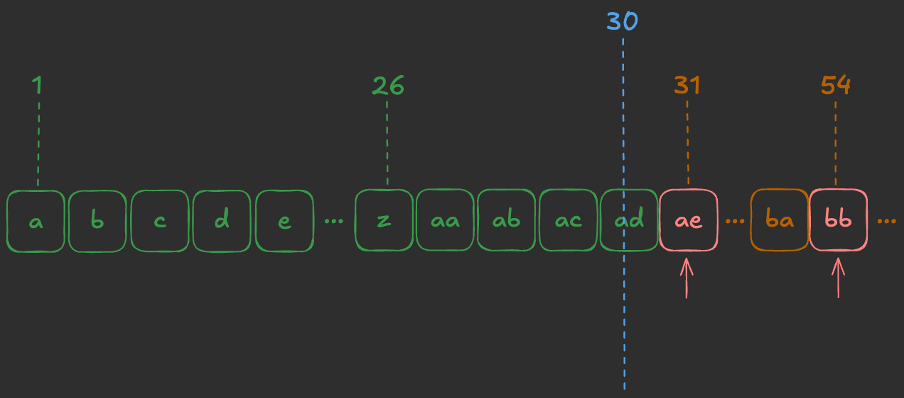
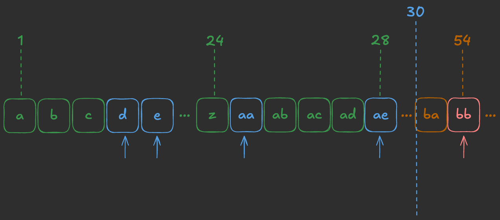
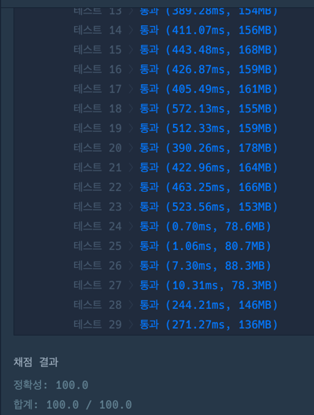

## 출처

- [프로그래머스 봉인된 주문](https://school.programmers.co.kr/learn/courses/30/lessons/389481)

## 접근

### 문제 분석

- 알파벳 순으로 정렬된 주문서에서 주어진 숫자(`n`)에 해당하는 주문서를 찾는 문제입니다.
- 이 때, 특정 주문(`bans`)이 삭제되어 있는 상태입니다.

### 시간복잡도 분석

- 주어진 숫자는 `n = 10^15` 인 long 타입의 숫자입니다.
> 따라서 해당 숫자에서 글자를 가져오는 알고리즘은 `O(N)`보다 작아야 합니다. 
- 주어진 주문인 `bans`는 길이가 `300,000`이하입니다. 또한, 각 주문의 길이는 최대 `11`입니다.
> 모든 주문의 알파벳을 비교하기 위해서는  <br>
`300,000 x 300,000(주문 간 비교) x 11(주문 길이)` <br>
`= 9x10^12 x 11` <br>
> 이므로 시간복잡도가 초과될 가능성이 있습니다. <br>
> 따라서 전체 주문을 최대 `O(NlogN)`까지 확인할 수 있습니다.

### 공간복잡도 분석
- 문제에서 삭제된 주문이 주어지기 때문에 이를 별도로 저장할 필요는 없습니다.

## 풀이

### 26진법
- 주문서의 순서는 다음과 같습니다.
```
"a"→"b"→"c"→"d"→"e"→"f"→...→"z"
→"aa"→"ab"→...→"az"→"ba"→...→"by"→"bz"→"ca"→...→"zz"
→"aaa"→"aab"→...→"aaz"→"aba"→...→"azz"→"baa"→...→"zzz"
→"aaaa"→...→"aazz"→"abaa"→...→"czzz"→"daaa"→...→"zzzz"
→"aaaaa"→...
```
- 위와 같은 형태는 26진법과 동일합니다.
> 주어진 숫자를 뒤에서부터 26으로 나누면서 확인하면 문자(주문)로 변경할 수 있습니다.

### 봉인된 주문배열 정렬
- 문제에서 주어지는 봉인된 주문의 배열인 `bans`는 `정렬 후 확인해야 합니다.`
> 작은 값부터 확인하는 이유는 앞에서 제거한 주문이 이후의 결과에 영향을 줄 수 있기 때문입니다.

- 문제의 1번 예제를 통해 정렬해야 하는 이유를 확인해보겠습니다.


- 위와 같이 `ae`라는 주문이 먼저 나오게 되면, 문제에서 주어진 `n = 30`보다 크기 때문에 해당 주문은 무시해야 합니다.


- 그러나, 위와 같이 앞에서 `d, e, aa`라는 주문을 제외한 뒤 `ae`라는 주문이 나오면 문제에서 주어진 `n = 30`이 뒤로 밀려나면서 해당 주문을 포함시켜야 합니다.

> 따라서, 주어진 주문을 앞에서부터 확인하기 위해 정렬이 필요함을 알 수 있습니다.

## 비교 함수 구현
- 비교함수를 구현하면 `정렬`할 때와, `현재 주문과 삭제된 주문의 크기를 비교`할 때 용이합니다.

## 코드
```java
import java.util.*;

class Solution {

    public String solution(long n, String[] bans) {

        // 정렬을 통해 삭제된 주문 순서대로 확인
        Arrays.sort(bans, (o1, o2) -> compare(o1, o2));

        // 삭제된 주문이 현재 주문보다 크다면 주문 숫자 1 증가(삭제 처리)
        for (String ban : bans) {
            if (compare(ban, getSpell(n)) <= 0) n++;
        }

        // 최종 주문 반환
        return getSpell(n);
    }

    // 주문 간의 크기 비교
    int compare(String s1, String s2) {

        // 두 주문의 길이가 다르다면, 길이가 긴 주문이 더 큼
        if (s1.length() != s2.length())
            return Integer.compare(s1.length(), s2.length());

        // 두 주문의 길이가 같다면, 앞에서부터 각 주문의 문자 비교
        for (int i = 0; i < s1.length(); i++) {
            if (s1.charAt(i) < s2.charAt(i)) return -1;
            else if (s1.charAt(i) > s2.charAt(i)) return 1;
        }

        // 모든 비교가 끝났다면 동일한 주문으로 판단
        return 0;
    }

    // 숫자 -> 주문 변환(진법 변환)
    String getSpell(long n) {
        StringBuilder sb = new StringBuilder();

        // 해당 숫자 맨뒤에서부터 26으로 나눈 값 문자로 치환
        while(n > 0){
            sb.append((char)('a' + (n - 1) % 26));
            n = (n - 1) / 26;
        }

        // 뒤에서부터 확인했으므로 뒤집기
        return sb.reverse().toString();
    }
}
```

## 결과



## 리뷰

- 처음부터 진법문제로 생각했다면 훨씬 쉽게 풀었을텐데, 단순 구현이라고 생각해서 복잡한 코드[^1]를 작성하느라 시간이 많이 걸렸습니다.
> 문제의 본질을 파악하는 습관을 들여야겠습니다.

## References

| URL | 게시일자 | 방문일자 | 작성자 |
| :-- | :------- | :------- | :----- |

[^1]: 최초에 작성한 숫자 -> 문자열 변환 코드입니다. 진법 문제로 생각하지 않고, 각 자리수를 일일이 분리해서 문자열을 찾았습니다.
      ```java
          String getSpell(long n) {
              int exp = 0;
              long start = -1, end = 0;
              while (end < n) {
                  start += (long)Math.pow(26, exp);
                  end += (long)Math.pow(26, exp + 1);
                  exp++;
              }
              
              StringBuilder sb = new StringBuilder();
              while (exp > 0) {
                  long ns = start;
                  int cnt = 0;
                  while (true) {
                      ns += (long)Math.pow(26, exp - 1);
                      if (ns >= n) break;
                      start = ns; cnt++;
                  }
                  sb.append((char)(cnt + 'a')); exp--;
              }
              
              return sb.toString();
          }
      ```