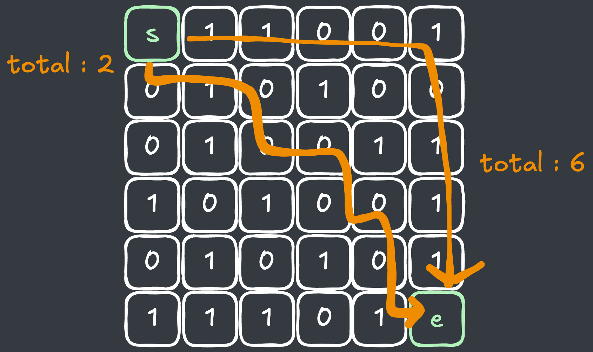
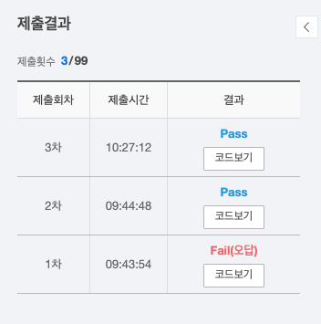

## 출처

- [SWEA 1249 보급로](https://swexpertacademy.com/main/solvingProblem/solvingProblem.do)

## 접근

### 시간복잡도 계산

- `N <= 100`, 지도의 최대 크기가 `10000`이므로, 방문 체크만 잘 해주면 완전탐색을 하는데 큰 문제가 없는 조건입니다.

### BFS

- `BFS(너비우선 탐색)`를 통해 최단경로를 구할 수 있습니다.
- 이 때, 미로찾기 알고리즘처럼 목적지에 도착하면 끝나는 것이 아니라, 가중치가 가장 낮은 경로로 이동해야 합니다.
- 따라서, 이미 목적지에 도착했더라도 더 빠른 경로가 있기 때문에 `BFS`를 종료하면 안됩니다.

  
  - 위 그림에서 `우 -> 하` 순으로 탐색을 진행할 경우, `전체 비용이 6`인 경로가 먼저 탐색되지만 비용이 가장 작은 경로는 아닙니다. 

- 이를 위해, 각 지점마다 도달할 수 있는 최소 가중치를 저장해두고, 해당 가중치보다 작은 값만 재방문이 가능하도록 하여 방문 횟수를 줄일 수 있습니다.
  - 코드로 표현하면 다음과 같습니다.
  ```java
  static int bfs(int N, int[][] map) {
    Deque<int[]> q = new ArrayDeque<>();
  
    // visited : 해당 지점에 도달할 수 있는 최소 가중치
    int[][] visited = new int[N][N];
  
    // 최소 가중치 초기화
    Arrays.stream(visited).forEach(v -> Arrays.fill(v, Integer.MAX_VALUE));
    
    q.offer(new int[] {0, 0, map[0][0]});
    visited[0][0] = map[0][0];
    
    while (!q.isEmpty()) {
        int[] cur = q.poll();
        
        for (int i = 0; i < 4; i++) {
          int nr = cur[0] + dr[i];
            int nc = cur[1] + dc[i];
            if (nr < 0 || nr >= N || nc < 0 || nc >= N) continue;
  
            // 다음 방문지점이 현재 값보다 클 때만 방문
            int now = cur[2] + map[nr][nc];
            if (now >= visited[nr][nc]) continue;
  
            visited[nr][nc] = now;
            q.offer(new int[] {nr, nc, now});
        }
    }
    
    return visited[N - 1][N - 1];
  }
  ```

### Dijkstra

- 현재 문제는 시간복잡도 상 `BFS`로도 충분히 해결이 가능하지만, 가중치가 있는 최단경로를 구할 때는 `Dijkstra`를 사용하면 더욱 빠르게 풀 수 있습니다.

> `Dijkstra`는 일종의 `Greedy`알고리즘 기법을 활용하여 다음 탐색지점을 결정하기 때문에 최단 경로로만 이동하여 탐색 횟수를 줄입니다.

- 위 알고리즘에서 `Queue`를 `PriorityQueue`로 변경 후, `현재 지점이 최소인지 확인 후 탐색을 시작`하면 다익스트라 알고리즘이 적용됩니다.
  - 코드로 표현하면 다음과 같습니다.
  ```java
  static int dijkstra(int N, int[][] map) {
  
        // 우선순위 큐 사용 | 기존 : Deque<int[]> q = new ArrayDeque<>();
        PriorityQueue<int[]> q = new PriorityQueue<>((o1, o2) -> Integer.compare(o1[2], o2[2]));
        int[][] visited = new int[N][N];
        Arrays.stream(visited).forEach(v -> Arrays.fill(v, Integer.MAX_VALUE));
        
        q.offer(new int[] {0, 0, map[0][0]});
        visited[0][0] = map[0][0];
        
        while (!q.isEmpty()) {
            int[] cur = q.poll();
            
            // 탐색 최적화(탐색 과정에서 현재보다 더 빠른 경로가 나타날 수 있음)
            if (visited[cur[0]][cur[1]] < cur[2])
                continue;
            
            for (int i = 0; i < 4; i++) {
            	int nr = cur[0] + dr[i];
                int nc = cur[1] + dc[i];
                if (nr < 0 || nr >= N || nc < 0 || nc >= N) continue;
                
                int now = cur[2] + map[nr][nc];
                if (now >= visited[nr][nc]) continue;
                
                visited[nr][nc] = now;
                q.offer(new int[] {nr, nc, now});
            }
        }
        
        return visited[N - 1][N - 1];
    }
  ```

## 풀이
```java
import java.io.*;
import java.util.*;

class Solution {
	public static void main(String args[]) throws Exception {
		BufferedReader br = new BufferedReader(new InputStreamReader(System.in));
		int T = Integer.parseInt(br.readLine());

		for(int test_case = 1; test_case <= T; test_case++) {
			  int N = Integer.parseInt(br.readLine());
            
        int[][] map = new int[N][N];

        for (int i = 0; i < N; i++) {
				    char[] s = br.readLine().toCharArray();
				    for (int j = 0; j < N; j++) 
                map[i][j] = s[j] - '0';
        }
            
        //System.out.println("#" + test_case + " " + bfs(N, map));
        System.out.println("#" + test_case + " " + dijkstra(N, map));
		}
	}
    
    static int[] dr = {0, 0, 1, -1};
    static int[] dc = {1, -1, 0, 0};
    
    // BFS
    static int bfs(int N, int[][] map) {
        
        // 너비 우선으로 탐색하는 큐
        Deque<int[]> q = new ArrayDeque<>();
        int[][] visited = new int[N][N];
        Arrays.stream(visited).forEach(v -> Arrays.fill(v, Integer.MAX_VALUE));

        q.offer(new int[] {0, 0, map[0][0]});
        visited[0][0] = map[0][0];

        while (!q.isEmpty()) {
            int[] cur = q.poll();

            if (visited[cur[0]][cur[1]] < cur[2])
                continue;

            // 4방향 탐색
            for (int i = 0; i < 4; i++) {
                int nr = cur[0] + dr[i];
                int nc = cur[1] + dc[i];
                if (nr < 0 || nr >= N || nc < 0 || nc >= N) continue;

                int now = cur[2] + map[nr][nc];
                if (now >= visited[nr][nc]) continue;

                visited[nr][nc] = now;
                q.offer(new int[] {nr, nc, now});
            }
        }

        // 목적지까지의 최소경로 출력
        return visited[N - 1][N - 1];
    }
    
    // 다익스트라
    static int dijkstra(int N, int[][] map) {
        
        // 우선순위 큐 사용
        PriorityQueue<int[]> q = new PriorityQueue<>((o1, o2) -> Integer.compare(o1[2], o2[2]));
        
        // 방문 배열 초기화
        int[][] visited = new int[N][N];
        Arrays.stream(visited).forEach(v -> Arrays.fill(v, Integer.MAX_VALUE));
        
        q.offer(new int[] {0, 0, map[0][0]});
        visited[0][0] = map[0][0];
        
        while (!q.isEmpty()) {
            int[] cur = q.poll();
            
            // 탐색 최적화
            if (visited[cur[0]][cur[1]] < cur[2])
                continue;
            
            for (int i = 0; i < 4; i++) {
            	int nr = cur[0] + dr[i];
                int nc = cur[1] + dc[i];
                if (nr < 0 || nr >= N || nc < 0 || nc >= N) continue;
                
                int now = cur[2] + map[nr][nc];
                if (now >= visited[nr][nc]) continue;
                
                visited[nr][nc] = now;
                q.offer(new int[] {nr, nc, now});
            }
        }
        
        return visited[N - 1][N - 1];
    }
}
```

## 결과

- 소요시간 : 28:33



- BFS 시 실행 시간 : `0.53029s`
- 다익스트라 적용 시 : `0.21911s`

## 리뷰

뭔가 출제자는 다익스트라를 의도하고 낸 것 같은데 `BFS`만으로도 풀려서 생각보다 금방 풀 수 있었습니다.

> 그래도 시간복잡도가 빡빡한 문제를 대비해야 하기 때문에 최적화를 항상 고민해야겠습니다.

## References

| URL | 게시일자 | 방문일자 | 작성자 |
| :-- | :------- | :------- | :----- |
