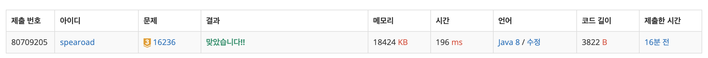

## 출처

- https://www.acmicpc.net/problem/16236

## 접근

### 알고리즘

- 시작지점부터 가장 가까운 물고기부터 탐색합니다.
- 문제 조건에서 주어진 물고기를 선택하는 기준을 만족하기 위해, Heap[^1]에 다음 물고기를 넣어 정렬하였습니다.
- 다음 물고기가 먹을 수 있는 물고기라면, 해당 위치를 시작점으로 다시 BFS를 수행합니다.

### 시간복잡도 고민

- BFS로 물고기를 먹으러 이동하면서 걸리는 시간 : O(N^2)
- 이동하면서 물고기를 정렬하는 시간(Priority Queue 사용 시) : O(NlogN)
  > N = 20 이므로 시간복잡도 내 충분히 가능하다고 판단했습니다.

### 유의사항

- PriorityQueue를 정렬할 때, Integer의 유틸리티 메서드인 compare()를 활용하면 좋다고 합니다.[^2]
- 물고기를 먹은 뒤 해당 위치에서 BFS를 다시 수행하기 위해 방문 배열을 초기화하는 로직이 필요합니다.

## 풀이

```java
package solving;

import java.io.BufferedReader;
import java.io.IOException;
import java.io.InputStreamReader;
import java.util.*;

/*
 * [조건]
 * 시간 제한 : 2초 / 메모리 제한 512MB
 * [풀이]
 * 오른쪽 아래부터 역으로 공간을 돌면서 가장 가까운 물고기의 위치를 확인한다.(N^2)
 * 해당 물고기를 먹으러 이동하면서 걸리는 시간을 측정한다.(N^2)
 * 더이상 이동할 수 없거나, 모든 칸이 빌때까지 이를 반복한다(N^2)
 * => N^6 = 20^6 = 32 x 10^6 이므로 시간복잡도 내 가능
 * 시작지점부터 가장 가까운 물고기를 탐색한다.
 * 해당 지점까지 bfs로 이동하여 해당 지점이 나오면 걸린 시간을 현재시간에 더한다.
 * 더이상 이동이 불가능하다면 현재 시간을 출력한다.
 * 이동이 가능하다면 먹은 횟수를 더하고, 먹은 횟수가 상어의 크기만큼 쌓이면 상어 크기를 1 늘린다.
 */
public class bj_16236_아기_상어 {
    static int N, eatCount, size = 2;
    static int[] start;
    static int[][] space;

    public static void main(String[] args) throws IOException {
        BufferedReader br = new BufferedReader(new InputStreamReader(System.in));
        N = Integer.parseInt(br.readLine());
        space = new int[N][N];
        start = new int[2];
        for (int i = 0; i < N; i++) {
            StringTokenizer st = new StringTokenizer(br.readLine());
            for (int j = 0; j < N; j++) {
                int now = Integer.parseInt(st.nextToken());
                if (now == 9) start = new int[]{i, j};
                space[i][j] = now;
            }
        }

        System.out.println(bfs());
    }

    // 먹을 수 있는 물고기가 더 없을떄까지 bfs 이동
    static int[] dr = {-1, 0, 0, 1};
    static int[] dc = {0, -1, 1, 0};
    private static int bfs() {
        boolean[][] visited = new boolean[N][N];

        // 우선순위 큐 : 거리 > 위 > 왼쪽 순으로 내부 정렬
        PriorityQueue<int[]> q = new PriorityQueue<>((o1, o2) -> {
            if (o1[2] != o2[2]) return Integer.compare(o1[2], o2[2]); // Integer.compare() 메서드 활용
            if (o1[0] != o2[0]) return Integer.compare(o1[0], o2[0]);
            return Integer.compare(o1[1], o2[1]);
        });
        int ret = 0;
        q.offer(new int[] {start[0], start[1], 0});
        visited[start[0]][start[1]] = true;

        while (!q.isEmpty()) {
            int[] now = q.poll();

            // 자신보다 작은 물고기를 만났을 때 : 해당 물고기를 먹은 후 큐를 비우고 다시 bfs 시작
            int fish = space[now[0]][now[1]];
            if (fish != 0 && fish < size) {
                if (++eatCount >= size) {
                    size++;
                    eatCount = 0;
                }

                // 이동시간 갱신
                ret += now[2];

                // bfs 초기화 + 방문배열 초기화
                q.clear();
                q.offer(new int[]{now[0], now[1], 0});
                for (int j = 0; j < N; j++) Arrays.fill(visited[j], false);
                visited[now[0]][now[1]] = true;

                // 공간 변화 : 아기상어 위치 이동 + 최초위치 아기상어 칸 비우기
                space[now[0]][now[1]] = 9;
                space[start[0]][start[1]] = 0;
                start = new int[]{now[0], now[1]};

                continue;
            }

            for (int i = 0; i < 4; i++) {
                int nr = now[0] + dr[i];
                int nc = now[1] + dc[i];
                if (nr < 0 || nr >= N || nc < 0 || nc >= N) continue;
                if (visited[nr][nc] || space[nr][nc] > size) continue;
                visited[nr][nc] = true;
                q.offer(new int[] {nr, nc, now[2] + 1});
            }
        }

        return ret;
    }
}
```

## 결과



## 리뷰

- 먹을 수 있는 가장 가까운 물고기의 위치를 구하기 위해 BFS를 문제의 조건에 맞게 구현하는 문제였습니다.
  > 최단거리를 구할 때 기본적으로 BFS를 고려하는 습관을 들여야겠습니다.
- CompareTo를 구현하기 위해 Integer의 유틸리티 메서드를 활용하는 것이 좋다는 것을 이펙티브 자바를 읽으며 알게 되었고, 실제로 활용해볼 수 있었습니다.
- 접근방법을 알면 생각보다 간단히 구현할 수 있는 문제이지만, 구현 과정에서 디버깅하면서 1시간 정도 소요되었습니다.
  > 이럴 때 IDE의 디버깅 모드를 활용할지 고민이지만, 프로그래머스 같은 웹 환경에서 코딩테스트에 익숙해지기 위해 최대한 console만으로 디버깅하는 연습을 하려고 노력중입니다.
  > 구현 문제는 꾸준히 연습해야 시간을 단축할 수 있는 것 같습니다.

## References

| URL | 게시일자 | 방문일자 | 작성자 |
| :-- | :------- | :------- | :----- |

[^1]: Heap을 구현한 PriorityQueue를 사용했습니다.
[^2]: 이펙티브 자바(Effective Java 3/E) "Item 14 : Comparable을 구현할지 고려하라" 참조
