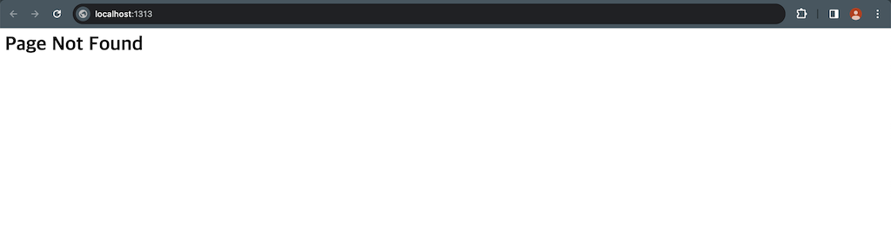
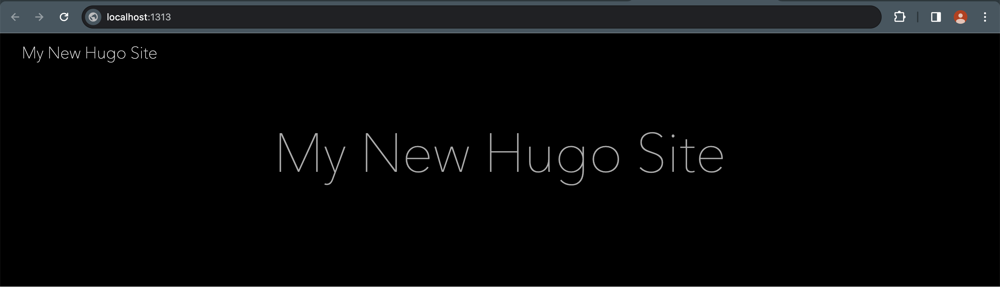
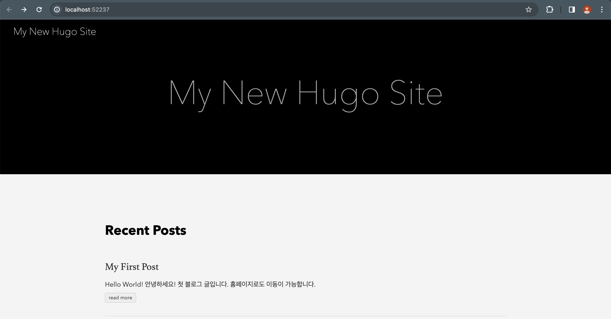

## 도입

> 이전 포스팅 참조 :
> [개발 블로그의 종류와 선택](https://leaf-nam.github.io/posts/blog/%EA%B0%9C%EB%B0%9C_%EB%B8%94%EB%A1%9C%EA%B7%B8%EC%9D%98_%EC%A2%85%EB%A5%98%EC%99%80_%EC%84%A0%ED%83%9D_240229/) > [SSG에 대하여](https://leaf-nam.github.io/posts/blog/ssg%EC%97%90-%EB%8C%80%ED%95%98%EC%97%AC_240302/)

어떤 개발 블로그를 사용할지도 정했고, SSG 엔진도 정했으니 이제 진짜로 블로그를 만들어보겠습니다.

이 글을 읽는 분들은 처음 Hugo를 접하실테니 간단한 구조와 기본적인 명령어, 테마 적용법 정도만 알아보고 자세한 환경설정은 차후 별도의 포스팅으로 다룰 예정입니다.

그 외 환경설정은 Hugo 공식문서[^1]에 친절하게 ~~(영어로)~~ 정리되어 있으니 해당 페이지를 확인하시면 됩니다.

~~Hugo 관련된 오류들은 한글로 검색해도 잘 안나와서 자동으로 영어공부를 하게 해줍니다 :cry:~~

> [이 포스팅은 Git이 설치되어 있는 것을 전제로 합니다. 혹시 Git이 설치되지 않은 분들은 설치 후 진행해주세요.](https://git-scm.com/downloads)

## Hugo 설치방법

Hugo의 쉘 스크립트[^2]를 사용하기 위해서는 별도의 설치가 필요합니다.

맥 유저는 brew를 사용하면 정말 간편하게 설치할 수 있습니다. brew를 사용할 수 없는 윈도우는 직접 압축파일을 받아 설치하시거나 별도의 패키지 매니저를 통해 설치가 가능합니다.

### 윈도우

1.  **패키지 매니저를 활용해 설치**

    - 환경변수나 기본 세팅을 패키지 매니저를 통해 쉽게 할 수 있습니다.

      1. **패키지 매니저를 다운로드**합니다.

      - [Hugo 공식문서](https://gohugo.io/installation/windows/#package-managers)에서 지원하는 윈도우 패키지 매니저는 Chocolatey, Scoop, Winget 3가지 종류가 있습니다.

      > 저는 윈도우 노트북에서 설치 시 Scoop을 사용해 설치를 진행했기에 Scoop을 설치하는 것을 예시로 설명드리겠습니다.

      - Scoop 설치방법은 [공식 홈페이지](https://scoop.sh/)에 나와있는 것처럼 윈도우에 기본 설치된 PowerShell을 열어서 다음 스크립트를 실행하시면 됩니다.

        ```py
        $ Set-ExecutionPolicy -ExecutionPolicy RemoteSigned -Scope CurrentUser

        $ Invoke-RestMethod -Uri https://get.scoop.sh | Invoke-Expression
        ```

      2. **Hugo를 설치**합니다.

         ```py
          $ scoop install hugo-extended
         ```

      > 위 명령어를 사용하면 자동으로 환경변수 세팅까지 완료됩니다.

2.  **Hugo 패키지 직접 설치**

    - 패키지 매니저 설치가 귀찮으시면 다음과 같이 진행할 수 있습니다. 다만, 환경변수를 직접 설정해야 합니다.

      1. [공식 깃허브에 **최신 패키지가 릴리즈**되고 있습니다.](https://github.com/gohugoio/hugo/releases) 해당 **패키지를 다운로드** 받습니다.

      > Assets > Show all 24 assets > hugo\_{최신버전}\_windows-amd64.zip

      2. **다운로드 받은 파일을 hugo > bin 폴더에 압축 해제**합니다.(나중에 환경변수를 통해 접근하기 때문에 폴더는 어디에 생성하셔도 무관합니다.[^3])

      > c:₩{설치경로}₩hugo₩bin₩{압축파일 해제}

      3. **환경변수를 세팅**합니다.

      - 명령어를 실행하려면 hugo.exe가 포함된 c:₩{설치경로}₩hugo₩bin 폴더를 환경변수에 등록해야 합니다.[^4]

      > 저는 맥에서 작업하고 있어 구체적인 설명은 [윈도우 도움말](<https://learn.microsoft.com/en-us/previous-versions/windows/it-pro/windows-2000-server/bb726962(v=technet.10)?redirectedfrom=MSDN>)을 확인하시거나, 환경변수 관련된 블로그 글이 많으니 구글신의 도움을 받읍시다.

### 맥 & 리눅스

- [brew](https://brew.sh/)만 설치되어 있으면 코드 1줄이면 끝입니다.

  ```py
  $ brew install hugo
  ```

### 설치 확인

- 다음 명령어를 쳤을 때 휴고 버전이 0.112.0 이상이면 정상 설치 완료입니다.

  ```py
  $ hugo version
  # hugo v0.123.4-21a41003c4633b142ac565c52da22924dc30637a+extended darwin/arm64 BuildDate=2024-02-26T16:33:05Z VendorInfo=brew
  ```

> 참고로 윈도우의 경우 Git Bash와 같은 리눅스 기반 쉘에서 실행하라는 경고문이 있습니다.[^5]

## 디렉터리 생성 및 로컬 실행

이제 Hugo 설치를 마쳤으니, 블로그를 위한 디렉터리를 구성하고 로컬에서 직접 실행해보겠습니다.

1. **사이트 디렉터리 생성**

- 다음 명령어를 통해 디렉터리를 생성할 수 있습니다.

  ```py
  # 사이트명 내부에 본인이 원하는 사이트 이름을 적습니다.(괄호는 제외)
  $ hugo new site {사이트명}
  ```

2. **로컬서버 실행**

- 이어서 다음 명령어를 실행하면 해당 디렉터리로부터 서버를 생성해서 로컬로 띄워줍니다.

  ```py
  $ hugo server
  # Web Server is available at http://localhost:1313/ (bind address 127.0.0.1)
  ```

- 서버주소는 기본적으로 [localhost:1313](http://localhost:1313) 입니다.
- 정상 실행된다면, 브라우저에서 다음과 같은 화면이 나옵니다.

  

3. **디렉터리 구조**

- 생성된 디렉터리 구조는 다음과 같습니다.

  ```py
  ├── archetypes        # 새 블로그 글을 쓰면 생성되는 글의 기본 형식을 작성할 수 있습니다.
  │   └── default.md    # 별다른 옵션없이 글을 작성하면 생성되는 글의 포맷입니다.
  ├── assets            # 로고 이미지와 같은 이미지나 js, css 등의 파일이 위치합니다.
  ├── content           # 작성한 글이 들어가는 디렉터리입니다. 차후 해당 디렉터리를 참고해 블로그 페이지를 빌드합니다.
  ├── data              # json이나 csv, yaml과 같은 데이터를 저장할 수 있습니다.
  ├── hugo.toml         # 설정파일입니다. 다양한 설정들이 있으며 차후 별도 포스팅으로 다룰 예정입니다.
  ├── i18n              # 국제화 시 웹사이트 번역 내용이 포함됩니다. 글로벌하게 포스팅을 하려면 번역해서 넣으면 됩니다.
  ├── layouts           # header, body 등 http 템플릿의 레이아웃을 설정할 수 있습니다.
  ├── public            # hugo가 빌드한 파일이 들어가는 경로입니다. 차후 서버가 배포되면 해당 위치의 파일들을 제공합니다.
  │   ├── categories
  │   │   └── index.xml
  │   ├── index.xml
  │   ├── sitemap.xml
  │   └── tags
  │       └── index.xml
  ├── static            # 빌드 시에 그대로 들어가야 하는 정적파일들이 들어갑니다. favicon.ico, robots.txt 등이 있습니다.
  └── themes            # 다운로드한 테마가 들어갑니다.
  ```

## 테마 적용 및 블로그 글 작성

1. **테마 적용방법**

- hugo사이트에서 기본적으로 제공하는 ananke 테마를 적용해보겠습니다.

  > 새로 생성한 사이트 루트 디렉토리에서 진행합니다.

- 깃으로 테마를 다운로드 하기 위해 다음과 같은 명령어를 사용합니다.

```py
# 해당 경로에서 git을 생성합니다.
$ git init
# submodule로 테마를 다운로드 받습니다.
$ git submodule add https://github.com/theNewDynamic/gohugo-theme-ananke.git themes/ananke
```

- 해당 테마를 적용하기 위해 설정파일(hugo.toml)에 테마를 명시합니다.

```py
# hugo.toml파일을 열고 아래 내용을 적으시면 됩니다.
theme = 'ananke'
```

- 아까 접속한 로컬 서버에 테마가 적용되었는지 확인합니다.



2. **블로그 글 작성**

- 블로그 글을 작성하는 명령어는 다음과 같습니다.

```py
# 해당 명령어를 사용하면 /content 내부에 /posts/my-first-post.md 파일이 생성됩니다.
$ hugo new content posts/my-first-post.md
```

- 해당 파일에 다음과 같은 내용을 작성해봅시다.

```java
//  아래 주석의 내부를 /posts/my-first-post.md 파일의 생성된 글 아래에 붙여넣으시면 됩니다.

+++
title = 'My First Post'
date = 2024-03-03T16:49:22+09:00
draft = true
+++
/*
<!-- -----------여기부터-------------- -->
## Hello World!

*안녕하세요!* **첫 블로그 글**입니다.

[홈페이지](http://localhost:1313)로도 이동이 가능합니다.

<!-- -----------여기까지-------------- -->
*/
```

- 이제 로컬 서버에서 확인하기 위해 서버가 실행중인 쉘에서 서버를 중지한 후, -D 옵션을 붙여 다시 시작해봅시다.

```java
/* 로컬서버 중지 */
$ ctrl + c
/* 서버 재시작 */
$ hugo server -D
```

- 글이 정상적으로 업로드 되었는지 확인해봅니다.



> 여기까지 따라오셨다면, 블로그 생성 및 게시글 작성까지 완료입니다!

## 결론

지금까지 Hugo의 설치방법과 블로그 생성 및 글 작성방법에 대해 알아보았습니다.

> 명령어 몇 줄로 쉽게 홈페이지를 생성할 수 있다니 참 좋은 세상에 살고 있는 것 같습니다. :smile:

다음 시간에는 Git pages를 활용해서 웹에 블로그를 직접 배포해 보겠습니다.

## References

[^1]: ["Hugo 공식 문서"](https://gohugo.io/documentation/)
[^2]: 쉘에서 사용하는 간단한(?) 명령어를 뜻합니다. 윈도우에서는 cmd나 powershell 등에서 실행이 가능하고, 맥에서는 기본적으로 zsh나 bash로 실행할 수 있습니다. 자세한 설명은 [위키백과](https://ko.wikipedia.org/wiki/%EC%85%B8_%EC%8A%A4%ED%81%AC%EB%A6%BD%ED%8A%B8)를 확인하세요.
[^3]: 다만 다른 설치프로그램들과 함께 관리하기 위해 C:₩Program Files₩ 경로에 hugo 폴더를 생성해서 설치하는 것을 권장합니다.
[^4]: 이 절차를 거치지 않으면 매번 hugo 명령어를 쓸때마다 c:₩{설치경로}₩hugo₩bin₩hugo를 적어야 하므로 매우 불편합니다.
[^5]: [윈도우 사용자를 위한 경고문](https://gohugo.io/getting-started/quick-start/#commands)

    ~~제가 직접 PowerShell에서 기본적인 명령어를 쳤을땐 잘 작동했던 것 같은데 어디선가 충돌이 발생하나 봅니다.~~
