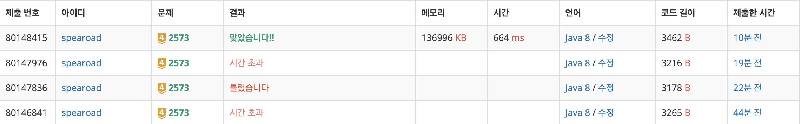

## 출처

- https://www.acmicpc.net/problem/2573

## 접근

- 각 칸이 10이하이고 전체 칸은 10,000이므로 빙산을 모두 녹이려면 10 _ 10,000 _ 10,000이지만, 네 변이 노출되면 금방 사라지므로 완전탐색이 가능하다고 판단했습니다.
- 매 회마다 빙산을 녹이고, 빙산을 bfs(dfs)로 탐색해서 두 덩어리가 있는지 확인한다.
- 모든 빙산이 다 녹았지만 2개로 분리되지 않는 경우를 주의한다.[^1]

## 풀이

```java
package solving;

import java.io.BufferedReader;
import java.io.IOException;
import java.io.InputStreamReader;
import java.util.*;

/*
 * [조건]
 * 시간제한 : 1초, 메모리 제한 : 256MV
 * 이차원 배열의 크기가 300^2 이하이며 전체 칸의 개수는 10,000개 이하, 각 칸의 크기는 10 이하
 * [풀이]
 * 각 칸이 10이하이고 전체 칸은 10,000이므로 빙산을 모두 녹이려면 10 * 10,000 * 10,000이지만, 네 변이 노출되면 금방 사라지므로 완전탐색
 * 매 회마다 빙산을 녹이고, 빙산을 bfs로 탐색해서 두 덩어리가 있는지 확인한다.
 */
public class bj_2573_빙산 {

    static int N, M, count;
    static int[] dr = {0, 0, 1, -1};
    static int[] dc = {1, -1, 0, 0};
    static int[][] pole;

    public static void main(String[] args) throws IOException {
        // 초기화
        BufferedReader br = new BufferedReader(new InputStreamReader(System.in));
        StringTokenizer st = new StringTokenizer(br.readLine());
        N = Integer.parseInt(st.nextToken());
        M = Integer.parseInt(st.nextToken());
        pole = new int[N][M];
        for (int i = 0; i < N; i++) {
            st = new StringTokenizer(br.readLine());
            for (int j = 0; j < M; j++) pole[i][j] = Integer.parseInt(st.nextToken());
        }

        count = 0;

        // 빙산을 녹이면서 두 개로 분리되는지 확인
        while (!isFinished()) {
            melt();
            count++;
        }
        System.out.println(count);
    }

    // 빙산 녹이기(녹은 값을 별도의 리스트에 저장 후 마지막에 반영)
    private static void melt() {
        List<int[]> melted = new ArrayList<>();
        for (int i = 0; i < N; i++) {
            for (int j = 0; j < M; j++) {
                if (pole[i][j] == 0) continue;
                int now = pole[i][j];
                for (int k = 0; k < 4; k++) {
                    int nr = i + dr[k];
                    int nc = j + dc[k];
                    if (nr < 0 || nr >= N || nc < 0 || nc >= M || pole[nr][nc] != 0) continue;
                    now --;
                }
                if (now < 0) now = 0;
                melted.add(new int[] {i, j, now});
            }
        }
        for (int[] now : melted) pole[now[0]][now[1]] = now[2];
    }

    // 2개로 분리되었는지 확인(BFS)
    private static boolean isFinished() {
        // 두 덩이로 분리되지 않고 모든 빙산이 녹았을때 예외처리(중요)
        int sum = 0;
        for (int i = 0; i < N; i++) {
            for (int j = 0; j < M; j++) {
                sum += pole[i][j];
            }
        }
        if (sum == 0) {
            count = 0;
            return true;
        }

        // BFS 초기화
        Queue<int[]> q = new ArrayDeque<>();
        boolean[][] isVisited = new boolean[N][M];
        boolean isOneBlock = false;

        // 한 얼음을 만날때까지 확인
        for (int i = 0; i < N; i++) {
            for (int j = 0; j < M; j++) {
                if (!isVisited[i][j] && pole[i][j] != 0) {

                    // 이미 얼음을 만났음에도 다시 만난 경우 true(빙산이 2개로 나눠짐)
                    if (isOneBlock) return true;
                    isOneBlock = true;

                    // BFS를 돌면서 방문처리
                    q.offer(new int[] {i, j});
                    isVisited[i][j] = true;
                    while (!q.isEmpty()) {
                        int[] now = q.poll();
                        for (int k = 0; k < 4; k++) {
                            int nr = now[0] + dr[k];
                            int nc = now[1] + dc[k];
                            if (nr < 0 || nr >= N || nc < 0 || nc >= M || pole[nr][nc] == 0 || isVisited[nr][nc]) continue;
                            isVisited[nr][nc] = true;
                            q.offer(new int[] {nr, nc});
                        }
                    }
                }
            }
        }

        return false;
    }
}
```

## 결과



## 리뷰

- BFS를 사용한 간단한 구현문제였습니다.
- 2등분 되기 전에 얼음이 모두 녹아버리는 경우를 예외처리하지 않아 시간초과가 발생[^2]해서 헤맸습니다.
- 실제 구현하는데는 오래 걸리지 않았지만 시간초과가 발생해서 최적화 문제로 생각했고, 예외상황을 생각하는데 많은 시간이 걸렸습니다.
  > 문제 풀이가 막히거나 시간 초과가 발생한다면 최적화보다는 예외상황을 우선 점검하는게 좋을 것 같습니다.

## References

| URL | 게시일자 | 방문일자 | 작성자 |
| :-- | :------- | :------- | :----- |

[^1]: 문제에도 위 경우에는 0으로 처리하라는 주의사항이 있습니다.
[^2]: 제 풀이에서 얼음이 모두 녹아버리면 while문을 빠져나오지 못해 시간초과가 발생합니다.
