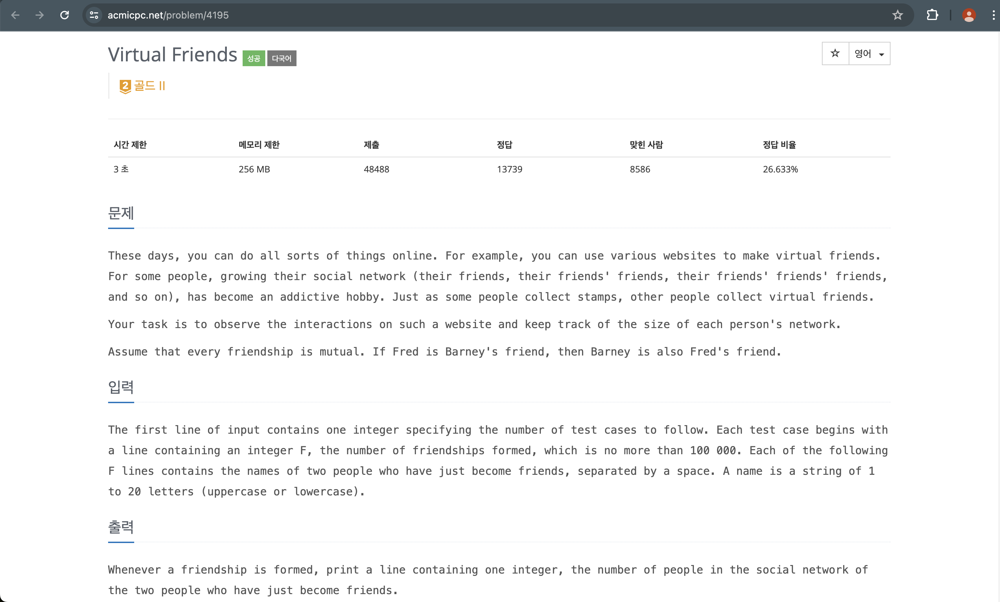

## 출처

- https://www.acmicpc.net/problem/4195

## 접근

- 처음에는 문제가 잘 이해되지 않았습니다.[^1]
- 몇 번 읽어보니, 두 정점이 주어지면 두 정점을 연결하고 같은 그래프 내에 있는 모든 친구 개수를 출력하는 문제임을 알았습니다.
  
- 친구관계가 연결되어 같은 그래프에 포함되는 과정이 Union-Find 알고리즘과 동일하기 때문에, 이를 활용하여 해결할 수 있습니다.

### 유니온 파인드(Union Find)

- Union과 Find 메서드를 통해 서로소 집합[^2]을 연결하는 알고리즘입니다.
- 각 집합의 단위는 Root로부터 하위 원소들로 구성되며, 모든 원소들은 동일한 Root를 바라보는 특징이 있습니다.
- Union과 Find를 간략히 그림으로 나타내면 다음과 같습니다.
  

1. Root는 본인을 바라보는 노드이며, 최초 네트워크가 구성될 때 본인을 바라보도록 만듭니다.

#### Union

- union 연산을 수행하면, 서로 교집합이 없는 두 네트워크의 Root를 한쪽을 바라보도록 연결합니다.
- 이 때, 한쪽 네트워크의 부모를 다른 네트워크의 부모를 바라보도록 변경해주면 되므로 연결 과정은 O(1)로 연산이 가능합니다.

#### Find

- find 연산을 수행하면, 부모가 본인인 노드(Root)가 나올때까지 탐색을 수행합니다.
- 만약 네트워크 끝에서부터 탐색한다면(위 그림에서 3, 5번 노드), 최대 O(N)의 시간복잡도가 필요합니다.
- 이를 줄이기 위해 Find과정에서 만나는 부모들을 모두 부모를 바라보도록 변경하는 작업을 수행하면, 처음 탐색속도는 동일하게 O(N)이지만 이후 탐색속도는 O(1)이 되도록 개선할 수 있습니다.[^3]

## 풀이

```java
import java.io.BufferedReader;
import java.io.IOException;
import java.io.InputStreamReader;
import java.util.HashMap;
import java.util.LinkedList;
import java.util.List;
import java.util.StringTokenizer;

/*
 * [조건]
 * 시간제한 : 3초 / 메모리제한 : 256MB
 * F <= 100,000 / name.length() <= 20
 * [풀이]
 * Union find 알고리즘을 통해 공통 친구 네트워크의 개수를 구한다.
 * 친구 집합의 root를 find를 통해 찾는다.
 * root가 아직 정해지지 않았다면, 공통 집합에 가입시킨다.
 * 두 친구관계가 만나면 Union을 통해 공통 집합에 가입시키고, 공통 집합의 크기를 더한다.
 */
public class bj_4195_친구_네트워크 {

    static int groupId = 0;
    static HashMap<String, String> friendship; // 친구관계(부모)를 가리키는 해시맵
    static HashMap<String, Integer> rootCount; // 네트워크 크기를 루트와 매핑하는 해시맵

    public static void main(String[] args) throws IOException {
        BufferedReader br = new BufferedReader(new InputStreamReader(System.in));
        int T = Integer.parseInt(br.readLine());
        for (int i = 0; i < T; i++) {
            int F = Integer.parseInt(br.readLine());
            friendship = new HashMap<>();
            rootCount = new HashMap<>();
            for (int j = 0; j < F; j++) {
                StringTokenizer st = new StringTokenizer(br.readLine());
                String f1 = st.nextToken();
                String f2 = st.nextToken();
                System.out.println(getFriends(f1, f2));
            }
        }
    }

    /*
     * 집합(친구관계)을 생성하는 메서드
     */
    static void makeSet(String s) {
        friendship.put(s, s);

        // 최초 친구 : 1명
        rootCount.put(s, 1);
    }

    /*
     * 각 네트워크의 루트를 찾아(Find) 두 관계를 합치는 메서드
     * 왼쪽값의 root에 오른쪽을 편입시킴
     */
    static int union(String s1, String s2) {
        String root1 = find(s1);
        String root2 = find(s2);

        // 이미 친구일 경우 예외처리
        if (root1.equals(root2)) return rootCount.get(root1);

        // 네트워크 편입
        friendship.put(root2, root1);

        // 편입 시 두 네트워크의 합으로 루트 해시맵의 값을 변경, 네트워크의 합 return
        int value = rootCount.get(root1) + rootCount.get(root2);
        rootCount.put(root1, value);
        return value;
    }

    /*
     * 부모를 찾는 메서드
     * HashMap의 값이 본인이 아니면 본인이 나올때까지 재귀호출하여 path compression
     * HashMap의 값 == 본인 이면 root
     */
    static String find(String me) {

       // Recursive Path Compression(재귀적으로 부모값을 루트로 변경시켜 이후 탐색속도 높임)
        if (!me.equals(friendship.get(me)))
          friendship.put(me, find(friendship.get(me)));

        return friendship.get(me);
    }

    /*
     * 두 네트워크를 합치고 공통의 친구 개수를 찾는 메서드
     */
    static int getFriends(String f1, String f2) {
        if (!friendship.containsKey(f1)) makeSet(f1);
        if (!friendship.containsKey(f2)) makeSet(f2);
        return union(f1, f2);
    }
}
```

## 결과


## 리뷰

- 오랜만에 유니온 파인드 알고리즘을 만나서 복습해볼 수 있었습니다.
- 중간에 같은 네트워크에 이미 소속된 두 친구가 만났을 경우를 예외처리하지 않아서 조금 헤맸습니다.
- 확실히 구현문제는 예외 상황들을 미리 그려놓고 문제 풀이에 들어가야 빠르게 처리할 수 있는 것 같습니다.

## References

| URL | 게시일자 | 방문일자 | 작성자 |
| :-- | :------- | :------- | :----- |

[^1]:
    개인적으로 영어 원문으로 변경하니 더 이해가 쉬웠던 것 같습니다.
    

[^2]: 서로 중복(교집합)이 없는 집합을 말합니다. 애초에 교집합이 있다면 같은 네트워크 안에 포함되어 있기 때문에 유니온 연산이 불가능합니다.
[^3]: 위 과정을 경로 압축(Path Compression)이라고 부릅니다. 이번 문제에서 경로압축을 하지않으면 O(N)의 탐색을 N(100,000)회 수행하므로 O(N^2) ≒ 2^40 으로 시간초과가 발생합니다.
