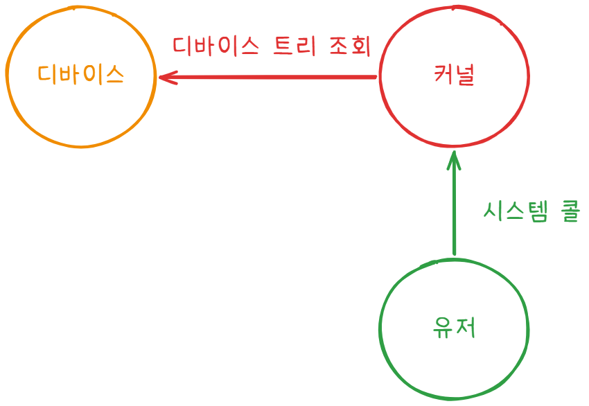
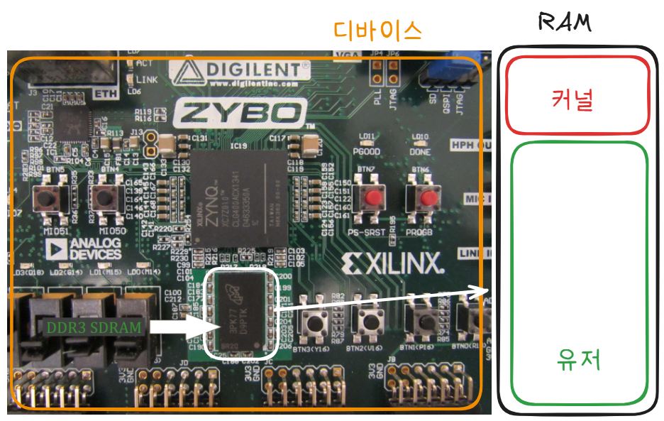
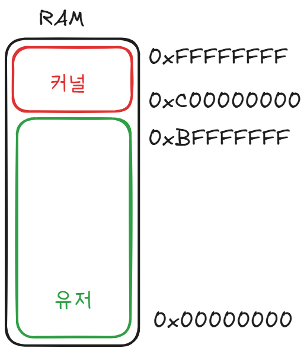
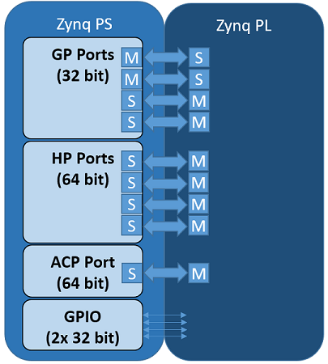
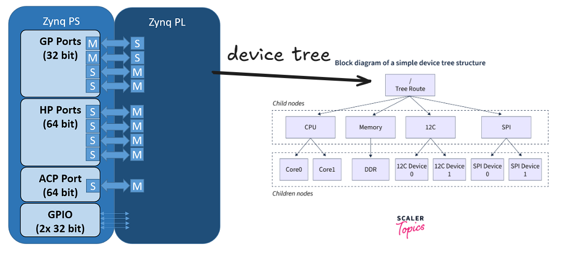
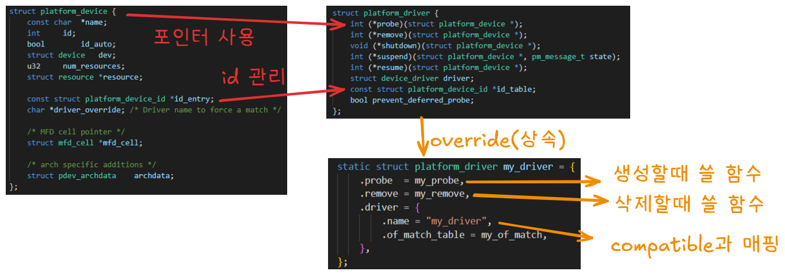

## 개요 

Zynq 보드와 같은 SoC 기반 시스템에서 **사용자 애플리케이션(App)** 이 **FPGA 디바이스**를 제어하기 위해서는 **커널(Kernel)** 과 **디바이스(Device)** 간의 메모리 접근 메커니즘을 이해하는 것이 중요합니다. 

이번 글에서는 **디바이스 트리(Device Tree)** 와 **비트스트림(Bitstream)** 을 기반으로 커널과 유저 영역에서 디바이스를 읽고 쓰는 전체 구조를 살펴보겠습니다.

## 전체 그림

전체 아키텍처는 다음과 같습니다.



위와 같이 **device**, **kernel**, **user** 가 상호작용하여 프로그램을 수행합니다.



징크보드로 전체 구조를 살펴보면 위와 같습니다.

### 유저(app)

사용자가 기대하는 동작은 다음과 같습니다.

- **open()** : 장치 드라이버를 연다. 
- **read()** : 장치 정보를 조회한다.
`ex. led가 켜져있는지 확인`

- **write()** : 장치에 쓰기 작업을 한다.
`ex. led 켜기`

- **ioctl()** : 장치에 기타 작업을 한다.
`ex. led 색 바꾸기 등`

> **위 함수들의 이름은 앞으로 계속 나오기때문에 기억해두시면 좋습니다.**

### 커널

이번에는 커널 입장에서 해야 할 일들을 확인해 보겠습니다.

- **probe()** : 드라이버 주소를 받아온다.
- **read()** : 사용자가 읽으면 디바이스 주소를 읽어서 전달한다.
- **write(), ioctl()** : 사용자가 요청하면 디바이스 주소에 요청값을 쓴다.

### 디바이스

디바이스는 다음의 한가지 일만 하면 됩니다.

- **비트스트림(.bit), 디바이스 트리(.dts)** : 자신의 메모리 주소 제공 

##  주소체계

각 요소가 주소를 어떻게 관리하는지 좀만 더 들어가보겠습니다.

### 유저 & 커널



위 그림과 같이 징크보드(`4GB RAM`)의 메모리는 유저영역과 커널영역으로 나눠서 사용합니다.

 - 유저영역 주소 : `0x00000000 ~ 0xBFFFFFFF`
 - 커널영역 주소 : `0xC0000000 ~ 0xFFFFFFFF`

### 디바이스



위와 같이 디바이스 트리는 PS와 PL영역으로 구분됩니다.

- 커널영역 주소 : PS(고정) + PL(유동)

> 쉽게 PS는 칩과 연결된 영역, PL은 FPGA등으로 프로그래밍 가능한 영역이라고 생각할 수 있습니다.


## 메모리 접근 메커니즘

그럼 서로 다른 주소체계를 사용하는 커널과 디바이스가 어떻게 메모리에 접근하는지 살펴보겠습니다.

아래는 디바이스 - 커널 - 유저 순으로 실제 장비가 등록되고, 호출되는 순서를 시간 순으로 나열한 것입니다. 

### 1. 비트스트림 생성 시점
FPGA 등으로 설계한 `PL`영역의 하드웨어 `비트스트림`을 추출합니다.
> PS영역은 이미 고정된 주소이기 때문에 변경되지 않습니다.

### 2. 커널 빌드 시점
비트스트림의 각 주소에 맞는 디바이스 트리를 작성합니다.
커널을 빌드할때 부팅파일(`BOOT.BIN`)에 비트스트림을 포함시키고, 작성한 디바이스 트리(`system.dts`)를 전달합니다.

### 3. 부팅(오버레이) 시점
디바이스 트리에 적혀있는 설정 정보를 보고 각 장치와 모듈을 매핑할 맵을 커널 내부에 등록합니다.

### 4. 연결(probe) 시점
커널은 `platform_get_resource` 함수를 호출해서 제어에 필요한 디바이스의 주소를 확인하고 `ioremap`등의 함수로 가상메모리와 연결하여 사용할 준비를 마칩니다.

### 5. 열기(open) 시점
유저가 파일을 열면(`open`) 커널이 등록한(연결된) 디바이스 주소를 파일 구조체에 연결합니다.

### 5. 읽기(read) 시점
유저가 시스템 콜(`read`)을 호출하면 커널이 디바이스 주소에서 정보를 가져옵니다.

### 6. 쓰기(write) 시점
유저가 시스템 콜(`write`)을 호출하면 커널이 디바이스 주소에 정보를 씁니다.

### 7. 제거(remove) 시점
장치 주소 및 기타 사용하던 메모리 자원을 제거합니다.

## 세부구현

위와 같은 메커니즘이 커널 내부에서 어떻게 동작할 수 있는지, 이를 가능하게 하는 핵심 기법들을 살펴보겠습니다.

### 시스템 콜 오버라이드

장치 드라이버에서 커널이 기본적으로 사용하는 시스템 콜은 아래와 같습니다.

- `probe`
- `open`
- `read`
- `write`
- `ioctl`
- `remove`

다양한 장치 드라이버에서 해당 시스템 콜을 사용하기 위해, 커널은 해당 API를 추상화시켜 놓았습니다.

따라서 아래와 같이 디바이스 드라이버의 파일 포인터에 해당 함수들을 오버라이딩하면 커널 코드로 작성된 시스템 콜이 기본 시스템 콜 대신 실행됩니다.

```c
// 디바이스 드라이버에 정의된 오버라이드 가능한 함수들
static struct platform_driver my_driver = {
    .probe  = my_probe,
    .remove = my_remove
};

// 파일 포인터에 정의된 오버라이드 가능한 함수들
static const struct file_operations my_fops = {
    .open  = my_open,
    .read  = my_read,
    .write = my_write,
    .ioctl = my_ioctl
};
```

### 디바이스 트리 탐색



위와 같이 각 장치의 영역에 대응하는 디바이스 트리를 작성해서 주소를 `트리(Tree)` 자료구조로 표현할 수 있습니다.

각 장치는 디바이스 트리에 `compatible`이라는 속성을 사용해서 각 디바이스의 이름을 커널에 전달합니다.
커널은 해당 이름과 주소를 별도의 맵으로 저장해둡니다. 

> (`platform_device` 구조체) : (`platform_driver` 구조체)


 
위와 같이 공통 인터페이스인 platform_driver를 구현해서 커스텀 함수(`prove, remove`)를 실행할 수 있습니다.

이후 `platform_device_register()`함수를 통해 구현한 드라이버를 커널에 등록 및 사용합니다.

### 장치 드라이버 역참조

장치 드라이버는 `platform_driver` 구조체의 `probe`함수에서만 가져올 수 있기 때문에, 이후의 시스템 콜(`read, write`)에서는 참조가 불가능합니다.

이를 가져오기 위해 전역변수에 저장할 수도 있지만, 이는 드라이버 전역 노출과 함께 불필요한 함수에서 접근할 수 있는 문제가 있기 때문에 **커스텀 디바이스**를 만들고 이를 드라이버 파일 포인터에 넣는 기법을 사용할 수 있습니다.

```c
struct my_device {
    struct cdev cdev;      // ⭐ 핵심: 내부에 cdev 포함
    int value;
};
```

위와 같이 먼저 커스텀 디바이스 내부에 cdev를 포함시킵니다.
cdev는 다음과 같이 inode 안에 저장되어 있기 때문에 `open` 시스템 콜 사용시 바로 접근이 가능합니다.

```c
struct file {
    
    struct inode {
      struct cdev *i_cdev;  // ⭐ 역참조를 위해 저장할 구조체(open 할때 이미 생성됨)
    };

    // 생략

    const struct file_operations *f_op;     // 시스템 콜 오버라이드
    void *private_data; // ⭐ 드라이버와 연결할 영역

    // 생략
};
```

`container_of()` 함수를 사용하면 특정 구조체의 위치(주소)를 역으로 계산해서 가져올 수 있기 때문에, cdev를 구조체에 포함시키면 역으로 디바이스 드라이버의 주소를 알아낼 수 있습니다.

```c
// open 함수에서 private data와 my device 연결
static int my_open(struct inode *inode, struct file *file)
{
    struct my_device *dev;

    /* ⭐ container_of로 cdev → my_device 찾기 */
    dev = container_of(inode->i_cdev, struct my_device, cdev);

    file->private_data = dev;

    printk("open: dev=%p\n", dev);
    return 0;
}
```

위와 같이 저장하면 이제 아래와 같이 `read, write`에서 디바이스 드라이버를 사용할 수 있습니다.

```c
static ssize_t my_read(struct file *file, char __user *buf, size_t len, loff_t *off)
{
    // 저장한 디바이스 꺼내기
    struct my_device *dev = file->private_data;

    printk("read: value=%d\n", dev->value);
    return 0;
}

static ssize_t my_write(struct file *file, const char __user *buf, size_t len, loff_t *off)
{
    struct my_device *dev = file->private_data;

    // 저장한 디바이스에 쓰기
    dev->value = 1234;
    printk("write: value=%d\n", dev->value);
    return len;
}
```

## 결론
지금까지 커널이 어떻게 디바이스를 인식해서 상호작용하는지 전체 구조를 알아보았습니다.
각 디바이스에 맞는 드라이버를 플랫폼 독립적으로 구현할 수 있도록 추상화한 부분이 아주 흥미로웠습니다.

> 커널을 공부하면서 C로도 객체지향이 가능하고, 실제로 다양한 패턴이 적용되는걸 보면서 결국 모든 언어는 추상화와 설계가 가장 중요함을 다시금 느꼈습니다.

## References

| URL | 게시일자 | 방문일자 | 작성자 |
| :-- | :------- | :------- | :----- |
| [The Linux Kernel — Linux and the Devicetree 공식 문서](https://kernel.org/doc/html/latest/devicetree/usage-model.html) | N/A | 2026-03-26 | kernel |
| [The Linux Kernel — Xilinx FPGA 공식 문서](https://kernel.org/doc/html/latest/driver-api/xilinx/index.html) | N/A | 2026-03-26 | kernel |
| [The Linux Kernel — Devicetree FPGA bindings 공식 문서](https://kernel.org/doc/html/latest/devicetree/bindings/fpga/index.html) | N/A | 2026-03-26 | kernel |
| [Das U-Boot — Xilinx Device Tree bindings (U-Boot 공식 문서)](https://docs.u-boot.org/en/v2024.07/board/xilinx/xilinx.html) | N/A | 2026-03-26 | u-boot |
| [Device Tree Linux](https://www.scaler.com/topics/device-tree-linux/) | 14 Jul 2023 | 2026-03-26 | scaler |
| [PS/PL Interfaces](https://pynq.readthedocs.io/en/v2.3/overlay_design_methodology/pspl_interface.html) | N/A | 2026-03-26 | pynq |