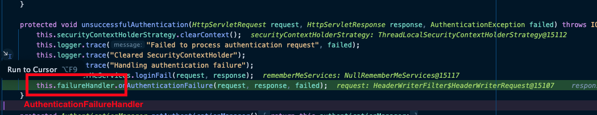

## 도입

### 지난 포스팅

- [[Java]Spring Security WebMVC 기본 구조](https://1eaf.site/posts/spring_security/1)
- [[Java]Spring Security 예외처리, 캐싱, 로깅](https://1eaf.site/posts/spring_security/2)

Spring Security의 WebMVC와 기타 기능들에 이어 다양한 기능을 지원하는 인가 로직에 대해 알아보겠습니다.

> 이전의 포스팅들과 이번 포스팅까지 제대로 이해한다면, 기본적인 Spring Security의 기능들을 사용하는데 큰 어려움이 없으실 겁니다.

## 인증과 인가

너무 추상적이지만 Spring Security를 이해하는데 중요한 개념이므로 짚고 넘어가겠습니다.

- [인증(Authentication)](https://en.wikipedia.org/wiki/Authentication) : 데이터나 시스템의 접근 권한을 가졌는지 검증하는 것입니다.
- [인가(Authorization)](https://en.wikipedia.org/wiki/Authorization) : 특정 리소스의 접근 권한을 가졌는지 확인하여 허용 또는 거부하는 것입니다.

즉, 인증은 로그인하는 행위 그 자체인 반면, 인가는 로그인한 사용자의 권한을 확인해서 접근 제어를 하는 것입니다.

> 둘은 유사해 보이지만, 인증 오류(401)와 인가 오류(403)가 구분되어 있는 것처럼 보안에서 두 개념을 분리해서 생각하는 것은 중요합니다.[^1]



## Authentication

인증은 Spring Security의 핵심 로직입니다.

- 인증이 성공하면, 사용자의 자격을 확인하고, 권한을 부여합니다.
- 인증이 실패하면, 실패 메시지를 전송하거나 인증 URL로 Redirect를 하는 등의 작업을 수행합니다.

### SecurityContext

현재 요청(사용자)의 인증 객체(Authentication)를 담고 있는 문맥, 혹은 컨테이너입니다. 인증이 완료된 인증 객체를 저장하는 역할을 합니다.

- 이러한 Context는 쓰레드 로컬 저장소인 `SecurityContextHolder` 내부에 위치하고 있습니다.[^2]

### Authentication Object

사용자 식별자, 증명, 권한 등의 인증 정보를 담고 있는 객체입니다. 인증된 객체는 `SecurityContext`에 담아 요청 전역에서 사용할 수 있습니다.

- **principal** : 사용자 식별자입니다. 사용자를 구분할 수 있는 고유한 값이 필요합니다.
- **credentials** : 비밀번호와 같은 증명입니다. 인증이 완료된 이후 외부 노출을 막기 위해 초기화됩니다.
- **authorities** : 해당 사용자의 인증과 동시에 승인되는 권한입니다. [인가](#authorization)를 설명하면서 더 자세히 살펴보겠습니다.



### AuthenticationManager

인증을 관리하기 위한 인터페이스(API)입니다. Spring Security는 해당 인터페이스를 사용해서 인증을 수행하기 때문에 이를 구현해야 활용할 수 있습니다.

- 만약 Spring Security를 사용하지 않고 `Filter`에서 직접 `SecurityContext`에 접근한다면 구현할 필요는 없습니다.

  > 다만, Spring Security에서 제공하는 다양한 캐싱과 로깅, 최적화 등의 기능을 잘 활용하려면 이를 구현하는게 좋습니다.

- **ProviderManager**

  `AuthenticationManager`를 구현한 구현체입니다. 인증 서비스를 제공하는 `AuthenticationProvider`들을 리스트로 담아서 관리하며 인증 필요 시 사용자 요청에서 Id, Password, Token등을 확인하여 인증을 시도합니다.

  - 만약 `AuthenticationProvider`가 등록되지 않은 상태로 `ProviderManager`를 사용한다면 인증 관련 오류인 `ProviderNotFoundException`이 발생합니다.

  - **AuthenticationProvider**

    인증을 제공하는 객체입니다. `ProviderManager`에 등록되어 순서대로 실행됩니다.

    - 기본적으로 `AuthenticationProvider`는 증명(credentials)을 외부에 노출하지 않기 위해 인증과 동시에 비우게 됩니다.[^3]

  > 인증 제공자(`AuthenticationProvider`)는 단순한 Username, Password 뿐 아니라, OTT, Anonymous 등 다양한 방식의 인증을 제공합니다. 인증 제공자들에 대한 자세한 설명은 [공식 문서](https://docs.spring.io/spring-security/reference/servlet/authentication/passwords/index.html)를 참고하시기 바랍니다.



### AbstractAuthenticationProcessingFilter

인증의 주요 흐름을 담고 있는 필터입니다. [ExceptionTranslationFilter](https://1eaf.site/posts/spring_security/2/#exceptiontranslationfilter)에서 이미 살펴보았던 `AuthenticationEntryPoint`를 통해 받은 요청에서 사용자 정보(principals) 및 증명(credentials)을 가져와서 인증을 시도합니다.



> 인증 오류를 처리한다는 점에서 `ExceptionTranslationFilter`와 동작이 유사합니다. 다만, 내부적으로 발생할 수 있는 오류들을 Try-Catch로 잡아서 처리하기 때문에 인증 과정에서 실패하더라도 `ExceptionTranslationFilter`까지 도달하지 않고 설정된 `AuthenticationFailureHandler`를 사용합니다.[^4]

## Authorization

인증된 객체는 권한을 인가받게 되는데, 권한에 따라 자원(URL) 별로 접근제어가 가능합니다.

### Authorities

[위](#authentication-object)에서 설명한 것처럼, 인증 객체는 생성과 동시에 권한(`authorities`)을 리스트로 갖게 됩니다.

- 승인된 권한이라는 뜻에서 `GrantedAuthority`라는 클래스의 객체로 저장됩니다.[^5]

### AuthorizationManager

인가를 관리하기 위한 인터페이스(API)입니다. `AuthorizationManager`는 승인된 권한을 바탕으로, 접근을 허용할지 아니면 거부할지를 결정합니다.

- 내부적으로 다음과 같이 구현되어, 구현된 `check` 메서드를 default 메서드인 `verify`에서 위임하여 실행하는 식으로 동작합니다.
  ```java
  AuthorizationDecision check(Supplier<Authentication> authentication, Object secureObject);
  
  default void verify(Supplier<Authentication> authentication, Object secureObject) throws AccessDeniedException {
  // ...
  }
  ```

- **check**
  - 해당 요청을 승인할지, 거부할지를 결정합니다.
  - 승인 : `new AuthorizationDecision(true)`를 반환합니다. 요청을 정상적으로 진행합니다.
  - 거부 : `new AuthorizationDecision(false)`를 반환합니다. `AccessDeniedException` 예외가 발생합니다.

- 이러한 API를 구현한 **다양한 구현체**가 있으며, 어플리케이션의 특성에 맞게 접근권한을 관리하는 것이 가능합니다. 
  > 자세한 구현체들은 [공식 문서](https://docs.spring.io/spring-security/reference/servlet/authorization/architecture.html#authz-delegate-authorization-manager)에서 확인할 수 있으니, 본인의 상황에 맞는 구현체를 선택하거나, 필요 시 커스터마이징 하여 사용하시면 됩니다.



### 계층적 역할(Hierarchical Roles)

대부분의 어플리케이션에서 역할[^6]은 특정한 계층을 가지고 있습니다. 
- 예를 들어, 관리자 권한은 사용자가 가진 모든 권한을 사용 가능하고 거기에 추가로 관리자의 권한이 더해지는 식입니다.
- 그러나 이러한 계층적 권한은 어플리케이션을 복잡하게 만들 수 있습니다.
  > 전체 관리자와 중간 관리자, 사용자 세가지 권한이 있다고 하면 `사용자의 권한을 중간관리자는 모두 가져야` 하고, `전체 관리자는 중간 관리자와 사용자 관리자의 권한을 모두 가져야` 하는 복잡한 상황이 발생합니다.
- 이를 쉽게 구현하기 위해, Spring Security는 계층적으로 권한을 관리할 수 있는 API를 제공합니다.
  ```java
  @Bean
  static RoleHierarchy roleHierarchy() {
      return RoleHierarchyImpl.withDefaultRolePrefix()
          .role("ADMIN").implies("STAFF")
          .role("STAFF").implies("USER")
          .role("USER").implies("GUEST")
          .build();
  }
  
  @Bean
  static MethodSecurityExpressionHandler methodSecurityExpressionHandler(RoleHierarchy roleHierarchy) {
      DefaultMethodSecurityExpressionHandler expressionHandler = new DefaultMethodSecurityExpressionHandler();
      expressionHandler.setRoleHierarchy(roleHierarchy);
      return expressionHandler;
  }
  ```
  - 위와 같이 설정하게 되면, 
    - `ADMIN` 계정은 `STAFF, USER, GUEST` 권한 목록을 갖고,
    - `STAFF` 계정은 `USER, GUEST` 권한 목록을 갖고,
    - `USER` 계정은 `GUEST` 권한 목록을 갖게 됩니다. 
  > 물론 위 설정에서처럼 `MethodSecurityExpressionHandler`를 통해 설정된 권한 계층을 `AuthorizationManager`에서 사용하지 않으면 적용되지 않습니다.



## 결론

Spring Security의 로직은 다음 API를 구현하여 활용할 수 있습니다.
1. 인증(Authentication) : `AuthenticationManager`
2. 인가(Authorization) : `AuthorizationManager`

> 다음 포스팅에서는 Spring Security를 활용하여 TDD[^7] 스타일로 인증 및 인가 로직을 개발해보겠습니다.

### 다음 포스팅

- [[Java]Spring Security(With TDD) 기본 인증 및 인가 구현하기](https://1eaf.site/posts/spring_security/4)

## References

| URL                                                                                                                                                 | 게시일자        | 방문일자        | 작성자           |
|:----------------------------------------------------------------------------------------------------------------------------------------------------|:------------|:------------|:--------------|
| [인증(Authorization)](https://en.wikipedia.org/wiki/Professional_certification#Computer_technology)                                                   | 2024.11.22. | 2024.11.29. | Wikipedia     |
| [인가(Authentication)](https://en.wikipedia.org/wiki/Authentication)                                                                                  | 2024.11.6.  | 2024.11.29. | Wikipedia     |
| [Understanding 403 Forbidden](http://web.archive.org/web/20190904190534/https://www.dirv.me/blog/2011/07/18/understanding-403-forbidden/index.html) | 2011.7.18.  | 2024.11.29. | Daniel Irvine |
| [Spring Security Authentication](https://docs.spring.io/spring-security/reference/servlet/authentication/architecture.html)                          | -           | 2024.11.29. | Spring        |
| [Spring Security Authorization](https://docs.spring.io/spring-security/reference/servlet/authorization/architecture.html)                           | -           | 2024.12.02. | Spring        |
[^1]: 401은 인증 오류이지만, 영문명은 Unauthorized입니다. 이러한 [개념을 이해하기 좋은 문서](http://web.archive.org/web/20190904190534/https://www.dirv.me/blog/2011/07/18/understanding-403-forbidden/index.html)가 있어 첨부합니다.
[^2]: `SecurityContext`는 사용자 요청별로 관리되어야 하기 때문에 Thread-Safety하도록 `ThreadLocal 저장소`에 보관됩니다.

      > Thread-Safety가 보장되지 않는다면 현재 사용자가 아닌 다른 사용자의 인증 객체에 접근할 가능성이 있어 보안 이슈가 발생할 수 있습니다.

[^3]:
    만약 사용자 요청을 캐싱하여 반환할 경우, 증명(Credentials)이 지워진 상태로 저장될 수 있습니다. 따라서 캐싱된 요청을 다시 인증하는게 불가능하기 때문에 별도의 인증 로직을 구성하거나 이러한 옵션을 해제해야 합니다.
    
    

[^4]:
    실제로 디버깅을 통해 로그인 요청이 실패하여 재로그인 시도 시 `ExceptionTranslationFilter`의 `AuthenticationEntryPoint`로 이동하지 않고, `AbstractAuthenticationProcessingFilter`내부의 `AuthenticationFailureHandler`를 사용하여 로그인 페이지로 Redirect 하는 것을 확인할 수 있었습니다.
    

[^5]: `GrantedAuthority`객체는 기본적으로 `SimpleGrantedAuthority` 구현체를 사용할 수 있는데, 권한 요청 메서드인 `getAuthority()`를 실행했을 때 `ROLE_`형태의 Prefix를 가지는 권한(String)을 가져올 수 있습니다.
      
      > 이러한 권한 객체의 Prefix는 다음과 같이 변경해서 사용할 수 있습니다.

      ```java
        @Bean
        static GrantedAuthorityDefaults grantedAuthorityDefaults() {
          return new GrantedAuthorityDefaults("MYPREFIX_");
        }
      ```
[^6]: 역할은 권한들의 집합입니다. 
      
      예를 들어, **사용자 역할(ROLE_USER)** 은 다음과 같이 **로그인, 게시글 조회, 본인 게시글 수정, 본인 게시글 삭제** 의 권한을 가질 수 있습니다.

      > `ROLE_USER = {LOGIN_AUTHORITY, GET_POST_AUTHORITY, PATCH_MY_POST_AUTHORITY, DELETE_MY_POST_AUTHORITY}`

[^7]: Test Driven Development의 준말로, 단위 테스트를 먼저 작성한 후 구현하는 방식의 개발 방법론입니다.