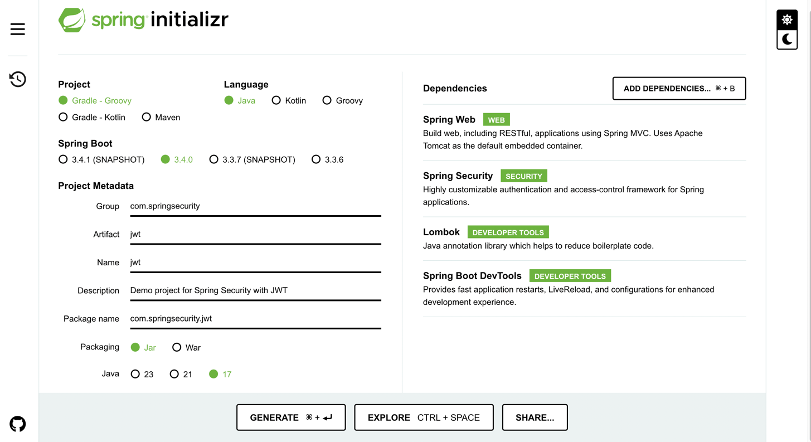
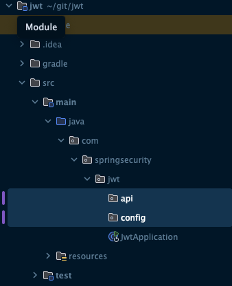
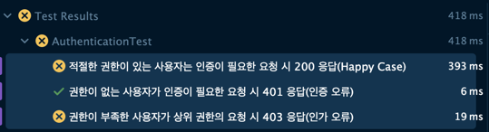
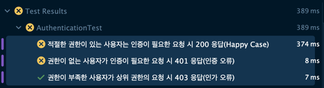
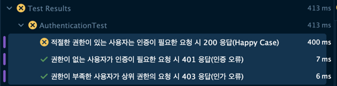
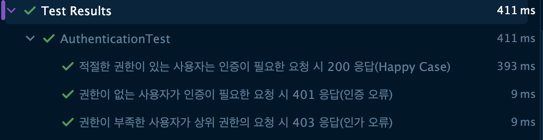

## 도입

### 지난 포스팅

- [[Java]Spring Security WebMVC 기본 구조](https://1eaf.site/posts/spring_security/1)
- [[Java]Spring Security 예외처리, 캐싱, 로깅](https://1eaf.site/posts/spring_security/2)
- [[Java]Spring Security 인증(Authentication)과 인가(Authorization)](https://1eaf.site/posts/spring_security/3)

지금까지 Spring Security의 핵심 개념에 대해 알아보았습니다.
이번 시간에는 TDD[^1]로 실제 프로젝트를 생성하고 인증 및 인가 로직을 구현해보겠습니다.

## 프로젝트 생성

### 1. **Springboot Project Setup**
- [Spring 프로젝트 생성 페이지](https://start.spring.io/)에서 다음과 같이 세팅 및 4개의 의존성을 추가해줍니다.
   
   
### 2. **디렉터리 구조 생성**
- 패키지는 다음과 같이 생성하겠습니다.
   
- **api**
  - 클라이언트와의 통신 인터페이스입니다.
  - 컨트롤러 클래스를 포함시킬 예정입니다.
- **config**
  - Spring Security를 포함한 각종 설정 클래스를 포함시킬 예정입니다.

### 3. **기본 로그인 페이지 생성**
- Spring Security 의존성을 추가 후 `JwtApplication.class`의 Main 메서드를 실행한 뒤, 브라우저를 통해 http://localhost:8080에 접속하면 다음과 같이 기본적으로 로그인 페이지를 제공합니다.
  
- 하지만, 위 로그인 페이지의 패스워드는 마치 `OTT`[^2]처럼, 매번 SpringBoot 서버가 실행될 때마다 패스워드가 변경됩니다.
- 계정별 기본 패스워드를 설정하기 위해 [예제 페이지](https://docs.spring.io/spring-security/reference/servlet/getting-started.html)를 참고해서 다음과 같이 `config` 패키지 내부에 `SecurityConfig` 클래스를 생성합니다.
  - ```java
    package com.springsecurity.jwt.config;
    
    /* import 생략 */
    
    @Configuration
    @EnableWebSecurity
    public class SecurityConfig {
      
        @Bean
        public UserDetailsService userDetailsService() {
            List<UserDetails> userDetails = List.of(
                User.withDefaultPasswordEncoder().username("user").password("user1234").roles("USER").build(),
                User.withDefaultPasswordEncoder().username("admin").password("admin1234").roles("ADMIN").build());
            return new InMemoryUserDetailsManager(userDetails);
        }
      
        @Bean
        public PasswordEncoder passwordEncoder() {
            return PasswordEncoderFactories.createDelegatingPasswordEncoder();
        }
    }
    ```

- 위와 같이 설정하면 User 계정과 Admin 계정을 통한 로그인이 가능해집니다.
  > `withDefaultPasswordEncoder()`메서드는 예제용이기 때문에 실제 프로젝트의 인증 로직에서 활용하면 취약할 수 있습니다.
  
### 4. **기본 API 생성**
다음과 같이 세 가지 API가 있다고 가정하겠습니다.

1. 누구나 접근 가능한 API
2. `USER` 권한 이상의 사용자만 접근 가능한 API
3. `ADMIN` 권한의 사용자만 접근 가능한 API
    
- 이러한 자원을 다음과 같이 api 패키지 내부의 `ApiController`로 구현하겠습니다.
  
  - ```java
    package com.springsecurity.jwt.api;
    
    import org.springframework.web.bind.annotation.GetMapping;
    import org.springframework.web.bind.annotation.RestController;
    
    @RestController
    public class ApiController {
    
        @GetMapping("/admin/resources")
        public String getAdminResources() {
            return "ADMIN 자원 획득";
        }
    
        @GetMapping("/user/resources")
        public String getUserResources() {
            return "USER 자원 획득";
        }
    
        @GetMapping("/public/resources")
        public String getPublicResources() {
            return "PUBLIC 자원 획득";
        }
    }
    ``` 

> 여기까지는 프로젝트 구조를 빠르게 잡기 위해 테스트코드를 작성하지 않았습니다. 이후부터는 **TDD 스타일로 테스트를 우선 작성**하고, 실제 구현을 이어나가겠습니다.

## 설계

### 요구사항 분석
인증 및 인가를 사용해서 달성하려는 요구사항은 다음과 같이 3가지로 분석할 수 있습니다.
> 실제로는 훨씬 많은 요구사항이 있을 수 있지만, 예제이므로 최소한의 기능만을 테스트하겠습니다.

1. 권한이 없는 사용자가 인증이 필요한 요청 시 401 응답`(인증 오류)`
2. 권한이 부족한 사용자가 상위 권한의 요청 시 403 응답`(인가 오류)`
3. 적절한 권한이 있는 사용자는 인증이 필요한 요청 시 200 응답`(Happy Case)`

> TDD를 할때는 작성하기 쉬운 Happy Case보다 예외상황과 경계값 등 놓치기 쉬운 테스트케이스를 먼저 작성하는게 좋습니다.

### 통합테스트 작성

[다음 페이지](https://docs.spring.io/spring-security/reference/servlet/test/mockmvc/setup.html)를 참고해서 위 요구사항에 맞는 통합테스트를 작성해보겠습니다.

> 보통 TDD는 단위테스트로 구현되지만, **외부 의존성인 Spring Security의 로직을 테스트하기 위해**서는 Mocking[^3]이 필수적입니다.

```java
package com.springsecurity.jwt.config;

import com.springsecurity.jwt.api.ApiController;
import org.junit.jupiter.api.BeforeEach;
import org.junit.jupiter.api.DisplayName;
import org.junit.jupiter.api.Test;
import org.junit.jupiter.api.extension.ExtendWith;
import org.springframework.beans.factory.annotation.Autowired;
import org.springframework.context.annotation.Import;
import org.springframework.test.context.ContextConfiguration;
import org.springframework.test.context.junit.jupiter.SpringExtension;
import org.springframework.test.context.web.WebAppConfiguration;
import org.springframework.test.web.servlet.MockMvc;
import org.springframework.test.web.servlet.setup.MockMvcBuilders;
import org.springframework.web.context.WebApplicationContext;

import static org.springframework.security.test.web.servlet.request.SecurityMockMvcRequestPostProcessors.user;
import static org.springframework.security.test.web.servlet.setup.SecurityMockMvcConfigurers.springSecurity;
import static org.springframework.test.web.servlet.request.MockMvcRequestBuilders.get;
import static org.springframework.test.web.servlet.result.MockMvcResultMatchers.status;

@ExtendWith(SpringExtension.class)
@ContextConfiguration(classes = SecurityConfig.class)
@WebAppConfiguration
@Import(ApiController.class)
class AuthenticationTest {

    MockMvc mockMvc;

    @Autowired
    WebApplicationContext context;

    @BeforeEach
    void init() {
        mockMvc = MockMvcBuilders.webAppContextSetup(context)
                .apply(springSecurity()).build();
    }

    @Test
    @DisplayName("권한이 없는 사용자가 인증이 필요한 요청 시 401 응답(인증 오류)")
    void testAuthenticationError() throws Exception {
        mockMvc.perform(get("/user/resources"))
                .andExpect(status().is(401));
    }

    @Test
    @DisplayName(" 권한이 부족한 사용자가 상위 권한의 요청 시 403 응답(인가 오류)")
    void testAuthorizationError() throws Exception {
        mockMvc.perform(get("/admin/resources").with(user("user").roles("USER")))
                .andExpect(status().is(403));
    }

    @Test
    @DisplayName("적절한 권한이 있는 사용자는 인증이 필요한 요청 시 200 응답(Happy Case)")
    void testHappyCase() throws Exception {

        // 권한 없는 사용자 -> Public API
        mockMvc.perform(get("/public/resources"))
                .andExpect(status().is(200));

        // User -> User API
        mockMvc.perform(get("/user/resources").with(user("user").roles("USER")))
                .andExpect(status().is(200));

        // Admin -> User API
        mockMvc.perform(get("/user/resources").with(user("admin").roles("ADMIN")))
                .andExpect(status().is(200));

        // Admin -> Admin API
        mockMvc.perform(get("/admin/resources").with(user("admin").roles("ADMIN")))
                .andExpect(status().is(200));
    }
}
```
> 위와 같이 `mockMvc`의 `perform()`메서드로 API 요청을 Mocking할 때, `with()`메서드의 파라미터로 `SecurityMockMvcRequestPostProcessors.user()`메서드를 사용하면 임시 사용자를 만들어 권한을 설정할 수 있습니다. 

## 구현

위에서 작성한 테스트를 실행해보면 인증 테스트는 통과하지만, 인가 테스트와 Happy Case가 실패합니다.

  > 현재 인증 관련 로직을 작성하지는 않았지만, Spring Security 의존성을 추가하면 **자동으로 인증 관련 로직이 추가**되기 때문에 모든 요청에서 401오류가 발생하여 첫번째 테스트가 통과합니다.



### API별 권한 부여

먼저, API별로 필요한 권한을 설정하기 위해 다음과 같이 `SecurityConfig`를 수정합니다.

```java

    /* 생략 */
    
    @Bean
    public SecurityFilterChain filterChain(HttpSecurity http) throws Exception {
        return http
                .authorizeHttpRequests(authorize -> authorize
                        // Public API는 모든 요청에 허용
                        .requestMatchers("/public/**").permitAll()
                        // User API는 USER 권한 필요
                        .requestMatchers("/user/**").hasRole("USER")
                        // Admin API는 ADMIN 권한 필요
                        .requestMatchers("/admin/**").hasRole("ADMIN"))
                .formLogin(Customizer.withDefaults())
                .build();
    }

    // MockMVC에서 HandlerMappingIntrospector를 사용하기 위함
    @Bean(name = "mvcHandlerMappingIntrospector")
    public HandlerMappingIntrospector mvcHandlerMappingIntrospector() {
        return new HandlerMappingIntrospector();
    }

    /* 생략 */

```
> `mvcHandlerMappingIntrospector`를 Bean으로 등록한 이유는 `MockMvc`가 실행될 때 해당 Bean이 없으면 `requestMatcher`를 정상적으로 실행하지 못하기 때문입니다.[^4]

- 다시 테스트를 실행해보면, 다음과 같이 2번째(인가) 테스트 케이스만 성공하는 것을 확인할 수 있습니다.
  
- **1번(인증) 테스트가 실패하는 원인**은 `SecurityFilterChain`에 필요한 권한이 설정되었지만, Spring Security의 기본 정책 상 권한이 부족할 경우 로그인 페이지로 이동하는 302를 응답하기 때문입니다.
- **3번(Happy Case) 테스트가 실패하는 원인**은 ADMIN 역할이 USER 역할을 갖고 있지 않기 때문에 User API에 접근할 권한이 없기 때문에 403을 응답하기 때문입니다.

### AuthenticationEntryPoint 설정

1번(인증) 테스트를 성공하기 위해 권한이 부족할 경우 401 응답을 보내도록 `AuthenticationEntryPoint`를 수정하겠습니다.[^5]

```java
    @Bean
    public SecurityFilterChain filterChain(HttpSecurity http) throws Exception {
        return http
                .authorizeHttpRequests(authorize -> authorize
                        .requestMatchers("/public/**").permitAll()
                        .requestMatchers("/user/**").hasRole("USER")
                        .requestMatchers("/admin/**").hasRole("ADMIN"))
                .formLogin(Customizer.withDefaults())
                .exceptionHandling(handler -> handler
                        .authenticationEntryPoint(new CustomAuthenticationEntryPoint()))
                .build();
    }

    static class CustomAuthenticationEntryPoint implements AuthenticationEntryPoint {
        @Override
        public void commence(HttpServletRequest request, HttpServletResponse response, AuthenticationException authException) throws IOException, ServletException {
            response.setCharacterEncoding("UTF-8");
            response.sendError(401, "인증 오류");
        }
    }
```

- 다시 테스트를 실행해보면, 다음과 같이 1, 2번째(인가) 테스트 케이스가 성공하는 것을 확인할 수 있습니다.



### RoleHierarchy 설정 

마지막(Happy Case) 테스트를 성공하기 위해 다음과 같이 `RoleHierarchy`(계층적 권한)을 Bean으로 등록하겠습니다.[^6]

```java
    @Bean
    static RoleHierarchy roleHierarchy() {
        return RoleHierarchyImpl.withDefaultRolePrefix()
                .role("ADMIN").implies("USER")
                .build();
    }
```

- 다시 테스트를 실행해보면, 드디어 모든 테스트가 성공합니다!



## 결론

지금까지 예제 프로젝트를 생성 후, 인증과 인가 요구사항을 통합테스트로 작성하고 모든 요구사항을 달성했습니다.

- 해당 프로젝트의 전체 코드는 [다음 깃허브 링크](https://github.com/leaf-nam/spring_security_example)에서 확인하실 수 있습니다.

> 다음 포스팅에서는 현재 프로젝트에 JWT를 활용한 인증 및 인가를 도입해보겠습니다.

### 다음 포스팅

- [[Java]Spring Security(With TDD) JWT 구현하기](https://1eaf.site/posts/spring_security/5)

## References

| URL                                                                                              | 게시일자        | 방문일자        | 작성자                    |
|:-------------------------------------------------------------------------------------------------|:------------|:------------|:-----------------------|
| [Spring 공식문서](https://docs.spring.io/spring-security/reference/servlet/authentication/passwords) | -           | 2024.12.06. | Spring                 |
| [RFC 7519](https://datatracker.ietf.org/doc/html/rfc7519)                                        | 2015.05.    | 2024.12.06. | IETF                   |
| [모의 객체](https://ko.wikipedia.org/wiki/%EB%AA%A8%EC%9D%98_%EA%B0%9D%EC%B2%B4)                     | 2024.05.16. | 2024.12.07. | Wikipedia              |
| [Spring 이슈 20848](https://github.com/spring-projects/spring-framework/issues/20848)              | 2017.12.14. | 2024.12.07. | spring-projects-issues |

[^1]: `Test Driven Development`의 준말로, 단위 테스트를 먼저 작성한 후 구현하는 방식의 개발 방법론입니다. 

[^2]: `One Time Token`의 준말로, 1회성 토큰을 뜻합니다. 웹에서 회원가입을 할 때, 이메일이나 문자로 받는 토큰이 여기에 해당합니다. 

[^3]: [모의 객체](https://ko.wikipedia.org/wiki/%EB%AA%A8%EC%9D%98_%EA%B0%9D%EC%B2%B4)를 생성하여 테스트하는 것을 말합니다. 
      
      > 실제 모듈을 사용하는 테스트는 변경에 취약하고 깨지기 쉬울 뿐 아니라 내부 로직을 잘 이해하지 못하면 작성이 어렵기 때문에, 외부 의존성에는 Mocking을 활용하여 효율적으로 테스트할 수 있습니다.

[^4]: 관련 내용은 [다음 이슈](https://github.com/spring-projects/spring-framework/issues/20848)를 참고하시기 바랍니다.
      
      > 원래 테스트를 성공시키기 위해 설정 코드를 추가하는 것은 바람직하지 않으나, 아직은 프로젝트 규모가 크지 않고 테스트에 집중하기 위해 별도의 테스트 설정 파일을 생성하지는 않았습니다. 

[^5]: `AuthenticationEntryPoint`에 대한 자세한 설명은 [인증 오류 관련 이전 포스팅](https://1eaf.site/posts/spring_security/2/#authenticationexception)을 참고바랍니다.

[^6]: `RoleHierarchy`에 대한 자세한 설명은 [인가 관련 이전 포스팅](https://1eaf.site/posts/spring_security/3/#%EA%B3%84%EC%B8%B5%EC%A0%81-%EC%97%AD%ED%95%A0hierarchical-roles)을 참고바랍니다.