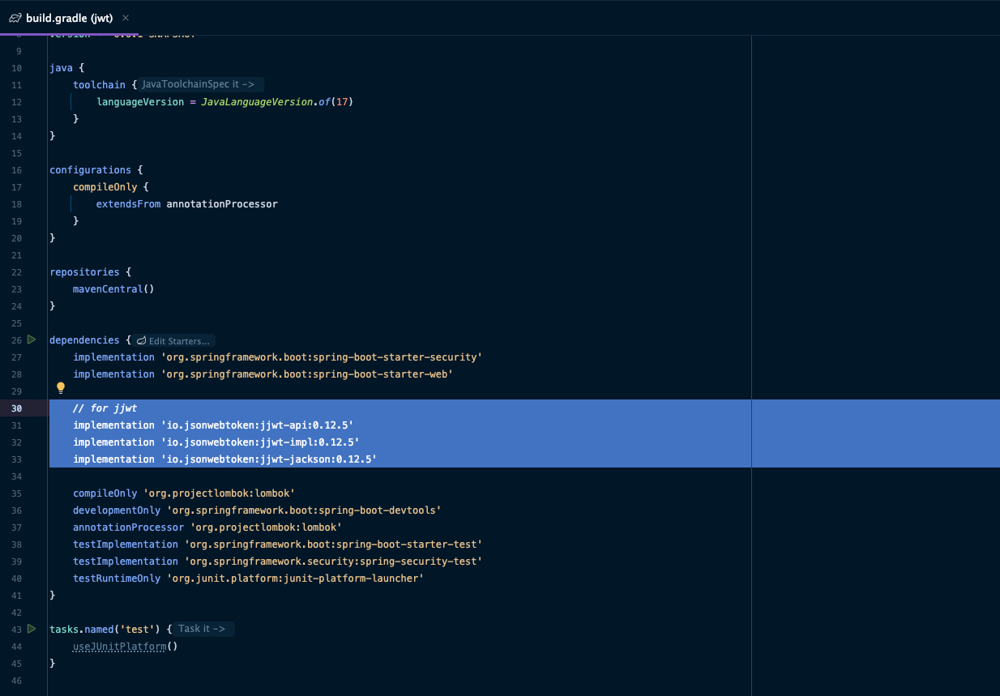
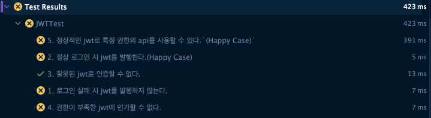

## 도입

### 지난 포스팅

- [[Java]Spring Security WebMVC 기본 구조](https://1eaf.site/posts/spring_security/1)
- [[Java]Spring Security 예외처리, 캐싱, 로깅](https://1eaf.site/posts/spring_security/2)
- [[Java]Spring Security 인증(Authentication)과 인가(Authorization)](https://1eaf.site/posts/spring_security/3)
- [[Java]Spring Security(With TDD) 기본 인증 및 인가 구현하기](https://1eaf.site/posts/spring_security/4)

지금까지 Spring Security의 기본 개념을 학습하고, 기본 인증 및 인가를 구현했습니다.

이번 시간에는 JWT의 기본 개념을 익히고, 프로젝트에 인증 및 인가 로직에 활용해보겠습니다.

### JWT

JWT는 JSON Web Token의 준말로 [RFC 7519](https://datatracker.ietf.org/doc/html/rfc7519) 명세에 정의된 토큰입니다.
  
  - 위 명세에 따르면, JWT는 다음과 같이 정의할 수 있습니다.

  `JSON Web Token (JWT)는 두 당사자 간에 전송되는 클레임(claims)을 표현하기 위한 간결하고 URL에 안전한 수단입니다. JWT의 클레임은 JSON 객체로 인코딩되며, 이는 JSON Web Signature (JWS) 구조의 페이로드(payload)로 사용되거나 JSON Web Encryption (JWE) 구조의 평문(plaintext)으로 사용됩니다. 이를 통해 클레임은 디지털 서명되거나 메시지 인증 코드(Message Authentication Code, MAC)를 사용하여 무결성이 보호되거나 암호화될 수 있습니다.`

이러한 JWT 인증의 장단점을 살펴보면 다음과 같습니다.

- **장점**

  1. `stateless`[^1]한 특성이 있어 서버 부담을 줄일 수 있습니다.
      > 서버에 사용자의 정보들을 별도로 저장하지 않고도, JWT를 복호화함으로써 인증된 사용자임을 바로 파악할 수 있기 때문입니다.

  2. `Cookie 저장소`[^2]를 지원하지 않는 등 기존의 `Session - Cookie 방식`을 사용할 수 없는 환경에서도 인증이 가능합니다.
  
  3. 프론트엔드와 백엔드가 분리된 아키텍쳐로 개발되는 현대 웹앱에 적합한 형태입니다.
     > 특히, 백엔드 서버가 `Scale Out`[^3]이나 `MSA`[^4] 등으로 구조가 복잡해지면 필연적으로 인증 동기화의 어려움을 겪는데, JWT를 활용하면 토큰 유효성만 검사하면 되기 때문에 이러한 문제를 쉽게 해결할 수 있습니다. 

- **단점**
  
  1. 해당 방식을 사용하려면 프론트엔드에서 JWT를 어딘가에 보관했다가 요청 시 함께 전송해야 하는데, 이러한 과정에서 토큰을 탈취당할 수 있습니다.
  
  2. 토큰 탈취를 막기 위해 `Refresh Token`[^5]을 도입할 수 있지만, 이를 저장 및 검증하는 과정에서 추가적인 서버 부하가 발생합니다.
  
  3. 인코딩되는 토큰의 길이가 길기 때문에, 토큰 전송 과정에서 네트워크 부하가 발생합니다.

  4. Payload(Body)에 담기는 정보는 암호화되지 않기 때문에, 중요하거나 취약한 정보를 담을 수 없습니다.  
  
> `Session - Cookie`의 장단점은 `JWT`와 정반대라고 생각하시면 되겠습니다. `Session - Cookie` 방식을 사용할지 `JWT`를 사용할지는 요구사항에 따라 다를 수 있으니, 장단점을 따져보고 취사선택 하시면 되겠습니다. 

## 설계

### JWT 의존성 추가

다음과 같이 `build.gradle`에 [JWT 파싱을 위한 라이브러리](https://github.com/jwtk/jjwt)를 추가해줍니다.

   ```groovy
     // for jjwt
     implementation 'io.jsonwebtoken:jjwt-api:0.12.6'
     implementation 'io.jsonwebtoken:jjwt-impl:0.12.6'
     implementation 'io.jsonwebtoken:jjwt-jackson:0.12.6'
   ```

        
  
  > 저는 jjwt를 사용하겠습니다. 다양한 라이브러리가 있지만, 대부분 기능은 유사하니 사용이 편한 라이브러리를 사용하시면 되겠습니다.
     

### 요구사항 분석

JWT를 사용해서 달성하려는 요구사항을 정리해보면 다음과 같습니다.

1. 로그인 실패 시 jwt를 발행하지 않는다.
2. 정상 로그인 시 jwt를 발행한다.`(Happy Case)`
3. 잘못된 jwt로 인증할 수 없다.
4. 권한이 부족한 jwt에 인가할 수 없다.
5. 정상적인 jwt로 특정 권한의 api를 사용할 수 있다.`(Happy Case)`

### 통합테스트 작성

```java
package com.springsecurity.jwt.integration;

import com.springsecurity.jwt.api.ApiController;
import com.springsecurity.jwt.utility.JwtUtil;
import org.junit.jupiter.api.BeforeEach;
import org.junit.jupiter.api.DisplayName;
import org.junit.jupiter.api.Test;
import org.junit.jupiter.api.extension.ExtendWith;
import org.springframework.beans.factory.annotation.Autowired;
import org.springframework.context.annotation.Import;
import org.springframework.http.HttpHeaders;
import org.springframework.test.context.ContextConfiguration;
import org.springframework.test.context.junit.jupiter.SpringExtension;
import org.springframework.test.context.web.WebAppConfiguration;
import org.springframework.test.web.servlet.MockMvc;
import org.springframework.test.web.servlet.setup.MockMvcBuilders;
import org.springframework.web.context.WebApplicationContext;

import static org.assertj.core.api.Assertions.assertThat;
import static org.springframework.security.test.web.servlet.setup.SecurityMockMvcConfigurers.springSecurity;
import static org.springframework.test.web.servlet.request.MockMvcRequestBuilders.*;
import static org.springframework.test.web.servlet.result.MockMvcResultMatchers.*;

@ExtendWith(SpringExtension.class)
@ContextConfiguration(classes = SecurityConfig.class)
@WebAppConfiguration
@Import(ApiController.class)
public class JWTTest {

    MockMvc mockMvc;

    JwtUtil jwtUtil;

    @Autowired
    WebApplicationContext context;

    @BeforeEach
    void init() {
        mockMvc = MockMvcBuilders.webAppContextSetup(context)
                .apply(springSecurity()).build();
    }

    @Test
    @DisplayName("1. 로그인 실패 시 jwt를 발행하지 않는다.")
    void testLoginFailure() throws Exception {
        // given : 정상 아이디와 잘못된 패스워드
        String id = "user";
        String password = "badPassword";

        // when : 토큰 발급 시도
        mockMvc.perform(post("/oauth/token").param("username",id).param("password",password))

                // then : 401(Unauthenticated) 오류
                .andExpect(status().is(401));
    }

    @Test
    @DisplayName("2. 정상 로그인 시 jwt를 발행한다.(Happy Case)")
    void testLoginSuccess() throws Exception {
        // given : 정상 아이디, 패스워드
        String id = "user";
        String password = "user1234";

        // when : 토큰 발급
        String token = mockMvc.perform(post("/oauth/token")
                        .param("username", id)
                        .param("password", password))
                .andExpect(status().is(200))
                .andReturn().getResponse().getContentAsString();

        // then : 정상 토큰여부 확인(JwtUtil)
        assertThat(jwtUtil.validate(token)).isTrue();
    }

    @Test
    @DisplayName("3. 잘못된 jwt로 인증할 수 없다.")
    void testAuthentication() throws Exception {
        // given : 잘못된 jwt 토큰
        String badToken = "bearer asdf1234";

        // when : User API 접근
        mockMvc.perform(get("/user/resources")
                        .header(HttpHeaders.AUTHORIZATION, badToken))

                // then : 401 오류
                .andExpect(status().is(401));
    }

    @Test
    @DisplayName("4. 권한이 부족한 jwt에 인가할 수 없다.")
    void testAuthorization() throws Exception {
        // given : User JWT 획득
        String id = "user";
        String password = "user1234";
        String userToken = mockMvc.perform(post("/oauth/token")
                        .param("username", id)
                        .param("password", password))
                .andExpect(status().is(200))
                .andReturn().getResponse().getContentAsString();

        // when : Admin API 접근
        mockMvc.perform(get("/admin/resources")
                        .header(HttpHeaders.AUTHORIZATION, userToken))

                // then : 403(Forbidden) 오류
                .andExpect(status().is(403));
    }

    @Test
    @DisplayName("5. 정상적인 jwt로 특정 권한의 api를 사용할 수 있다.`(Happy Case)`")
    void testHappyCase() throws Exception {
        // given : Admin JWT 획득
        String id = "admin";
        String password = "admin1234";
        String userToken = mockMvc.perform(post("/oauth/token")
                        .param("username", id)
                        .param("password", password))
                .andExpect(status().is(200))
                .andReturn().getResponse().getContentAsString();

        // when : Admin API 접근
        mockMvc.perform(get("/admin/resources")
                        .header(HttpHeaders.AUTHORIZATION, userToken))

                // then : Admin 자원 획득
                .andExpect(status().is(200))
                .andExpect(content().string("ADMIN 자원 획득"));
    }
}
```

위 통합테스트를 작성하면서, 기존에 없던 `JWTUtil`이라는 클래스를 임시로 만들었습니다.
> `TDD`를 하는 만큼 테스트 과정에서 필요한 클래스는 그때그때 만들면서 대응하는 것이 좋습니다.

아직 세부사항은 전혀 구현되지 않았으나, 일단은 테스트를 실행할 수 있도록 컴파일 오류를 해결하기 위해 다음과 `utility` 패키지를 만들고, `JwtUtil` 클래스를 생성합니다.

```java
package com.springsecurity.jwt.utility;

public class JwtUtil {
    public boolean validate(String token) {
        return false;
    }
}
```

통합테스트를 실행하면 다음과 같이 4개의 테스트가 실패합니다. 



### JwtUtil 단위테스트 작성

```java

```

## 결론


### 다음 포스팅

## References

| URL                                                                                                    | 게시일자 | 방문일자        | 작성자    |
|:-------------------------------------------------------------------------------------------------------|:-----|:------------|:-------|
| [Spring 공식문서](https://docs.spring.io/spring-security/reference/servlet/authentication/passwords)       | -    | 2024.12.06. | Spring |
| [RFC 7519](https://datatracker.ietf.org/doc/html/rfc7519)                                              |2015.05. | 2024.12.06. | IETF|

[^1]: [`stateless`](https://ko.wikipedia.org/wiki/%EB%AC%B4%EC%83%81%ED%83%9C_%ED%94%84%EB%A1%9C%ED%86%A0%EC%BD%9C)는 무상태 프로토콜을 뜻하며, 웹 통신의 기초인 HTTP 프로토콜도 이러한 특성을 가집니다. 서버에서 세션이나 기타 상태를 보관하지 않기 때문에 수평적인 확장(Scale-out)이 용이합니다.

[^2]: [`cookie 저장소`](https://developer.mozilla.org/ko/docs/Web/HTTP/Cookies)는 서버가 클라이언트에게 전송하는 작은 데이터 조각입니다. 웹 브라우저와 같은 대부분의 클라이언트는 이를 별도의 저장소에 저장하고 있다가, 서버의 응답에 이를 포함하여 전송합니다.

[^3]: [`Scale Out`](https://en.wikipedia.org/wiki/Scalability)은 수평적 확장을 뜻합니다. 많은 사용자(트래픽)들을 감당하기 위해 서버는 동일한 역할을 수행하는 여러 개의 작은 서버를 두고, 부하를 골고루 분산하여 이에 대응합니다.

[^4]: [`MSA`](https://ko.wikipedia.org/wiki/%EB%A7%88%EC%9D%B4%ED%81%AC%EB%A1%9C%EC%84%9C%EB%B9%84%EC%8A%A4)는 느슨하게 결합된 작은 서비스들을 구조화하여 큰 서비스를 수행하는 개발 기법입니다. 큰 애플리케이션을 작은 단위로 모듈화하여 작은 팀들이 독립적으로 서비스를 개발, 확장, 리팩터링 가능하게 합니다.

[^5]: [`refresh token`](https://auth0.com/docs/secure/tokens/refresh-tokens)은 `access token`의 탈취를 대비하여 함께 발행하는 토큰입니다. 

      `access token`이 탈취되면 해당 사용자의 권한이 모두 탈취되기 때문에, 이를 방지하기 위해 보통 토큰 만료시간을 짧게 설정합니다. 이러한 경우, 사용자는 매번 다시 인증과정을 거쳐 토큰을 발급받아야 하는데, 이러한 번거로움을 줄이기 위해 유효한 `Refresh Token`을 보유한 사용자는 즉시 `Access Token`을 재발급해줍니다.

      

