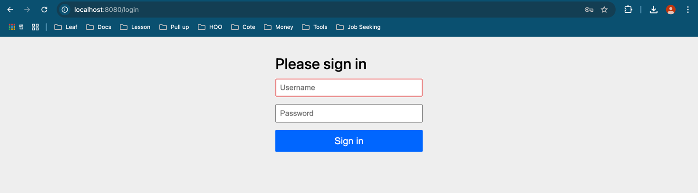

## 도입

### 지난 포스팅

- [[Java]Spring Security WebMVC 기본 구조](https://1eaf.site/posts/spring_security/1)
- [[Java]Spring Security 예외처리, 캐싱, 로깅](https://1eaf.site/posts/spring_security/2)
- [[Java]Spring Security 인증(Authentication)과 인가(Authorization)](https://1eaf.site/posts/spring_security/3)

지금까지 Spring Security의 핵심 개념에 대해 알아보았습니다.
이번 시간에는 이를 실제 프로젝트에 적용해보기 위해, 실제 프로젝트를 생성 및 설계해보겠습니다.

## 프로젝트 생성
### 1. **Springboot Project Setup**
- [Spring 프로젝트 생성 페이지](https://start.spring.io/)에서 다음과 같이 세팅 및 4개의 의존성을 추가해줍니다.
  
   
- 이어서 다음과 같이 `build.gradle`에 [JWT 파싱을 위한 라이브러리](https://github.com/jwtk/jjwt)를 추가해줍니다.
   ```groovy
     // for jjwt
     implementation 'io.jsonwebtoken:jjwt-api:0.12.6'
     implementation 'io.jsonwebtoken:jjwt-impl:0.12.6'
     implementation 'io.jsonwebtoken:jjwt-jackson:0.12.6'
   ```
        
      > 저는 jjwt를 사용하겠습니다. 다양한 라이브러리가 있지만, 대부분 기능은 유사하니 사용이 편한 라이브러리를 사용하시면 되겠습니다.
     
### 2. **디렉터리 구조 생성**
- 패키지는 다음과 같이 생성하겠습니다.
   
- api
  - 클라이언트와의 통신 인터페이스입니다.
  - 컨트롤러 클래스를 포함시킬 예정입니다.
- config
  - Spring Security를 포함한 각종 설정 클래스를 포함시킬 예정입니다.

### 3. **기본 로그인 페이지 생성**
- Spring Security 의존성을 추가 후 `JwtApplication.class`의 Main 메서드를 실행한 뒤, 브라우저를 통해 http://localhost:8080에 접속하면 다음과 같이 기본적으로 로그인 페이지를 제공합니다.

- 하지만, 위 로그인 페이지의 패스워드는 `OTT`[^3]형식으로, 매번 SpringBoot 서버가 실행될 때마다 패스워드가 변경됩니다.
- 계정별 기본 패스워드를 설정하기 위해 다음과 같이 `config` 패키지 내부에 `SecurityConfig` 클래스를 생성합니다.
   
- ```java
  package com.springsecurity.jwt.config;
    
  /* import 생략 */
    
  @Configuration
  @EnableWebSecurity
  public class SecurityConfig {
    
      @Bean
      public UserDetailsService userDetailsService() {
          UserDetails userDetails = User.withDefaultPasswordEncoder()
            .username("user").password("user1234").roles("USER")
            .username("admin").password("admin1234").roles("ADMIN").build();
    
          return new InMemoryUserDetailsManager(userDetails);
      }
    
      @Bean
      public PasswordEncoder passwordEncoder() {
          return PasswordEncoderFactories.createDelegatingPasswordEncoder();
      }
  }
  ```
     
- 위와 같이 설정하면 User 계정과 Admin 계정을 통한 로그인이 가능해집니다.
      > `withDefaultPasswordEncoder()`메서드는 예제 코드 작성용이기 때문에 실제 프로젝트의 인증 로직에서 활용하면 취약할 수 있습니다.

### 4. **기본 API 생성**
다음과 같이 세 가지 API가 있다고 가정하겠습니다.

1. 누구나 접근 가능한 API
2. `USER` 권한 이상의 사용자만 접근 가능한 API
3. `ADMIN` 권한의 사용자만 접근 가능한 API
    
- 이러한 자원을 다음과 같이 api 패키지 내부의 `ApiController`로 구현하겠습니다.
  
  - ```java
    package com.springsecurity.jwt.api;
    
    import org.springframework.web.bind.annotation.GetMapping;
    import org.springframework.web.bind.annotation.RestController;
    
    @RestController
    public class ApiController {
    
        @GetMapping("/admin/resources")
        public String getAdminResources() {
            return "ADMIN 자원 획득";
        }
    
        @GetMapping("/user/resources")
        public String getUserResources() {
            return "USER 자원 획득";
        }
    
        @GetMapping("/public/resources")
        public String getPublicResources() {
            return "PUBLIC 자원 획득";
        }
    }
    ``` 

> 여기까지는 프로젝트 구조를 빠르게 잡기 위해 테스트코드를 작성하지 않았습니다. 이후부터는 **TDD 스타일로 테스트를 우선 작성**하고, 실제 구현을 이어나가겠습니다.

### 요구사항 분석
JWT를 사용해서 달성하려는 요구사항은 간단하게 다음과 같이 4가지로 분석할 수 있습니다.
1. 로그인 시 JWT를 발행한다.`(인증)`
2. JWT가 없는 사용자는 인증이 필요한 요청을 수행할 수 없다.`(인증)`
3. JWT가 있지만 권한이 부족한 사용자는 인증이 필요한 요청을 수행할 수 없다.`(인가)`
4. JWT가 있고, 권한이 있는 사용자는 인증이 필요한 요청을 수행할 수 있다.`(Happy Case)`

> TDD를 할때는 Happy Case보다 예외상황과 경계값 등 놓치기 쉬운 테스트케이스를 먼저 작성하는게 좋습니다.

### 통합테스트 작성
보통 TDD는 단위테스트로 구현되지만, 외부 의존성인 Spring Security를 테스트하기 위해서는 Mocking[^4]이 필수적이므로, 통합테스트를 우선 작성하겠습니다.
- 로그인 시 JWT를 발행한다.`(인증)`
- JWT가 없는 사용자는 인증이 필요한 요청을 수행할 수 없다.`(인증)`
- JWT가 있지만 권한이 부족한 사용자는 인증이 필요한 요청을 수행할 수 없다.`(인가)`
- JWT가 있고, 권한이 있는 사용자는 인증이 필요한 요청을 수행할 수 있다.`(Happy Case)`

## 결론

실제 프로젝트를 생성 및 요구사항에 대한 통합테스트를 작성해 보았습니다. 다음 시간에는 실제로 TDD 방식으로 각 테스트를 구현해보겠습니다.

### 다음 포스팅

## References

| URL                                                                                                    | 게시일자 | 방문일자        | 작성자    |
|:-------------------------------------------------------------------------------------------------------|:-----|:------------|:-------|
| [Spring 공식문서](https://docs.spring.io/spring-security/reference/servlet/authentication/passwords)       | -    | 2024.12.06. | Spring |
| [RFC 7519](https://datatracker.ietf.org/doc/html/rfc7519)                                              |2015.05. | 2024.12.06. | IETF|

[^1]: JSON Web Token의 준말로 [RFC 7519](https://datatracker.ietf.org/doc/html/rfc7519) 명세에 정의된 토큰입니다.

      `JSON Web Token (JWT)는 두 당사자 간에 전송되는 클레임(claims)을 표현하기 위한 간결하고 URL에 안전한 수단입니다. JWT의 클레임은 JSON 객체로 인코딩되며, 이는 JSON Web Signature (JWS) 구조의 페이로드(payload)로 사용되거나 JSON Web Encryption (JWE) 구조의 평문(plaintext)으로 사용됩니다. 이를 통해 클레임은 디지털 서명되거나 메시지 인증 코드(Message Authentication Code, MAC)를 사용하여 무결성이 보호되거나 암호화될 수 있습니다.`

[^2]: Test Driven Development의 준말로, 단위 테스트를 먼저 작성한 후 구현하는 방식의 개발 방법론입니다. 

[^3]: One Time Token의 준말로, 1회성 토큰을 뜻합니다.

[^4]: TODO 