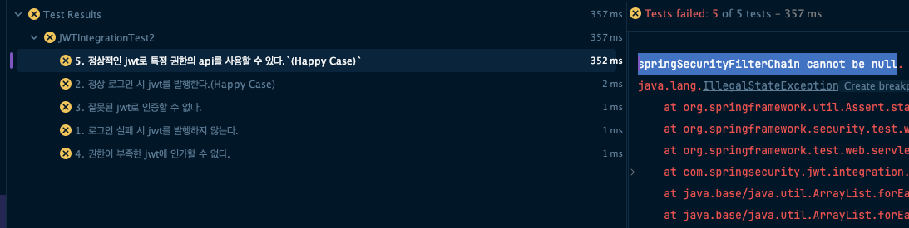
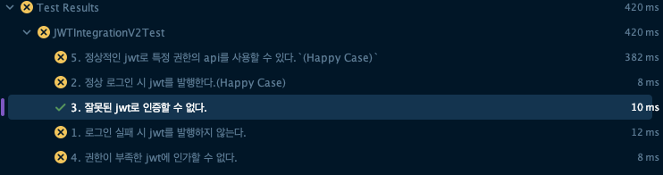
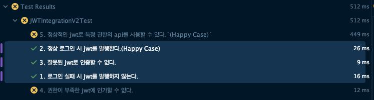
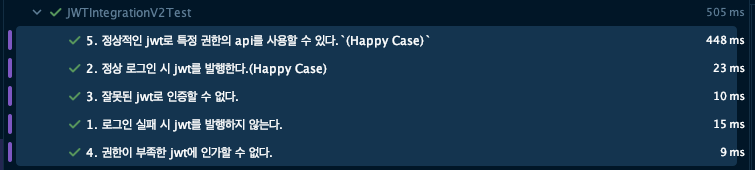
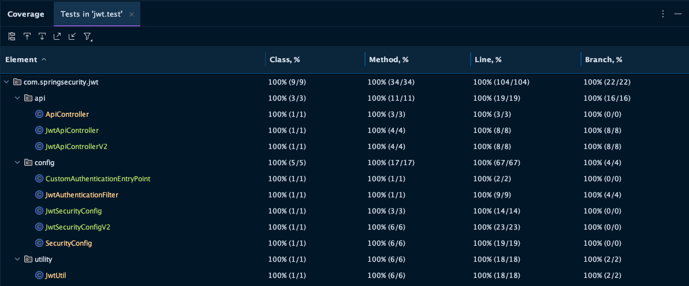

## 도입

### 지난 포스팅

- [[Java]Spring Security WebMVC 기본 구조](https://1eaf.site/posts/spring_security/1)
- [[Java]Spring Security 예외처리, 캐싱, 로깅](https://1eaf.site/posts/spring_security/2)
- [[Java]Spring Security 인증(Authentication)과 인가(Authorization)](https://1eaf.site/posts/spring_security/3)
- [[Java]Spring Security(With TDD) 기본 인증 및 인가 구현하기](https://1eaf.site/posts/spring_security/4)
- [[Java]Spring Security(With TDD) JWT 직접 구현하기](https://1eaf.site/posts/spring_security/5)

저번 시간에는 `JWT`의 **인증 필터를 직접 구현**해서 인증 로직을 완성했습니다.

이번 시간에는 `Spring`에서 제공하는 `oauth2-resource-server` 라이브러리를 통해 동일한 인증 로직을 구현해보겠습니다.

## 설계

### 요구사항 분석

요구 사항은 [지난 포스트](https://1eaf.site/posts/spring_security/5/#%EC%9A%94%EA%B5%AC%EC%82%AC%ED%95%AD-%EB%B6%84%EC%84%9D)와
동일합니다.

1. 로그인 실패 시 jwt를 발행하지 않는다.
2. 정상 로그인 시 jwt를 발행한다.`(Happy Case)`
3. 잘못된 jwt로 인증할 수 없다.
4. 권한이 부족한 jwt에 인가할 수 없다.
5. 정상적인 jwt로 특정 권한의 api를 사용할 수 있다.`(Happy Case)`

### 통합 테스트

통합
테스트도 [지난 시간](https://1eaf.site/posts/spring_security/5/#%ED%86%B5%ED%95%A9%ED%85%8C%EC%8A%A4%ED%8A%B8-%EC%9E%91%EC%84%B1)
에 사용한 것을 그대로 사용하겠습니다.

- 다만, 기존 테스트와 `URL` 기반으로 요청을 분리하기 위해 다음과 같이 일부 테스트 코드를 변경하였습니다.

1. 테스트에 사용할 `SecurityConfig`를 `JwtSecurityConfig`에서 `JwtSecurityConfigV2`로 변경합니다.
2. 요청 `URL`을 `/jwt/**`에서 `/jwt/v2/**`로 변경합니다.

```java
package com.springsecurity.jwt.integration;

/* 생략 */

@ExtendWith(SpringExtension.class)

// SecurityConfig 변경
@ContextConfiguration(classes = JwtSecurityConfigV2.class)
@WebAppConfiguration
@Import(IntegrationTestConfig.class)
public class JWTIntegrationV2Test {

    MockMvc mockMvc;
    JwtUtil jwtUtil;

    @Autowired
    WebApplicationContext context;

    @BeforeEach
    void init() {
        jwtUtil = new JwtUtil();
        mockMvc = MockMvcBuilders.webAppContextSetup(context)
                .apply(springSecurity()).build();
    }

    @Test
    @DisplayName("1. 로그인 실패 시 jwt를 발행하지 않는다.")
    void testLoginFailure() throws Exception {
        // given : 정상 아이디와 잘못된 패스워드(user)
        String id = "user";
        String password = "badPassword";

        // when : 토큰 발급 시도
        mockMvc.perform(post("/jwt/v2/token")
                        .param("username", id)
                        .param("password", password))
                .andDo(print())

                // then : 401(Unauthenticated) 오류
                .andExpect(status().is(401));

        // given : 정상 아이디와 잘못된 패스워드(admin)
        id = "admin";
        password = "badPassword";

        // when : 토큰 발급 시도
        mockMvc.perform(post("/jwt/v2/token")
                        .param("username", id)
                        .param("password", password))
                .andDo(print())

                // then : 401(Unauthenticated) 오류
                .andExpect(status().is(401));
    }

    @Test
    @DisplayName("2. 정상 로그인 시 jwt를 발행한다.(Happy Case)")
    void testLoginSuccess() throws Exception {
        // given : 정상 아이디, 패스워드
        String id = "user";
        String password = "user1234";

        // when : 토큰 발급
        String token = mockMvc.perform(post("/jwt/v2/token")
                        .param("username", id)
                        .param("password", password))
                .andExpect(status().is(200))
                .andReturn().getResponse().getContentAsString();

        // then : 정상 토큰여부 확인(JwtUtil)
        jwtUtil.validate(token);
    }

    @Test
    @DisplayName("3. 잘못된 jwt로 인증할 수 없다.")
    void testAuthentication() throws Exception {
        // given : 잘못된 jwt 토큰
        String badToken = "bearer asdf1234";

        // when : User API 접근
        mockMvc.perform(get("/jwt/v2/user/resources")
                        .header(HttpHeaders.AUTHORIZATION, badToken))

                // then : 401 오류
                .andExpect(status().is(401));
    }

    @Test
    @DisplayName("4. 권한이 부족한 jwt에 인가할 수 없다.")
    void testAuthorization() throws Exception {
        // given : User JWT 획득
        String id = "user";
        String password = "user1234";
        String userToken = mockMvc.perform(post("/jwt/v2/token")
                        .param("username", id)
                        .param("password", password))
                .andExpect(status().is(200))
                .andReturn().getResponse().getContentAsString();

        // when : Admin API 접근
        mockMvc.perform(get("/jwt/v2/admin/resources")
                        .header(HttpHeaders.AUTHORIZATION, "Bearer " + userToken))

                // then : 403(Forbidden) 오류
                .andExpect(status().is(403));
    }

    @Test
    @DisplayName("5. 정상적인 jwt로 특정 권한의 api를 사용할 수 있다.`(Happy Case)`")
    void testHappyCase() throws Exception {
        // given : Admin JWT 획득
        String id = "admin";
        String password = "admin1234";
        String adminToken = mockMvc.perform(post("/jwt/v2/token")
                        .param("username", id)
                        .param("password", password))
                .andExpect(status().is(200))
                .andReturn().getResponse().getContentAsString();

        // when : 권한 없이 PUBLIC API 접근
        mockMvc.perform(get("/jwt/v2/public/resources")
                        .accept(MediaType.APPLICATION_JSON))
                .andExpect(status().is(200))

                // then : Public 자원 획득
                .andExpect(content().encoding(StandardCharsets.UTF_8))
                .andExpect(content().string("PUBLIC 자원 획득"));

        // when : Admin 권한으로 USER API 접근
        mockMvc.perform(get("/jwt/v2/user/resources")
                        .header(HttpHeaders.AUTHORIZATION, "Bearer " + adminToken)
                        .accept(MediaType.APPLICATION_JSON))

                // then : User 자원 획득
                .andExpect(status().is(200))
                .andExpect(content().encoding(StandardCharsets.UTF_8))
                .andExpect(content().string("USER 자원 획득"));

        // when : Admin 권한으로 Admin API 접근
        mockMvc.perform(get("/jwt/v2/admin/resources")
                        .header(HttpHeaders.AUTHORIZATION, "Bearer " + adminToken)
                        .accept(MediaType.APPLICATION_JSON))

                // then : Admin 자원 획득
                .andExpect(status().is(200))
                .andExpect(content().encoding(StandardCharsets.UTF_8))
                .andExpect(content().string("ADMIN 자원 획득"));
    }
}

```

- 위와 같이 `Spring Security` 설정을 변경 후, 컴파일 오류를 해결하기 위해 다음과 같이 임시로 `JwtSecurityConfigV2`를 생성합니다.

```java
package com.springsecurity.jwt.config;

public class JwtSecurityConfigV2 {
}
```

- 이제 테스트를 실행하면 다음과 같이 모든 테스트가 실패합니다.



- 실패 메시지를 확인해보면, `springSecurityFilterChain cannot be null.` 이라는 메시지를 확인할 수 있습니다.
- `MockMVC`를 초기화하는 과정에서 `SpringSecurity`를 실행할 때 필수적인 `bean`인 `springSecurityFilterChain`이 `Spring`에 등록되어 있지 않기 때문입니다.

> 아직 해당 설정파일에 아무것도 작성하지 않았기 때문에 당연한 결과입니다.

## 구현

### 라이브러리 가져오기

우선, `oauth2-resource-server`[^1]를 사용하기 위해 다음과 같이 `build.gradle`에 의존성을 주입합니다.

```groovy
// build.gradle
dependencies {
    implementation 'org.springframework.boot:spring-boot-starter-security'
    implementation 'org.springframework.boot:spring-boot-starter-web'

    // 의존성 추가
    implementation 'org.springframework.boot:spring-boot-starter-oauth2-resource-server'

    /* 생략 */
}
```

### JwtSecurityConfigV2 구현

이후, 기존에 통합테스트를 실행하기 위해 클래스만 생성해 두었던 `JwtSecurityConfigV2`에 다음과 같이 설정합니다.

- `SecurityMatcher URL` 설정 : `JwtSecurityConfig`와 `URL`기반으로 설정을 분리하기 위함입니다.
- `CSRF` 토큰 해제 : 해당 옵션을 해제하지 않고 `JWT` 로그인 시 `CSRF` 토큰이 없으면 오류가 발생할 수 있습니다. `JWT`는 `stateless`한 인증 방식이기 때문에 **`CSRF`토큰을
  구현하기가 제한**됩니다.
- `Session Management` 해제 : `JWT`는 `Session` 방식을 사용하지 않기 때문에 **이를 해제해주어야 세션 정보를 서버에 별도로 저장하지 않습니다.**
- 권한별 인가 로직 작성 : `API`별 필요한 권한을 명시합니다.
- `CustomAuthenticationEntryPoint`
  등록 : [저번에](https://1eaf.site/posts/spring_security/4/#authenticationentrypoint-%EC%84%A4%EC%A0%95) 생성한 해당 클래스를
  `ExceptionHandler`로 등록해야 인증 실패 시 `302`오류가 발생하지 않습니다.

> [지난 시간](https://1eaf.site/posts/spring_security/5/#jwtsecurityconfig-%EA%B5%AC%ED%98%84)에 생성한 `JwtSecurityConfig`설정과
> 대부분 동일하지만, 요청 `URL`을 다르게 설정하기 때문에 두 필터가 모두 `SecurityFilterChain`에 등록되어 각각 적용됩니다.

```java
package com.springsecurity.jwt.config;

import org.springframework.context.annotation.Bean;
import org.springframework.context.annotation.Configuration;
import org.springframework.security.config.annotation.web.builders.HttpSecurity;
import org.springframework.security.config.annotation.web.configuration.EnableWebSecurity;
import org.springframework.security.config.annotation.web.configurers.AbstractHttpConfigurer;
import org.springframework.security.config.http.SessionCreationPolicy;
import org.springframework.security.web.SecurityFilterChain;

@Configuration
@EnableWebSecurity
public class JwtSecurityConfigV2 {
    @Bean
    public SecurityFilterChain jwtFilterChainV2(HttpSecurity http, CustomAuthenticationEntryPoint customAuthenticationEntryPoint) throws Exception {
        return http
                .securityMatcher("/jwt/v2/**")
                .csrf(AbstractHttpConfigurer::disable)
                .sessionManagement(session -> session.sessionCreationPolicy(SessionCreationPolicy.STATELESS))
                .authorizeHttpRequests(authorize -> authorize
                        .requestMatchers("/jwt/v2/public/**").permitAll()
                        .requestMatchers("/jwt/v2/user/**").hasRole("USER")
                        .requestMatchers("/jwt/v2/admin/**").hasRole("ADMIN")
                        .requestMatchers("/jwt/v2/token").permitAll()
                        .anyRequest().authenticated())
                .exceptionHandling(handler -> handler
                        .authenticationEntryPoint(customAuthenticationEntryPoint))
                .build();
    }
}
```

이제 테스트를 수행하면 다음과 같이 3번 테스트만 성공합니다.



> 해당 `API`의 `Controller`를 구현하지 않았기 때문에 `404`오류가 발생합니다.

### API 구현

[지난 시간](https://1eaf.site/posts/spring_security/5/#api-%EA%B5%AC%ED%98%84)과 마찬가지로, 다음과 같이 `JwtApiControllerV2`에 모든 `API`
를 생성하겠습니다.

```java
package com.springsecurity.jwt.api;

import com.springsecurity.jwt.Role;
import com.springsecurity.jwt.utility.JwtUtil;
import lombok.RequiredArgsConstructor;
import org.springframework.http.HttpStatus;
import org.springframework.http.ResponseEntity;
import org.springframework.web.bind.annotation.*;

@RestController
@RequiredArgsConstructor
@RequestMapping("/jwt/v2")
public class JwtApiControllerV2 {

    private final JwtUtil jwtUtil;

    @GetMapping("/admin/resources")
    public String getAdminResources() {
        return "ADMIN 자원 획득";
    }

    @GetMapping("/user/resources")
    public String getUserResources() {
        return "USER 자원 획득";
    }

    @GetMapping("/public/resources")
    public String getPublicResources() {
        return "PUBLIC 자원 획득";
    }

    @PostMapping("/token")
    public ResponseEntity<String> getToken(@RequestParam String username, @RequestParam String password) {

        if (username.equals("user") && password.equals("user1234"))
            return new ResponseEntity<>(jwtUtil.issue("user", Role.USER.name()), HttpStatus.OK);

        if (username.equals("admin") && password.equals("admin1234"))
            return new ResponseEntity<>(jwtUtil.issue("admin", Role.ADMIN.name()), HttpStatus.OK);

        return new ResponseEntity<>(HttpStatus.UNAUTHORIZED);
    }
}
```

해당 `Controller`를 통합 테스트에 사용하기 위해 다음과 같이 `IntegrationTestConfig`를 수정합니다.

```java
package com.springsecurity.jwt.config;

/* 생략 */

@Configuration

//JwtApiControllerV2 추가
@Import({JwtApiControllerV2.class,
        JwtApiController.class,
        JwtUtil.class,
        JwtAuthenticationFilter.class,
        CustomAuthenticationEntryPoint.class})
public class IntegrationTestConfig {

    @Bean(name = "mvcHandlerMappingIntrospector")
    public HandlerMappingIntrospector mvcHandlerMappingIntrospector() {
        return new HandlerMappingIntrospector();
    }

    @Bean(autowireCandidate = false)
    public static RoleHierarchy testRoleHierarchy() {
        return RoleHierarchyImpl.withDefaultRolePrefix()
                .role("ADMIN").implies("USER")
                .build();
    }
}
```

이제, 다음과 같이 jwt 발행 관련 로직이 모두 성공합니다.



> 나머지 테스트에서는 아직 `JWT`를 활용한 인증 로직이 적용되지 않았기 때문에 401 오류가 발생합니다.

### Decoder, Converter 구현

토큰 인증을 도입하기 위해서는 `Decoder`와 `Converter`가 필요합니다.

- `Decoder` : `Authorization` 헤더에 있는 `Bearer + 'accessToken'`형태의 토큰을 복호화하여 유효성 검증과 함께 내부의 권한을 체크합니다.
- `Converter` : 복호화된 토큰에서 권한을 찾아서 `grantedAuthorities`에 등록합니다.

다음과 같이 `JwtSecurityConfigV2` 내부에 이를 구현하겠습니다.

```java
package com.springsecurity.jwt.config;

/* 생략 */

@Configuration
@EnableWebSecurity
public class JwtSecurityConfigV2 {
    @Bean
    public SecurityFilterChain jwtFilterChainV2(HttpSecurity http, CustomAuthenticationEntryPoint customAuthenticationEntryPoint) throws Exception {
        return http
                .securityMatcher("/jwt/v2/**")
                .csrf(AbstractHttpConfigurer::disable)
                .sessionManagement(session -> session.sessionCreationPolicy(SessionCreationPolicy.STATELESS))

                // OAuth2ResourceServer 사용하도록 FilterChain 등록
                .oauth2ResourceServer(oauth2 -> oauth2.jwt(Customizer.withDefaults()))

                .authorizeHttpRequests(authorize -> authorize
                        .requestMatchers("/jwt/v2/public/**").permitAll()
                        .requestMatchers("/jwt/v2/user/**").hasRole("USER")
                        .requestMatchers("/jwt/v2/admin/**").hasRole("ADMIN")
                        .requestMatchers("/jwt/v2/token").permitAll()
                        .anyRequest().authenticated())
                .exceptionHandling(handler -> handler
                        .authenticationEntryPoint(customAuthenticationEntryPoint))
                .build();
    }

    // Decoder 등록
    @Bean
    JwtDecoder jwtDecoder(JwtUtil jwtUtil) {
        // 기존 JwtUtil.class에서 사용한 SecretKey 활용
        return NimbusJwtDecoder.withSecretKey(jwtUtil.secretKey())
                // 기존에 발행된 토큰을 파싱해보면 헤더에 {alg: HS384} 라고 명시됨
                .macAlgorithm(MacAlgorithm.HS384).build();
    }

    // Converter 등록
    @Bean
    public JwtAuthenticationConverter jwtAuthenticationConverter() {
        JwtGrantedAuthoritiesConverter grantedAuthoritiesConverter = new JwtGrantedAuthoritiesConverter();

        // 권한을 가져올 claim명 설정
        grantedAuthoritiesConverter.setAuthoritiesClaimName("role");

        // 권한 앞에 Prefix 설정
        grantedAuthoritiesConverter.setAuthorityPrefix("ROLE_");

        JwtAuthenticationConverter jwtAuthenticationConverter = new JwtAuthenticationConverter();
        jwtAuthenticationConverter.setJwtGrantedAuthoritiesConverter(grantedAuthoritiesConverter);
        return jwtAuthenticationConverter;
    }
}
```

이제 테스트를 실행해보면, 다음과 같이 모든 테스트가 성공합니다.



커버리지 분석 결과, 다음과 같이 모든 코드를 테스트하고 있습니다.



## 결론

이번 시간에는 `oauth2-resource-server` 라이브러리를 사용하여 `JWT`인증을 직접 구현해 보았습니다.

> 해당 프로젝트의 전체 코드는 [**다음 깃허브 링크**](https://github.com/leaf-nam/spring_security_example)에서 확인하실 수 있습니다.

- 해당 라이브러리에서도 내부적으로는 [지난 시간](https://1eaf.site/posts/spring_security/5)에 구현한 `JWT 인증 필터`와 유사한 로직이 진행됩니다.

> 그러나 개인적으로는 필터를 직접 구현하는 것보다 **많은 사용자들에게서 이미 검증된 라이브러리를 사용**하는 것이 더욱 안전해 보이고, 예기치 못한 오류를 방지할 수 있을 것 같습니다.

### 다음 포스팅

## References

| URL                                                                                                           | 게시일자 | 방문일자        | 작성자    |
|:--------------------------------------------------------------------------------------------------------------|:-----|:------------|:-------|
| [OAuth 2.0 Resource Server](https://docs.spring.io/spring-security/reference/servlet/oauth2/resource-server/) | -    | 2024.12.17. | Spring |

[^1]: 해당 라이브러리의 내부적인 구조와 자세한 사용법은 [다음 링크](https://docs.spring.io/spring-security/reference/servlet/oauth2/resource-server/)를 참고하시기 바랍니다. 