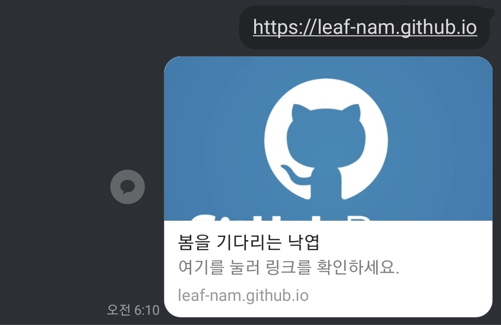

## 도입

> 이전 포스팅 참조 :
> [개발 블로그의 종류와 선택](https://leaf-nam.github.io/posts/blog/%EA%B0%9C%EB%B0%9C_%EB%B8%94%EB%A1%9C%EA%B7%B8%EC%9D%98_%EC%A2%85%EB%A5%98%EC%99%80_%EC%84%A0%ED%83%9D_240229/) > [SSG에 대하여](https://leaf-nam.github.io/posts/blog/ssg%EC%97%90-%EB%8C%80%ED%95%98%EC%97%AC_240302/) > [HUGO 기본 설치 및 사용법](https://leaf-nam.github.io/posts/240229_%EC%A2%8C%EC%B6%A9%EC%9A%B0%EB%8F%8C_%EA%B9%83%ED%97%88%EB%B8%8C_%EB%B8%94%EB%A1%9C%EA%B7%B8_%EC%83%9D%EC%84%B1%EA%B8%B0/240303_hugo-%EA%B8%B0%EB%B3%B8-%EC%84%A4%EC%B9%98-%EB%B0%8F-%EC%82%AC%EC%9A%A9%EB%B2%95/) > [Git 연동과 정적 페이지 배포](https://leaf-nam.github.io/posts/240229_%EC%A2%8C%EC%B6%A9%EC%9A%B0%EB%8F%8C_%EA%B9%83%ED%97%88%EB%B8%8C_%EB%B8%94%EB%A1%9C%EA%B7%B8_%EC%83%9D%EC%84%B1%EA%B8%B0/240304_git_%EC%97%B0%EB%8F%99%EA%B3%BC_%EC%A0%95%EC%A0%81_%ED%8E%98%EC%9D%B4%EC%A7%80_%EB%B0%B0%ED%8F%AC/)

저번 포스팅까지 블로그를 만들어봤는데요, 댓글이 없으니 뭔가 허전한 느낌입니다. 원래 블로그는 다른 사람과의 소통을 위함이니까요.

이번 시간에는 블로그 댓글을 생성하는 라이브러리들을 비교해보고, 그중 utterances를 직접 블로그에 적용해 보겠습니다.

> 저도 처음에는 어떻게 댓글을 구현할까 하다가, 직접 기능을 만들어보려고도 생각했었습니다. 하지만, 그럼 로그인 기능이나 댓글을 저장하는 DB도 만들어야 하는데 블로그 만드는 것보다 더 많은 노력이 필요할 것 같았습니다. 여기저기 찾아보니 댓글을 구현해주는 다양한 라이브러리가 있어 다행히 쉽게 적용할 수 있었습니다.

## 블로그 댓글 구현방법 비교

블로그 종류가 다양한 만큼, 블로그 댓글을 구현하는 방법도 다양합니다.

그럼 댓글 구현방법에 대한 각각의 장단점을 알아보겠습니다.

### Disqus


Disqus는 댓글을 쉽게 구현하도록 도와주는 프레임워크입니다. Disqus 내부에 서버가 있어 댓글을 작성하면 해당 서버에 댓글을 작성하고 불러오는 방식으로 구현됩니다.

또한, Hugo에서 공식적으로 지원하는 댓글 기능이기도 합니다.[^1]

[Hugo 문서](https://gohugo.io/content-management/comments/#configure-disqus)에 나와있는 것처럼 config에 Disqus 이름(shortname)을 작성하면 쉽게 연동이 가능합니다.

```yaml
services:
  disqus:
    shortname: your-disqus-shortname
```

**장점**

1. Hugo에서 기본으로 지원하는 기능인 만큼 연동성이 좋습니다.
2. 다른 사이트에 남긴 댓글들을 모아서 한번에 조회가 가능하며, 댓글 추이나 통계에 대한 분석도 제공합니다.[^2]
3. 사용자가 많고 특히 해외에서는 해당 서비스 사용자가 많은 것 같습니다.

**단점**

1. 댓글을 남기기 위해서는 사용자가 해당 서비스에 가입해야 합니다.
2. 현재까지 유효한 정책인지는 모르겠지만, 과거에는 2년 이상 사용 시 과금을 했다고 합니다. 서비스 기업이다 보니 차후에 요금정책이 변경될 가능성도 있을 것 같습니다.
3. 마찬가지로 해당 서비스가 종료되면 댓글도 사라질 위험이 있습니다.

> 저는 다른것보다 사용자가 새로운 회원가입을 해야 하는 부분에 불편함이 있을 것 같아 다른 옵션을 찾아보게 되었습니다.

### Commento


Commento는 가벼움과 프라이버시에 초점을 맞춘 댓글 플랫폼입니다. Commento 또한 해외에서 많이 사용하는 옵션 중 하나입니다.
Commento와 Disqus 사이에 고민하는 포스팅을 많이 볼 수 있었습니다.[^3]

**장점**

1. 프라이버시를 보장하기 위한 익명 댓글 기능이 있습니다.
2. 클라우드 서버나 사용자 DB에 연결되어 댓글이 저장되기 때문에 유실 걱정이 없습니다.
3. 제 기준에서는 UI나 디자인이 제일 깔끔한 것 같습니다.
   

**단점**

1. 클라우드 서비스 사용시 요금 정책이 있습니다. 현재 날짜 기준 월 10$, 연 99$입니다.
2. 클라우드 서비스나 DB에 등록하는 과정이 조금 복잡합니다.
3. 도메인별로 클라우드 서버를 설정하기 때문에 댓글 공유는 되지 않습니다.

> 요금은 클라우드 서비스를 사용하기 위해 어쩔 수 없이 내야하는 부분인 것 같고, 직접 DB를 구현하면 무료라고 합니다. 저는 차후 블로그 유저가 많아지거나, utterances가 불편한 점이 생기면 commento를 도입해볼 생각도 있습니다.

### Utterances


제 블로그에 도입해서 사용하고 있는 Utterances 입니다.

작동 원리는 깃허브 issue에 댓글을 남기고 트래킹하는 방식으로 구현이 되어있습니다.

> 정말 똑똑한 사람들이 많습니다. ~~여담이지만 utteranc.es라는 url 정말 잘 만든 것 같습니다.~~

코드 한 줄만 추가하면 바로 사용할 수 있어 가볍고 깃허브 아이디만 있으면 쉽게 댓글을 달 수 있습니다.

**장점**

1. 방문자도 깃허브 계정만 있으면 댓글을 남기는 것이 가능합니다.
2. script 기반으로 설치 및 구현이 쉽습니다.
3. 깃허브 이슈와 연동되기 때문에 별도의 저장공간이 불필요합니다.

**단점**

1. 이슈번호와 연결이 잘못되면 다른 글에 남긴 댓글이 보이는 등 이상현상이 발생한다고 하네요.(아직 댓글이 없어서 직접 확인은 못했습니다.)
2. 깃허브가 없는 일반 사용자는 댓글을 남길 수 없습니다.
3. css를 설정하지 못하고 정해진 테마(9개) 중 선택해야 합니다.(css 테마가 필요하면 직접 구현해서 오픈소스에 기여해달라고 하네요..)

> 어차피 깃허브 블로그인 이상 제 블로그의 생명주기는 깃허브와 같아졌으므로, utterances가 가장 합리적인 선택으로 보였습니다.
> 사용해보고 문제가 있다면 다른 댓글 플랫폼도 사용해보고 싶네요.

## Utterances 설치방법

설치를 시작하기에 앞서 Utterances에서 댓글이 구현되는 원리를 간단히 알아보자면 다음과 같습니다.

1. Utterances Bot이 깃허브 앱에 등록이 되고, 사용자가 작성한 스크립트로 페이지에 불러와집니다.
2. 해당 스트립트에 표기된 깃허브 레포지토리에서 현재 페이지에 맞는 댓글을 불러옵니다.
3. 댓글 작성버튼을 누르면 레포지토리에 현재 페이지의 정보와 함께 댓글을 저장합니다.

심플하면서도 깃허브 페이지에 아주 효과적인 전략인 것 같습니다. 그럼 이제 본격적으로 Utterances를 설치해보겠습니다.

### Utterances 기본설정

[먼저 Utterances 홈페이지](https://utteranc.es)에 들어가서 설정을 해야 합니다.
해당 페이지에 들어가시면 configuration탭이 있는데, 딱 4가지 설정만 하시면 됩니다.

1. **레포지토리 입력(필수)**

   먼저 해당 댓글을 사용할 레포지토리를 입력합니다. 본인의 블로그 레포지토리가 될 수도 있고, 별도의 댓글만 저장하기 위한 전용 레포지토리를 생성하셔도 좋습니다.

   저는 정적 페이지를 위한 레포지토리를 분리해두었기 때문에 해당 레포지토리를 그대로 사용했습니다.

   

2. **이슈 매핑방법(필수)**

   Utterances Bot이 깃허브 이슈에 댓글을 저장하고, 불러오기 위해서는 해당 이슈가 어떤 포스트에 해당하는지를 알아야 합니다.

   이를 위해 깃허브 이슈와 댓글을 어떻게 매핑할지 6가지 전략을 선택할 수 있습니다.

   > 실제로 Utterances로 댓글을 남기면 해당 전략에 따라 레포지토리 이슈에 저장이 되므로 본인이 관리하기 편한 방식을 선택하시는게 좋습니다.

   1. **pathname** : 현재 페이지의 url 중 경로명을 기반으로 댓글을 저장 및 탐색합니다.

   > 처음에 해당 방식을 사용했는데, 경로명에 한글이 포함되어있으면 utf-8로 인코딩 된 경로가 나오게 되어 나중에 알아보기가 힘들어 title로 변경했습니다.

   2. **URL** : url을 기반으로 댓글을 저장 및 탐색합니다. pathname과 다르게 전체 url경로를 모두 사용합니다.

   3. **title** : 포스팅 제목을 기반으로 댓글을 저장 및 탐색합니다.

   4. **og:title** : Open Graph[^4]의 메타 필드를 참조해서 댓글을 저장 및 탐색합니다.

   5. **issue number** : 이슈번호를 특정할 수 있습니다. 이슈가 자동생성되지 않아 미리 이슈를 만들어 두고 직접 연결해야 합니다.

   6. **specific term** : 이슈를 탐색할 때 설정한 특정 키워드를 포함하는지 확인합니다. 5번과 유사하지만 처음 댓글을 달면 해당 키워드를 포함하여 자동으로 이슈를 생성해줍니다.

   

3. **이슈 라벨 설정(선택)**

필수는 아니지만 이슈 앞에 부착할 라벨을 설정할 수 있습니다. 만약 이슈와 댓글을 동시에 사용하는 페이지가 있다면 이를 구분할 때 편리할 듯 합니다.

> 💬 와 같은 이모지도 넣을 수 있다고 하네요.



4. **테마 설정(필수)**

마지막으로 테마(댓글 템플릿)를 설정해야 합니다.
[utteranc.es](https://utteranc.es) 페이지에서 테마를 선택하면 자동으로 해당 테마에 맞게 페이지가 변경되니, 해당 페이지를 보고 본인의 블로그와 맞는 페이지를 선택하시면 될 것 같습니다.



> 이제 Utterances 설정이 끝났습니다. 모든 설정을 마치면 다음과 같이 스크립트를 복사할 수 있습니다.



### Hugo 템플릿 설정

모든 설정이 끝났다면, 해당 설정정보를 블로그로 불러와야 합니다. 저는 Hugo를 사용하고 있기 때문에 Hugo에서 설정하는 방법을 설명드리겠습니다.

> 다른 정적 페이지를 사용하신다면 해당 페이지의 html 중 댓글이 필요한 위치에 script를 불러오시면 됩니다.

Hugo에서 댓글을 적용하시려면 우선 Hugo가 어떻게 페이지를 렌더링하는지 이해해야 합니다.[^5] 위 주석을 참고하시면 Hugo의 페이지 렌더링 순서는 다음과 같습니다.

1. 사용자가 설정한 특정 레이아웃
2. 사용자가 설정한 기본 레이아웃
3. 테마에 설정된 특정 레이아웃
4. 테마에 설정된 기본 레이아웃

저는 PaperMod라는 테마를 사용하고 있습니다. 따라서 댓글을 화면에 표시하기 위해서는 제가 직접 레이아웃 폴더를 생성해서 **PaperMod의 Comment 레이아웃(comments.html)을 Override**[^6]해주어야 합니다.

따라서 다음과 같이 새로운 폴더와 comments.html 파일을 생성합니다.

```py
...
├── README.md
├── archetypes
├── config
│   └── _default
│       └── hugo.yaml
├── content
├── layouts  # layouts 디렉터리를 생성합니다.
│   └── partials  # partials 디렉터리를 생성합니다.
│       └── comments.html  # comments.html을 생성하고, 내부에 아래 주석 내용을 붙여넣기합니다.
├── public
├── resources
└── themes
    └── PaperMod

# [붙여넣기] comments.html : PaperMod에서 제공하는 기본 템플릿입니다.
{{- /* Comments area start */ -}}
{{- /* to add comments read => https://gohugo.io/content-management/comments/ */ -}}
{{- /* Comments area end */ -}}
```

위에서 생성한 comments.html 파일 내부에 아까 생성했던 utterances script 태그를 복사하면 완료입니다.

```py
{{- /* Comments area start */ -}}
# utterances script를 여기에 붙여넣습니다.
{{- /* Comments area end */ -}}
```

> 다른 Hugo 테마를 사용하신다면, 테마 폴더 내부의 layouts를 찾아보시면 Comments가 구현되어 있으실텐데 해당 파일을 가져오시면 됩니다.

> 테마에 Comments가 구현되어 있지 않다면 [Hugo 사이트를 참고](https://gohugo.io/templates/introduction/#comments)해서 직접 레이아웃을 구현하셔야 합니다.

### Github App 등록

Utterances가 레포지토리의 이슈에 접근하려면 깃허브 앱으로 등록해야 합니다.
[Utterances App](https://github.com/apps/utterances) 페이지에서 설치가 가능합니다.

참고로 아래 사진과 같이 댓글을 저장할 레포지토리만 등록하시면 잘 작동합니다.



### Canonical Path 설정

처음 Utterances를 적용하시면 아마 다음 페이지와 같이 로그인하라는 창이 나오실겁니다.



로그인 과정은 다음과 같습니다.

1. 로그인 버튼을 클릭하면 현재 페이지에서 Github의 OAuth 서비스 페이지로 이동합니다.
2. 인증이 완료되면 Github에서 인증 토큰을 발급합니다.
3. Utterances Bot이 해당 토큰을 통해 아까 설정한 레포지토리로 접근합니다.
4. 레포지토리에 접근이 가능해지면 현재 페이지와 레포지토리를 연결한 후, 현재 페이지로 복귀합니다.

이 과정에서 Utterances Bot은 Canonical Path[^7]를 통해 현재 페이지를 인식하게 됩니다.

그러나 Canonical Path가 제대로 설정되어 있지 않다면, **Utterance Bot이 해당 페이지를 인식하지 못합니다.** 따라서 Canonical Path를 올바르게 설정해서 Utterance Bot이 다시 해당 페이지로 찾아올 수 있도록 합니다.

이러한 Canonical Path는 **head에 링크 태그**로 생성됩니다.

> Canonical Path를 설정하는 방법은 테마마다 달라서 저는 PaperMod 테마 기준으로 설명드리겠습니다.

PaperMod 테마의 layouts > partials > head.html 템플릿을 확인해보면 다음과 같이 canonical path가 생성됨을 알 수 있습니다.

```go
// CanonicalURL이 있으면 그걸로 생성, 아니면 Permalink로 생성
<link rel="canonical" href="{{ if .Params.canonicalURL -}} {{ trim .Params.canonicalURL " " }} {{- else -}} {{
.Permalink }} {{- end }}">
```

따라서 hugo 설정파일 내부에 Params.canonicalURL 설정이 있다면 해당 설정을 통해 canonicalURL을 생성하고, 그렇지 않으면 **Permalink[^8]를 따라간다**는 것을 알 수 있습니다.

Permalink는 설정파일의 BaseURL에 현재 콘텐츠의 경로를 붙여서 생성됩니다.

```go
{{ with resources.Get "images/a.jpg" }}
  {{ .Permalink }} → https://example.org/images/a.jpg
{{ end }}
```

콘텐츠 경로는 hugo가 빌드하는 과정에서 잘 세팅이 되기 때문에 BaseURL만 해당 블로그의 기본주소로 잘 설정하면 정확한 canonicalURL을 얻을 수 있습니다.

따라서 기본 설정파일(hugo.yaml or hugo.toml or config.yaml)의 **BaseURL을 현재 블로그 페이지의 기본주소로** 잘 설정해주어야 합니다.

```py
# hugo.toml 혹은 hugo.yaml
baseURL: "https://{github계정명}.github.io/" # yaml 형식일 경우
baseURL = 'https://{github계정명}.github.io/' # toml 형식일 경우
```

> 여기까지 설정하셨으면 Github OAuth를 통해 로그인이 잘 되실겁니다.

## 결론

오늘은 깃허브 블로그 댓글을 구현하는 다양한 방법에 대해 알아보고, 그 중 Utterances를 통해 직접 구현해보았습니다. 다들 본인만의 블로그를 만드시는데 조금이나마 도움이 되었으면 좋겠습니다.

앞으로도 Hugo 블로그에 관련한 다양한 세팅에 대해 다뤄볼 예정이니 필요하거나 궁금한 부분이 있으시다면 알려주세요.

> 블로그 글이 너무 길어져버렸네요. 앞으로는 배경 설명과 직접 구현하는 포스팅을 잘 분리해야 할 것 같습니다..

## References

| URL                                               | 게시일자 | 방문일자    | 작성자                                                               |
| :------------------------------------------------ | :------- | :---------- | :------------------------------------------------------------------- |
| https://gohugo.io/                                | 미등록   | 2024.03.07. | [Hugo Authors](https://github.com/gohugoio/hugo/graphs/contributors) |
| https://disqus.com/                               | 미등록   | 2024.03.07. | 2024 Disqus                                                          |
| https://docs.commento.io/                         | 미등록   | 2024.03.07. | Commento                                                             |
| https://utteranc.es/                              | 미등록   | 2024.03.07. | [Utterances](https://github.com/orgs/utterance/people)               |
| https://stackshare.io/stackups/commento-vs-disqus | 미등록   | 2024.03.07. | Stackshare                                                           |

[^1]: [Hugo의 문서](https://gohugo.io/content-management/comments/)를 보면 공식적으로 Disqus를 지원하고 있습니다.
[^2]: [Disqus의 다양한 장점](https://disqus.com/platform/overview)은 해당 페이지에서 확인할 수 있습니다.
[^3]: [Commento vs Disqus](https://stackshare.io/stackups/commento-vs-disqus)
[^4]:
    [Open Graph](https://ogp.me/)는 검색엔진이나 SNS 등에서 해당 페이지에 접속하기 전에 대략적인 페이지 구성 등을 확인할 수 있도록 해주는 프로토콜입니다.
    

[^5]: [어떤 템플릿이 렌더링될까?](https://gohugo.io/templates/views/#which-template-will-be-rendered)
[^6]: 자바를 사용해보신 분들은 잘 아시겠지만 덮어쓰기한다는 뜻입니다.
[^7]: 한 페이지를 이동할 수 있는 여러 개의 URL이 있을때, Bot들이 참고해서 올 수 있는 공식 경로를 뜻합니다.
[^8]: 자세한 설명은 [Hugo 공식 홈페이지](https://gohugo.io/methods/resource/permalink/)를 참조하시기 바랍니다.
